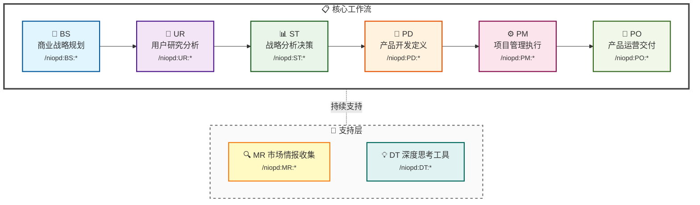
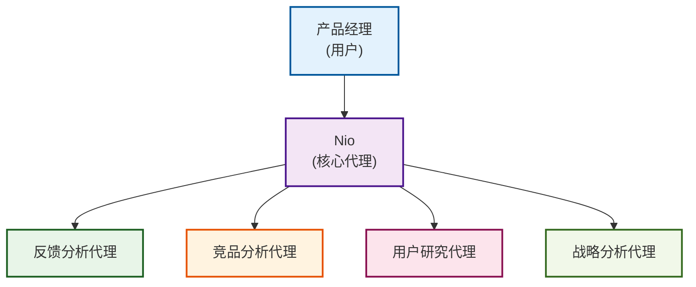

# 项目概述

<cite>
**本文档中引用的文件**
- [README.md](file://README.md)
- [plugin.json](file://niopd/.claude-plugin/plugin.json)
- [init.md](file://niopd/commands/SYS/init.md)
- [new-initiative.md](file://niopd/commands/BS/new-initiative.md)
- [swot.md](file://niopd/commands/ST/swot.md)
- [draft-prd.md](file://niopd/commands/PD/draft-prd.md)
- [help.md](file://niopd/commands/SYS/help.md)
- [README.md](file://niopd/templates/README.md)
</cite>

## 目录
1. [项目简介](#项目简介)
2. [核心理念与设计哲学](#核心理念与设计哲学)
3. [工作流架构](#工作流架构)
4. [指令集概览](#指令集概览)
5. [四大工作原则](#四大工作原则)
6. [目录结构详解](#目录结构详解)
7. [核心功能领域](#核心功能领域)
8. [NioPD作为AI产品管理伙伴](#niopd作为ai产品管理伙伴)
9. [应用场景与使用指南](#应用场景与使用指南)
10. [总结](#总结)

## 项目简介

NioPD (Nio 产品总监) 是一个专为 Claude Code 设计的AI驱动产品管理工具包，集成了69个智能化指令，覆盖从商业战略规划到产品交付运营的完整产品生命周期。该项目不仅仅是一个工具集合，更是一个智能的AI产品管理伙伴，旨在帮助产品经理提升产品思维能力，做出更明智的决策。

### 核心价值主张

NioPD通过以下方式改变产品经理的工作方式：

- **📝 知识捕获**：自动记录思考过程和决策，构建知识体系
- **⚡ 工作流加速**：自动化重复性任务，如MRD/PSD/PRD生成和反馈分析
- **📊 决策增强**：提供SWOT、波特五力、Kano等20+战略框架和分析工具
- **📁 上下文维护**：保持所有项目信息的组织和可追溯性
- **🎯 方法论驱动**：内置产品管理界经验证的最佳实践和方法论

**章节来源**
- [README.md](file://README.md#L59-L86)

## 核心理念与设计哲学

### 1. 文档驱动的产品管理

NioPD坚信好的产品管理始于清晰的文档。项目不仅帮助生成文档，更重要的是建立**文档之间的关联和追溯性**：

```
思考源材料 (sources/) 
   ↓ 引用
分析报告 (reports/)
   ↓ 支撑
决策文档 (docs/)
   ↓ 指导
执行计划 (plans/)
```

### 2. 方法论与最佳实践内置

NioPD不是简单的任务执行器，而是**方法论的载体**。每个指令都基于产品管理界的经典方法论：

- **DT:first-principles** - 埃隆·马斯克推崇的第一性原理思维
- **ST:swot** - 战略管理的经典SWOT分析框架
- **UR:jtbd** - Clayton Christensen的Jobs-to-be-Done理论
- **UR:kano** - Kano模型的功能优先级分类
- **ST:porters-five-forces** - 迈克尔·波特的五力分析模型
- **PO:aarrr-metrics** - Dave McClure的海盗指标

### 3. 思考优先，执行其次

与传统工具不同，NioPD强调**先思考清楚，再执行**：

1. **DT工具**帮您思考问题本质
2. **MR/UR分析**帮您收集数据和洞察
3. **ST框架**帮您做出战略决策
4. **PD文档**帮您明确产品定义
5. **PM计划**帮您组织执行
6. **PO运营**帮您持续优化

**章节来源**
- [README.md](file://README.md#L87-L126)

## 工作流架构

NioPD遵循一个清晰的产品开发流程，其中BS→UR→ST→PD→PM→PO形成主线，MR作为并行的市场情报收集，DT作为思维工具可在任何阶段使用：



**图表来源**
- [README.md](file://README.md#L127-L161)

### 各阶段详解

| 阶段 | 命名空间 | 目的 | 输出目录 | 核心方法论 |
|------|---------|------|---------|-----------|
| **SYS** | 系统管理 | 工作区初始化、系统配置 | - | 工程化管理 |
| **BS** | 商业战略规划 | 从想法生成到产品方向规划 | `sources/` | Brain Storming |
| **DT** | 深度思考工具 | 任何阶段的思维工具 | `sources/` | 第一性原理、五个为什么 |
| **MR** | 市场研究 | 全过程提供市场洞察 | `reports/` | 竞品分析、市场定位 |
| **UR** | 用户研究分析 | 深入了解用户需求、行为、痛点 | `reports/` | JTBD、Kano、用户画像 |
| **ST** | 战略分析决策 | 基于数据和框架的战略决策 | `reports/` | SWOT、波特五力、商业画布 |
| **PD** | 产品开发定义 | 转化洞察为具体产品需求 | `docs/` | MRD/PSD/PRD文档层级 |
| **PM** | 项目管理执行 | 规划、执行和跟踪项目进展 | `plans/` | PID、敏捷、DACI |
| **PO** | 产品运营交付 | 产品发布和持续优化 | `docs/` | AARRR、北极星指标 |

**章节来源**
- [README.md](file://README.md#L163-L195)

## 指令集概览

NioPD提供了69个智能化指令，覆盖9大功能领域：

### 指令分布统计

| 领域 | 缩写 | 指令数 | 核心功能 |
|------|------|---------|----------|
| 系统管理 | **SYS** | 8 | 初始化、帮助、升级、自定义扩展 |
| 商业战略 | **BS** | 5 | 立项、头脑风暴、机会识别 |
| 深度思考 | **DT** | 4 | 第一性原理、五个为什么、场景分析 |
| 市场研究 | **MR** | 7 | 竞品分析、市场定位、趋势研究 |
| 用户研究 | **UR** | 9 | 反馈分析、行为研究、用户画像 |
| 战略分析 | **ST** | 11 | SWOT、波特五力、商业画布、RICE |
| 产品开发 | **PD** | 13 | MRD/PSD/PRD、用户故事、旅程地图 |
| 项目管理 | **PM** | 10 | PID、发布计划、敏捷规划、DACI |
| 产品运营 | **PO** | 5 | AARRR、北极星指标、客户成功 |

**章节来源**
- [README.md](file://README.md#L59-L86)

## 四大工作原则

Nio遵循四个核心原则确保高质量的协作：

### 1. 同理心倾听
充分理解您的观点和上下文，确保沟通建立在相互理解的基础上。

### 2. 苏格拉底式提问
通过提问引导您自我发现，而不是直接给出答案。这种方法帮助您：
- **🔍 深度探索**：通过启发式对话帮助您发现隐藏的洞察
- **🎯 挑战假设**：揭示您可能忽略的前提条件和替代方案
- **🧠 培养思维**：将复杂问题分解为基本要素，找到问题本质

### 3. 第一性原理
帮助您将问题分解到本质，采用埃隆·马斯克推崇的第一性原理思维：
- 将问题分解到最基本的事实和假设
- 从零开始重新构建解决方案
- 打破基于类比或惯例的思考模式

### 4. 按需建议
仅在明确请求时提供具体建议，确保您始终掌握决策主导权。

**章节来源**
- [README.md](file://README.md#L34-L57)

## 目录结构详解

NioPD采用**文档目录结构**，每个目录对应文档生命周期的不同阶段：

```
niopd-workspace/
├── sources/       # 思考源材料层（BS + DT指令输出）
├── reports/       # 数据分析报告层（UR + MR + ST指令输出）
├── docs/          # 决策文档层（PD + PO指令输出）
└── plans/         # 执行计划层（PM指令输出）
```

### 目录设计理念

#### 1. sources/ - 思考源材料层
**用途**：存储原始思考记录、头脑风暴结果、深度思考分析
**输出指令**：BS、DT
**典型文件**：
- `[date]-brainstorm-discussion.md` - 头脑风暴记录
- `[date]-first-principles-thinking.md` - 第一性原理分析
- `[date]-five-whys-analysis.md` - 根因分析
- `note.md` - 日常想法和灵感记录

#### 2. reports/ - 数据分析报告层
**用途**：存储基于数据和方法论的结构化分析报告
**输出指令**：UR、MR、ST
**典型文件**：
- `[date]-user-feedback-summary.md` - 用户反馈分析报告
- `[date]-competitor-analysis.md` - 竞品分析报告
- `[date]-market-trends.md` - 市场趋势报告
- `[date]-swot-analysis.md` - SWOT分析报告

#### 3. docs/ - 决策文档层
**用途**：存储核心产品决策文档和运营方案
**输出指令**：PD、PO
**文档层级**：
```
Initiative (立项文档)
   ↓
MRD (市场需求文档)
   ↓
PSD (产品策略文档)
   ↓
PRD (产品需求文档)
   ↓
FAQ / 运营文档
```

#### 4. plans/ - 执行计划层
**用途**：存储项目执行计划、发布计划、风险管理等
**输出指令**：PM
**典型文件**：
- `[date]-<initiative>-pid-v1.md` - 项目立项文档（PID）
- `[date]-<initiative>-release-plan-v1.md` - 发布计划
- `[date]-<initiative>-roadmap-v1.md` - 产品路线图

**章节来源**
- [README.md](file://README.md#L196-L280)

## 核心功能领域

### 1. 商业战略规划 (BS)
专注于从想法到产品方向的转化过程：
- **`/niopd:BS:note`** - 快速记录灵感和想法
- **`/niopd:BS:hi`** - 头脑风暴对话
- **`/niopd:BS:new-initiative`** - 创建项目立项文档
- **`/niopd:BS:market-opportunity`** - 市场机会分析

### 2. 深度思考工具 (DT)
提供认知工具，帮助突破表面问题：
- **`/niopd:DT:first-principles`** - 第一性原理思考
- **`/niopd:DT:five-whys`** - 五个为什么根因分析
- **`/niopd:DT:socratic-questioning`** - 苏格拉底式提问
- **`/niopd:DT:scenarios`** - 场景规划

### 3. 市场研究 (MR)
深入了解竞争格局和市场趋势：
- **`/niopd:MR:competitor`** - 竞品分析
- **`/niopd:MR:compare`** - 多竞品对比
- **`/niopd:MR:positioning`** - 市场定位
- **`/niopd:MR:pricing`** - 竞争性定价分析

### 4. 用户研究 (UR)
深入理解用户需求和行为：
- **`/niopd:UR:feedback`** - 用户反馈分析
- **`/niopd:UR:behavior`** - 用户行为分析
- **`/niopd:UR:interview`** - 用户访谈分析
- **`/niopd:UR:personas`** - 用户画像创建

### 5. 战略分析 (ST)
基于数据和框架的战略决策：
- **`/niopd:ST:swot`** - SWOT分析
- **`/niopd:ST:canvas`** - 商业模式画布
- **`/niopd:ST:portfolio`** - 产品组合分析
- **`/niopd:ST:rice`** - RICE优先级框架

### 6. 产品开发 (PD)
转化洞察为具体产品需求：
- **`/niopd:PD:draft-prd`** - PRD草案生成
- **`/niopd:PD:stories`** - 用户故事生成
- **`/niopd:PD:journey`** - 用户旅程图
- **`/niopd:PD:roadmap`** - 产品路线图

### 7. 项目管理 (PM)
规划、执行和跟踪项目进展：
- **`/niopd:PM:release`** - 发布计划
- **`/niopd:PM:roadmap`** - 产品路线图
- **`/niopd:PM:kpis`** - KPI跟踪
- **`/niopd:PM:agile-planning`** - 敏捷规划

### 8. 产品运营 (PO)
产品发布和持续优化：
- **`/niopd:PO:faq`** - FAQ文档生成
- **`/niopd:PO:north-star`** - 北极星指标
- **`/niopd:PO:customer-success`** - 客户成功
- **`/niopd:PO:stakeholder-update`** - 利益相关者更新

**章节来源**
- [README.md](file://README.md#L301-L373)

## NioPD作为AI产品管理伙伴

### Nio的角色定位

Nio是NioPD的核心，一位经验丰富的高级产品经理AI助手，具有以下特征：

#### 1. 智能引导，而非简单执行
Nio采用**苏格拉底式提问**和**第一性原理思维**，不会直接给出答案，而是引导您：

- **🔍 深度探索**：通过启发式对话帮助您发现隐藏的洞察
- **🎯 挑战假设**：揭示您可能忽略的前提条件和替代方案
- **🧠 培养思维**：将复杂问题分解为基本要素，找到问题本质

#### 2. 四大工作原则
确保高质量协作的四个核心原则：

1. **同理心倾听** - 充分理解您的观点和上下文
2. **苏格拉底式提问** - 通过提问引导您自我发现
3. **第一性原理** - 帮助您将问题分解到本质
4. **按需建议** - 仅在明确请求时提供具体建议

#### 3. 组织结构
NioPD遵循AI驱动的产品专家组织模型：



**图表来源**
- [init.md](file://niopd/commands/SYS/init.md#L110-L140)

### 工作流程原则

NioPD遵循"用户领导、Nio协调、专家执行"的工作流程原则：

1. **用户发起**：产品经理启动工作
2. **Nio协调**：Nio定义任务并委托给合适的子代理
3. **专家执行**：专门的子代理执行具体任务
4. **结果整合**：Nio将结果整合并呈现给用户

**章节来源**
- [README.md](file://README.md#L34-L57)
- [init.md](file://niopd/commands/SYS/init.md#L110-L140)

## 应用场景与使用指南

### 1. 工作区初始化

使用`/niopd:SYS:init`命令创建标准化的工作区结构：

```bash
/niopd:SYS:init
```

这将创建以下目录结构：
- `niopd-workspace/sources/` - 思考源材料
- `niopd-workspace/reports/` - 分析报告
- `niopd-workspace/docs/` - 决策文档
- `niopd-workspace/plans/` - 执行计划

### 2. 完整工作流程示例

以下是一个从立项到上线的完整产品开发流程示例：

#### 场景：移动App重设计项目

**第1阶段：思考与立项（BS + DT）**
```bash
# 初始化工作区
/niopd:SYS:init

# 记录初步想法
/niopd:BS:note 用户反馈移动端体验不佳，考虑重设计

# 头脑风暴对话
/niopd:BS:hi

# 创建项目立项
/niopd:BS:new-initiative "移动端重设计"
```

**第2阶段：用户研究（UR）**
```bash
# 分析用户反馈
/niopd:UR:feedback --for="移动端重设计"

# 用户行为分析
/niopd:UR:behavior --for="移动端重设计"

# 创建用户画像
/niopd:UR:personas --from=<summary>
```

**第3阶段：市场研究（MR）**
```bash
# 竞品分析
/niopd:MR:competitor --url=https://www.example.com

# 市场定位分析
/niopd:MR:positioning --for="移动端重设计"

# 市场趋势研究
/niopd:MR:trends --topic="移动应用设计趋势"
```

**第4阶段：战略分析（ST）**
```bash
# SWOT分析
/niopd:ST:swot --for="移动端重设计"

# 商业模式画布
/niopd:ST:canvas --for="移动端重设计"

# 波特五力分析
/niopd:ST:porters-five-forces --for="移动端重设计"
```

**第5阶段：产品开发（PD）**
```bash
# 生成PRD草案
/niopd:PD:draft-prd --for="移动端重设计"

# 用户故事生成
/niopd:PD:stories --for="移动端重设计"

# 用户旅程图
/niopd:PD:journey --for="移动端重设计"
```

**第6阶段：项目管理（PM）**
```bash
# 发布计划
/niopd:PM:release --for="移动端重设计"

# 产品路线图
/niopd:PM:roadmap --for="移动端重设计"

# KPI跟踪
/niopd:PM:kpis --for="移动端重设计"
```

**第7阶段：产品运营（PO）**
```bash
# FAQ文档
/niopd:PO:faq --for="移动端重设计"

# 北极星指标
/niopd:PO:north-star --for="移动端重设计"

# 利益相关者更新
/niopd:PO:stakeholder-update --for="移动端重设计"
```

### 3. 快速开始指南

对于初学者，推荐以下快速开始流程：

1. **初始化**：`/niopd:SYS:init`
2. **立项**：`/niopd:BS:new-initiative "我的第一个项目"`
3. **用户研究**：`/niopd:UR:feedback --for="我的第一个项目"`
4. **PRD生成**：`/niopd:PD:draft-prd --for="我的第一个项目"`

### 4. 高级使用技巧

**工作流检查**：使用`/niopd:SYS:flow-check`检查当前项目状态，识别缺失文档，建议下一步操作。

**自定义扩展**：发现重复性任务时，使用`/niopd:SYS:new-command`创建自定义命令，或使用`/niopd:SYS:new-agent`创建专业代理。

**知识管理**：利用`/niopd:SYS:new-memory`记录个人工作习惯，让Nio更好地适应您的工作方式。

**章节来源**
- [README.md](file://README.md#L1653-L1673)
- [help.md](file://niopd/commands/SYS/help.md#L36-L139)

## 总结

NioPD作为一个AI驱动的产品管理工具包，通过以下核心优势为产品经理提供价值：

### 1. **完整的生命周期支持**
从商业战略规划到产品交付运营，覆盖产品管理的每一个关键阶段，形成闭环的工作流程。

### 2. **智能化的协作体验**
Nio作为AI产品管理伙伴，采用苏格拉底式提问和第一性原理思维，引导您深入思考，培养产品思维能力。

### 3. **方法论驱动的专业性**
内置20+个经典产品管理框架和分析工具，确保每个决策都有坚实的理论基础。

### 4. **文档驱动的知识管理**
通过标准化的目录结构和命名约定，建立可追溯的知识体系，支持团队协作和知识传承。

### 5. **灵活的使用方式**
支持从简单任务到复杂项目的各种使用场景，既适合初学者快速上手，也满足高级用户的深度需求。

NioPD不仅仅是一个工具集合，更是一个智能的产品管理生态系统。它改变了传统产品管理的方式，让产品经理能够专注于战略思考和决策制定，而将具体的分析和文档生成工作交给AI助手。这种人机协作的模式，正在重新定义现代产品管理的最佳实践。

通过69个智能化指令的有机组合，NioPD为产品经理提供了一个完整、专业、易用的产品管理解决方案，真正实现了"AI驱动的产品管理"这一愿景。