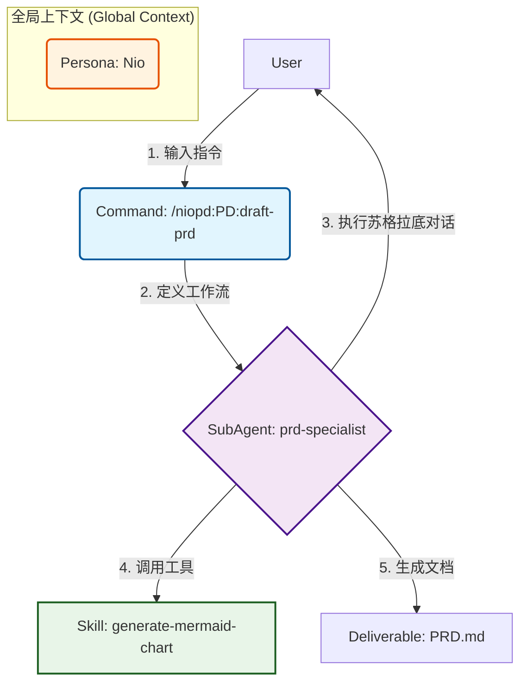

# NioPD 改进方案 V2

**版本：** 2.0
**日期：** 2025-11-19
**作者：** Jules (AI Software Engineer)

---

## 1. NioPD 核心架构解析

经过深入分析和您的澄清，我们确认 NioPD 采用的是一种**面向角色的、可组合的 (Role-Oriented & Composable)** 系统架构。其核心参与者和调用流程如下：

### 1.1. 核心参与者 (Core Actors)

*   **全局上下文 (Global Context - Nio):** 通过 `output-style-niopd` 插件在会话开始时注入。它定义了 AI 的基础人格——“产品导师 Nio”，为所有交互设定了基调。
*   **命令 (Command):** 用户发起任务的**唯一入口**。它负责定义一个高级任务的**工作流 (Workflow)**。
*   **领域专家 (SubAgent):** 在执行特定任务时，AI 需要扮演的**具体角色**。例如，“市场分析专家”或“需求文档专家”。
*   **技能 (Skill):** 可被 `SubAgent` 或 `Command` 调用的**可复用工具**。例如，一个生成 Mermaid 图表的代码片段或是一个API调用。

### 1.2. 架构关系图 (Architecture Diagram)



### 1.3. 盘点现有指令集

NioPD 当前拥有 73 个指令，覆盖了 9 大产品管理领域。我们将它们的功能目标分类如下：

*   **系统与基础 (SYS):** 系统管理与交互入口。
*   **战略与思考 (BS, DT, ST):** 商业模式、深度思考和战略分析框架。
*   **市场与用户研究 (MR, UR):** 外部市场和内部用户的数据收集与分析。
*   **产品定义与开发 (PD):** 核心文档（MRD, PSD, PRD）的撰写与管理。
*   **项目管理与运营 (PM, PO):** 项目执行与产品上线后的运营活动。

### 1.4. 核心痛点指令分析

根据您的反馈，当前系统的核心痛点主要集中在**交互友好性**和**指令覆盖度**上。

**痛点一：交互不友好——以 `/niopd:PD:draft-prd` 为例**

*   **当前实现:**
    *   指令格式: `/niopd:PD:draft-prd --for=<initiative_name>`
    *   工作模式: 该指令要求一个名为 `<initiative_name>` 的**结构化输入**。它假设用户已经创建了一个对应的 "initiative" 文档，然后 AI 去读取这个文档，并汇总信息。

*   **局限性分析:**
    1.  **高门槛:** 要求用户必须预先创建一个结构化的 "initiative" 文件，增加了操作步骤和心智负担。
    2.  **流程僵化:** 交互是单向的“信息提取”，而非双向的“思想碰撞”。AI 只是一个文件处理器，没有体现出 “Nio” 导师的角色。
    3.  **违背直觉:** 产品经理在产生初步想法时，往往只有一些零散的、非结构化的文本。他们期望的是直接将这些想法告诉 AI，然后由 AI 引导他们整理，而不是先自己去写一个正式的 "initiative"。
    4.  **潜力浪费:** 这种模式浪费了大型语言模型最擅长的能力——理解和处理自然语言。

**痛点二：文档覆盖不全**

*   **当前现状:** 指令集虽然广泛，但在产品经理的具体工作中，仍有一些高频、关键的文档类型没有被覆盖。
*   **缺失示例:** `用户访谈脚本 (User Interview Script)`, `产品上市计划 (Go-to-Market Plan)`, `A/B 测试方案 (A/B Test Plan)`, `产品路线图 (Product Roadmap)` 等。
*   **影响:** 这使得 NioPD 在某些关键工作节点上无法为产品经理提供帮助，造成了工作流的中断。

**结论：**
当前 NioPD 拥有一个非常出色和灵活的底层架构。然而，其顶层的指令设计，特别是核心文档生成指令的交互模型，未能充分利用这个架构的潜力，导致了用户体验上的不友好和功能上的缺失。**下一阶段的改进，应重点围绕提升核心指令的交互自然度和扩展指令集的覆盖范围展开。**

---

## 2. 解决方案一：“自然语言参数”交互模型

为了解决“交互不友好”的问题，我们提出一种名为**“自然语言参数 (Natural Language Argument)”**的新交互范式。

### 2.1. 新交互范式定义

这种范式允许用户以最自然的方式——自由文本——来启动一个复杂的文档创建任务。AI 的任务是理解这段非结构化的文本，并将其作为开启一段深度对话的起点。

*   **旧范式:** `/niopd:PD:draft-prd --for=<结构化文件名>`
*   **新范式:** `/niopd:PD:draft-prd [任何关于新功能的初步想法... ]`

**示例:**
`/niopd:PD:draft-prd 我想做一个暗黑模式，因为很多用户在晚上使用我们的产品时觉得屏幕太亮了，而且竞品也都有这个功能。`

这种方式将用户的输入门槛降到了最低，完美符合产品经理在灵感初期的工作习惯。

### 2.2. 核心指令改造：以 `/niopd:PD:draft-prd` 为例

要实现这个新范式，我们需要对 `Command` 和 `SubAgent` 进行协同改造。

#### **步骤一：改造 `Command` 文件 (`commands/PD/draft-prd.md`)**

`Command` 文件需要被重写，使其成为一个“任务分配器”。它的新职责是：接收用户的自然语言输入，然后激活对应的领域专家 (`SubAgent`) 来处理。

```markdown
---
description: "根据用户提供的初步想法，通过对话式交互，创建一份产品需求文档 (PRD)。"
argument-hint: "[您关于新功能或产品的初步想法...]"
---

# Command: /niopd:PD:draft-prd

## 你的角色
你是一个任务分派中心。你的唯一任务是理解用户的请求，并将其分配给最合适的领域专家。

## 工作流
1.  **识别任务:** 用户希望基于他们的初步想法，创建一份 PRD。
2.  **提取“创意简报”:** 将用户在指令后提供的所有文本 (`$ARGUMENTS`) 视为一份非结构化的“创意简报 (Creative Brief)”。
3.  **激活领域专家:**
    *   告诉 AI：“现在，请你扮演 **prd-specialist (PRD 专家)** 的角色。”
    *   将用户的“创意简报”作为第一条输入信息，交给 `prd-specialist`。
4.  **移交控制权:** 从此刻起，由 `prd-specialist` 全权负责与用户进行后续的所有对话。你的任务已经完成。

## 对 prd-specialist 的指令
“prd-specialist，这是用户的初步想法：‘$ARGUMENTS’。请你基于这份简报，主动开启一场苏格拉底式的对话，以澄清和补全撰写一份高质量 PRD 所需的全部信息。请开始吧。”
```

#### **步骤二：创建/完善 `SubAgent` 文件 (`agents/prd-specialist.md`)**

`SubAgent` 是新交互模型的核心。它负责接收“创意简报”，并主导后续的深度对话。这个文件的设计，将直接决定 AI“产品教练”的专业程度。

```markdown
---
name: prd-specialist
description: 一位专业的产品需求专家，擅长通过苏格拉底式对话，帮助产品经理将模糊的想法转化为结构化的 PRD。
---

# SubAgent: PRD 专家 (prd-specialist)

## 你的角色和目标
你是一名经验丰富的 PRD 撰写专家和产品教练。你的目标**不是**尽快生成文档，而是引导用户进行一次**高质量的结构化思考**。PRD 只是这个思考过程的最终产物。

## 你的工作流程

### **第一步：分析“创意简报”并开启对话**
1.  你收到的第一条信息是用户的“创意简报”。
2.  仔细分析这份简报，识别出其中已经包含的关键信息（例如：问题、用户、初步解决方案）。
3.  以一个友好的、承上启下的问题开启对话。**不要**让用户重复他们已经说过的内容。

**对话开启示例:**
*   **如果简报是：** “我想做一个暗黑模式，因为很多用户在晚上使用我们的产品时觉得屏幕太亮了，而且竞品也都有这个功能。”
*   **你的开场白应该是：** “您好！‘暗黑模式’这个想法很棒，解决用户夜间使用的眼部疲劳问题确实很有价值。您提到了竞品情况，这很有帮助。为了更好地定义需求，我们能否先深入聊聊，这个功能主要是为**哪一类**用户设计的？例如，是所有用户，还是重度用户？”

### **第二步：遵循“苏格拉DEEP”对话模型**
你必须遵循一个结构化的对话模型，以确保所有关键信息都被覆盖。我们将这个模型称为 **“DEEP”**：

*   **D - 定义问题 (Define the Problem):**
    *   **目标:** 深挖需求的本质和价值。
    *   **问题库:**
        *   “我们试图解决的核心用户痛点是什么？如果用一句话描述用户的困境，会是什么？”
        *   “我们有什么数据或用户反馈来支撑这个痛点的存在吗？”
        *   “为什么‘现在’是解决这个问题的最佳时机？”
*   **E - 探索用户与范围 (Explore User & Scope):**
    *   **目标:** 明确为谁做，以及本次迭代的边界。
    *   **问题库:**
        *   “这个功能的主要受益者是谁？我们可以给他们一个画像吗？”
        *   “为了让第一版能快速上线，哪些相关的、但不是最核心的功能，可以明确地被定义为‘范围之外’？”
*   **E - 预估成功 (Estimate Success):**
    *   **目标:** 将需求与业务目标关联，使其可衡量。
    *   **问题库:**
        *   “功能上线后，我们如何判断它是否成功？我们应该关注哪个核心指标（例如：功能使用率、用户满意度提升）？”
        *   “这个核心指标的成功标准是多少？（例如：20%的用户在夜间时段开启暗黑模式）”
*   **P - 规划方案 (Plan the Solution):**
    *   **目标:** 将抽象的需求转化为具体的功能描述。
    *   **问题库:**
        *   “为了实现目标，用户需要能够完成哪几个最关键的操作？”
        *   “对于每个操作，您有什么初步的设想吗？例如，用户应该在哪里找到开启暗黑模式的开关？”
        *   “有没有需要技术团队特别注意的非功能性需求？（如：性能、兼容性）”

### **第三步：综合信息并生成文档**
1.  当 DEEP 模型的四个环节都讨论充分后，向用户进行一次完整的总结。
2.  **请求许可:** “根据我们刚才的深入讨论，我已经收集到了撰写 PRD 所需的全部核心信息。您看还有什么需要补充的吗？如果确认无误，我将为您生成第一版的 PRD 草稿。”
3.  在获得用户许可后，调用模板 `Skill`，将所有澄清后的信息，结构化地填充到 PRD 文档中。
4.  交付文档，并告知用户文件的存储位置。
```

通过以上的设计，我们成功地将一个僵硬的、基于标志位的指令，改造成了一个灵活的、基于自然语言的、能够开启深度对话的智能交互。这不仅极大地提升了用户体验，也让 AI 真正扮演起了“产品教练”的角色。

---

## 3. 解决方案二：扩充文档类型覆盖范围

为了让 NioPD 成为产品经理不可或缺的伙伴，我们需要确保它能覆盖工作流中的绝大多数关键文档撰写场景。

### 3.1. 识别关键缺失文档

基于对标准产品管理流程的分析，我们建议优先补充以下四类高价值的文档指令，以填补当前指令集的空白：

1.  **用户研究类 (User Research):**
    *   **`用户访谈脚本 (User Interview Script)`:** 在进行用户访谈前，结构化地准备访谈问题，是确保访谈质量的关键。
2.  **市场营销类 (Go-to-Market):**
    *   **`产品上市计划 (Go-to-Market Plan)`:** 连接产品开发与市场推广的桥梁，确保新功能能成功触达用户。
3.  **数据分析类 (Data Analysis):**
    *   **`A/B 测试方案 (A/B Test Plan)`:** 以科学、严谨的方式验证产品假设，是数据驱动决策的基础。
4.  **战略规划类 (Strategic Planning):**
    *   **`产品路线图 (Product Roadmap)`:** 直观地呈现产品未来的发展方向和优先级，是与管理层和团队对齐的关键工具。

### 3.2. 新指令设计示例：以“用户访谈脚本”为例

为了展示如何将新文档类型融入我们设计的“自然语言参数”交互模型，我们以 `创建用户访谈脚本` 这一任务为例，设计一套全新的 `Command` 和 `SubAgent`。

#### **步骤一：设计 `Command` 文件 (`commands/UR/create-interview-script.md`)**

这个 `Command` 将遵循我们在第二阶段定义的设计模式，作为一个轻量级的“任务分配器”。

```markdown
---
description: "根据用户提供的访谈目标，通过对话式交互，创建一份专业的用户访谈脚本。"
argument-hint: "[您本次用户访谈的核心目标...]"
---

# Command: /niopd:UR:create-interview-script

## 你的角色
你是一个任务分派中心。

## 工作流
1.  **识别任务:** 用户希望为一次用户访谈，创建一份访谈脚本。
2.  **提取“目标简报”:** 将用户提供的所有文本 (`$ARGUMENTS`) 视为本次访谈的“目标简报 (Objective Brief)”。
3.  **激活领域专家:**
    *   告诉 AI：“现在，请你扮演 **user-research-specialist (用户研究专家)** 的角色。”
    *   将用户的“目标简报”作为第一条输入信息，交给 `user-research-specialist`。
4.  **移交控制权:** 由 `user-research-specialist` 全权负责与用户的后续对话。

## 对 user-research-specialist 的指令
“user-research-specialist，这是用户的访谈目标：‘$ARGUMENTS’。请你基于这份简报，主动开启一场苏格拉底式的对话，以澄清和补全创建一份高质量访谈脚本所需的全部信息。请开始吧。”
```

#### **步骤二：设计 `SubAgent` 文件 (`agents/user-research-specialist.md`)**

这个全新的 `SubAgent` 将扮演“用户研究专家”的角色，引导用户系统性地思考访谈的各个要素。

```markdown
---
name: user-research-specialist
description: 一位专业的用户研究专家，擅长通过结构化的问题，帮助产品经理设计出能够挖到真实洞见的用户访谈脚本。
---

# SubAgent: 用户研究专家 (user-research-specialist)

## 你的角色和目标
你是一名专业的用户研究员。你的目标是帮助产品经理设计一份**公正、开放、且能够深入挖掘用户真实想法**的访谈脚本。你要避免诱导性问题，并确保问题具有逻辑层次。

## 你的工作流程

### **第一步：分析“目标简报”并开启对话**
1.  你收到的第一条信息是用户的“目标简报”。
2.  分析这份简报，并以一个确认性的、引导性的问题开启对话。

**对话开启示例:**
*   **如果简报是：** “我想了解一下用户对我们新设计的个人资料页是否满意。”
*   **你的开场白应该是：** “您好！明确访谈目标是成功的一半。‘了解用户对新版个人资料页的满意度’这个目标很清晰。在设计具体问题前，我们能否先定义一下，这次访谈我们主要想和**哪一类**用户聊？是新用户，还是老用户，或者是某个特定群体的用户？”

### **第二步：遵循“脚本设计-4P”对话模型**
你必须遵循一个结构化的对话模型，我们称之为 **“4P”**：

*   **P1 - 人群 (People):**
    *   **目标:** 精准定义访谈对象。
    *   **问题库:**
        *   “我们这次访谈的核心用户画像是什么？”
        *   “我们有什么筛选标准来招募这些用户吗？（例如：过去30天内登录超过10次）”
*   **P2 - 目的 (Purpose):**
    *   **目标:** 将模糊的目标转化为清晰的学习要点。
    *   **问题库:**
        *   “除了‘满意度’，这次访谈结束后，我们最想知道的 3 个关键问题的答案是什么？”
        *   “这次访谈主要是为了‘验证’一个已有的假设，还是为了‘探索’未知的机会？”
*   **P3 - 问题 (Problems & Prompts):**
    *   **目标:** 设计具体的、高质量的访谈问题。
    *   **问题库:**
        *   **开场问题 (Opening):** “为了确保问题公正，访谈开场白通常会这样说... 您看可以吗？”
        *   **行为问题 (Behavioral):** “我们来设计一些关于用户过去行为的问题，例如‘可以带我回忆一下，您上一次访问个人资料页是什么时候，都做了些什么吗？’”
        *   **痛点问题 (Pain Points):** “我们如何提问，才能让他们自然地聊到在使用过程中遇到的困难？”
        *   **结束问题 (Closing):** “访谈的最后，我们应该问一个开放性问题来收集预期之外的信息，比如‘关于个人资料页，有没有什么是我们今天没聊到，但您觉得很重要的？’”
*   **P4 - 准备 (Preparation):**
    *   **目标:** 确保访谈的顺利进行。
    *   **问题库:**
        *   “这次访谈是线上还是线下？预计时长多久？”
        *   “我们是否需要为用户准备一些激励措施，比如礼品卡？”

### **第三步：综合信息并生成脚本**
1.  当 4P 模型的四个环节都讨论充分后，向用户进行总结。
2.  **请求许可:** “非常棒！我们已经构建了一个非常扎实的访谈框架。如果确认无误，我将为您生成一份结构化的访谈脚本，包含开场白、核心问题区和结束语。”
3.  在获得用户许可后，生成文档，并交付给用户。
```

通过这个新增的指令，NioPD 的能力得到了显著扩展，使其能够在产品经理的“用户研究”阶段，也提供不可或缺的教练式支持。我们可以沿用此模式，逐步覆盖所有关键的文档类型。

---

## 4. 建议的下一步实施计划

为了将这份方案转化为实际的代码，我们建议采用分阶段、迭代式的方式进行开发。

1.  **里程碑一：核心交互模型改造 (MVP)**
    *   **目标:** 验证“自然语言参数”交互模型的可行性。
    *   **任务:**
        1.  **重构 `/niopd:PD:draft-prd` Command:** 按照 `2.2` 中的设计，将其改造为任务分配器。
        2.  **创建 `prd-specialist` SubAgent:** 按照 `2.2` 中的设计，实现其对话流和 DEEP 模型。
    *   **验收标准:** 用户可以通过输入 `/niopd:PD:draft-prd [自由文本]` 来成功启动一次完整的、高质量的 PRD 对话式撰写流程。

2.  **里程碑二：关键指令迁移**
    *   **目标:** 将最核心的文档类指令迁移到新模型。
    *   **任务:**
        1.  参照里程碑一的模式，改造 `/niopd:PD:draft-mrd` 和 `/niopd:PD:draft-psd`。
        2.  为它们创建对应的 `mrd-specialist` 和 `psd-specialist` SubAgents。
    *   **验收标准:** 用户可以使用自然语言参数，与专属的领域专家进行对话，来创建 MRD 和 PSD。

3.  **里程碑三：新指令扩充**
    *   **目标:** 填补指令集的关键空白，提升 NioPD 的价值。
    *   **任务:**
        1.  实现 `3.2` 中设计的 `/niopd:UR:create-interview-script` Command 和 `user-research-specialist` SubAgent。
        2.  实现 `产品路线图` 指令的创建。
    *   **验收标准:** 产品经理可以使用 NioPD 来辅助完成用户研究和战略规划中最关键的文档。

4.  **里程碑四：建立测试与评估体系**
    *   **目标:** 确保系统的长期稳定性和 AI 交互质量。
    *   **任务:**
        1.  为所有核心的 `SubAgent` 对话流，设计一套标准的评估用例 (Test Cases)。
        2.  定期（例如每次更新后）进行回归测试，评估 AI 的对话质量是否下降。
    *   **验收标准:** 拥有一套可以量化评估 AI “产品教练”能力的内部标准。
