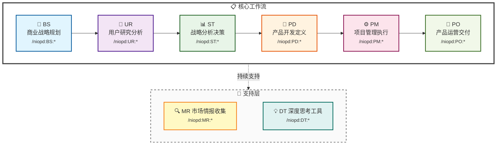

# NioPD - AI驱动的产品管理工具包

> **智能化产品管理工具包**：从战略思考到产品交付的全生命周期管理系统

[](https://opensource.org/licenses/MIT)
[](https://github.com/yourusername/niopd)
[](https://claude.ai)

---

## 📚 目录

1. [什么是 NioPD？](#什么是-niopd)
2. [核心理念与设计哲学](#核心理念与设计哲学)
3. [工作流架构](#工作流架构)
4. [目录结构详解](#目录结构详解)
5. [指令集完整说明](#指令集完整说明)
   - [SYS - 系统管理](#sys---系统管理)
   - [BS - 商业战略规划](#bs---商业战略规划brain-storming)
   - [DT - 深度思考工具](#dt---深度思考工具deep-thinking)
   - [MR - 市场研究](#mr---市场研究market-research)
   - [UR - 用户研究](#ur---用户研究user-research)
   - [ST - 战略分析](#st---战略分析strategy)
   - [PD - 产品开发](#pd---产品开发product-development)
   - [PM - 项目管理](#pm---项目管理project-management)
   - [PO - 产品运营](#po---产品运营product-operations)
6. [完整工作流示例](#完整工作流示例)
7. [快速开始](#快速开始)
8. [方法论参考](#方法论参考)
9. [安装与配置](#安装与配置)
10. [常见问题](#常见问题)

---

## 🎯 什么是 NioPD？

**NioPD (Nio Product Director)** 是一个为 Claude Code 设计的产品管理工具包，集成了73个智能化指令，覆盖从商业战略规划到产品交付运营的完整流程。

### 🌟 不仅仅是工具，更是您的 AI 产品管理伙伴

在产品管理的复杂世界中，您需要的不是另一个任务执行器，而是一位智能导师。**NioPD 的核心是 Nio**——一位经验丰富的高级产品经理 AI 助手，它通过以下方式改变您的工作方式：

#### 1. 💡 **智能引导，而非简单执行**

Nio 采用 **苏格拉底式提问** 和 **第一性原理思维**，不会直接给出答案，而是引导您：

- **🔍 深度探索**：通过启发式对话帮助您发现隐藏的洞察
- **🎯 挑战假设**：揭示您可能忽略的前提条件和替代方案
- **🧠 培养思维**：将复杂问题分解为基本要素，找到问题本质

#### 2. 🤝 **四大工作原则**

Nio 遵循四个核心原则确保高质量的协作：

1. **同理心倾听** - 充分理解您的观点和上下文
2. **苏格拉底式提问** - 通过提问引导您自我发现
3. **第一性原理** - 帮助您将问题分解到本质
4. **按需建议** - 仅在明确请求时提供具体建议

#### 3. 🚀 **核心价值主张**

NioPD 通过以下方式改变产品经理的工作方式：

- **📝 知识捕获**：自动记录您的思考过程和决策，构建知识体系
- **⚡ 工作流加速**：自动化重复性任务，如 MRD/PSD/PRD 生成和反馈分析
- **📊 决策增强**：提供 SWOT、波特五力、Kano 等 20+ 战略框架和分析工具
- **📁 上下文维护**：保持所有项目信息的组织和可追溯性
- **🎯 方法论驱动**：内置产品管理界经证的最佳实践和方法论

这种方式让您不仅能完成任务，更能 **提升产品思维能力**，做出 **更明智的决策**。

### 💯 **73 个智能化指令覆盖 9 大领域**

| 领域 | 缩写 | 指令数 | 核心功能 |
|------|------|---------|----------|
| 系统管理 | **SYS** | 8 | 初始化、帮助、升级、自定义扩展 |
| 商业战略 | **BS** | 5 | 立项、头脑风暴、机会识别 |
| 深度思考 | **DT** | 4 | 第一性原理、五个为什么、场景分析 |
| 市场研究 | **MR** | 7 | 竞品分析、市场定位、趋势研究 |
| 用户研究 | **UR** | 9 | 反馈分析、行为研究、用户画像 |
| 战略分析 | **ST** | 11 | SWOT、波特五力、商业画布、RICE |
| 产品开发 | **PD** | 14 | MRD/PSD/PRD、用户故事、旅程地图 |
| 项目管理 | **PM** | 10 | PID、发布计划、敏捷规划、DACI |
| 产品运营 | **PO** | 5 | AARRR、北极星指标、客户成功 |

---

## 🧠 核心理念与设计哲学

### 1. **文档驱动的产品管理**

NioPD 相信好的产品管理始于清晰的文档。我们不仅帮您生成文档，更重要的是建立 **文档之间的关联和追溯性**：

```
思考源材料 (sources/) 
   ↓ 引用
分析报告 (reports/)
   ↓ 支撑
决策文档 (docs/)
   ↓ 指导
执行计划 (plans/)
```

### 2. **方法论与最佳实践内置**

NioPD 不是简单的任务执行器，而是 **方法论的载体**。每个指令都基于产品管理界的经典方法论：

- **DT:first-principles** - 埃隆·马斯克推崇的第一性原理思维
- **ST:swot** - 战略管理的经典 SWOT 分析框架
- **UR:jtbd** - Clayton Christensen 的 Jobs-to-be-Done 理论
- **UR:kano** - Kano 模型的功能优先级分类
- **ST:porters-five-forces** - 迈克尔·波特的五力分析模型
- **PO:aarrr-metrics** - Dave McClure 的海盗指标

### 3. **思考优先，执行其次**

与传统工具不同，NioPD 强调 **先思考清楚，再执行**：

1. **DT 工具**帮您思考问题本质
2. **MR/UR 分析**帮您收集数据和洞察
3. **ST 框架**帮您做出战略决策
4. **PD 文档**帮您明确产品定义
5. **PM 计划**帮您组织执行
6. **PO 运营**帮您持续优化

---

## 🔄 工作流架构

NioPD 遵循一个清晰的产品开发流程，其中 BS→UR→ST→PD→PM→PO 形成主线，MR 作为并行的市场情报收集，DT 作为思维工具可在任何阶段使用：



### 各阶段详解

| 阶段 | 命名空间 | 目的 | 输出目录 | 核心方法论 |
|------|---------|------|---------|-----------|
| **SYS** | 系统管理 | 工作区初始化、系统配置 | - | 工程化管理 |
| **BS** | 商业战略规划 | 从想法生成到产品方向规划 | `sources/` | Brain Storming |
| **DT** | 深度思考工具 | 任何阶段的思维工具 | `sources/` | 第一性原理、五个为什么 |
| **MR** | 市场研究 | 全过程提供市场洞察 | `reports/` | 竞品分析、市场定位 |
| **UR** | 用户研究分析 | 深入了解用户需求、行为、痛点 | `reports/` | JTBD、Kano、用户画像 |
| **ST** | 战略分析决策 | 基于数据和框架的战略决策 | `reports/` | SWOT、波特五力、商业画布 |
| **PD** | 产品开发定义 | 转化洞察为具体产品需求 | `docs/` | MRD/PSD/PRD 文档层级 |
| **PM** | 项目管理执行 | 规划、执行和跟踪项目进展 | `plans/` | PID、敏捷、DACI |
| **PO** | 产品运营交付 | 产品发布和持续优化 | `docs/` | AARRR、北极星指标 |

---

## 📁 目录结构详解

NioPD 采用**文档目录结构**，每个目录对应文档生命周期的不同阶段：

```
niopd-workspace/
├── sources/       # 思考源材料层（BS + DT 指令输出）
├── reports/       # 数据分析报告层（UR + MR + ST 指令输出）
├── docs/          # 决策文档层（PD + PO 指令输出）
└── plans/         # 执行计划层（PM 指令输出）
```

### 目录设计理念

#### 1. **sources/ - 思考源材料层**

**用途**：存储原始思考记录、头脑风暴结果、深度思考分析

**输出指令**：BS、DT

**典型文件**：
- `[date]-brainstorm-discussion.md` - 头脑风暴记录
- `[date]-first-principles-thinking.md` - 第一性原理分析
- `[date]-five-whys-analysis.md` - 根因分析
- `[date]-scenario-planning.md` - 场景规划
- `note.md` - 日常想法和灵感记录

**特点**：
- 非结构化，记录思考过程
- 为后续分析提供原始素材
- 可追溯决策来源

#### 2. **reports/ - 数据分析报告层**

**用途**：存储基于数据和方法论的结构化分析报告

**输出指令**：UR、MR、ST

**典型文件**：
- `[date]-user-feedback-summary.md` - 用户反馈分析报告
- `[date]-competitor-analysis.md` - 竞品分析报告
- `[date]-market-trends.md` - 市场趋势报告
- `[date]-swot-analysis.md` - SWOT 分析报告
- `[date]-user-personas.md` - 用户画像
- `[date]-kano-analysis.md` - Kano 模型分析

**特点**：
- 结构化分析报告
- 基于方法论框架
- 支撑战略决策

#### 3. **docs/ - 决策文档层**

**用途**：存储核心产品决策文档和运营方案

**输出指令**：PD、PO

**文档层级**：

```
Initiative (立项文档)
   ↓
MRD (市场需求文档)
   ↓
PSD (产品策略文档)
   ↓
PRD (产品需求文档)
   ↓
FAQ / 运营文档
```

**典型文件**：
- `[date]-<initiative>-initiative-v1.md` - 项目立项文档
- `[date]-<initiative>-mrd-v1.md` - 市场需求文档
- `[date]-<initiative>-psd-v1.md` - 产品策略文档
- `[date]-<initiative>-prd-v1.md` - 产品需求文档
- `[date]-<initiative>-faq-v1.md` - 常见问题文档

**特点**：
- 权威性的产品定义
- 多版本管理（v1, v2...）
- 文档间引用关联
- 利益相关方对齐

#### 4. **plans/ - 执行计划层**

**用途**：存储项目执行计划、发布计划、风险管理等

**输出指令**：PM

**典型文件**：
- `[date]-<initiative>-pid-v1.md` - 项目立项文档（PID）
- `[date]-<initiative>-release-plan-v1.md` - 发布计划
- `[date]-<initiative>-roadmap-v1.md` - 产品路线图
- `[date]-<initiative>-sprint-plan-v1.md` - 敏捷冲刺计划
- `[date]-<initiative>-risk-analysis-v1.md` - 风险分析报告

**特点**：
- 执行导向
- 时间线明确
- 资源和依赖管理
- 可跟踪和更新

### 文档流转示例

一个完整的产品开发流程文档流转如下：

```
1. sources/20241030-mobile-redesign-brainstorm.md      (BS:hi)
2. sources/20241030-mobile-redesign-first-principles.md (DT)
3. reports/20241031-mobile-redesign-user-feedback.md   (UR)
4. reports/20241031-mobile-redesign-competitor.md      (MR)
5. reports/20241101-mobile-redesign-swot.md            (ST)
6. docs/20241102-mobile-redesign-initiative-v1.md      (BS)
7. docs/20241103-mobile-redesign-mrd-v1.md             (PD)
8. docs/20241104-mobile-redesign-psd-v1.md             (PD)
9. docs/20241105-mobile-redesign-prd-v1.md             (PD)
10. plans/20241106-mobile-redesign-pid-v1.md           (PM)
11. plans/20241107-mobile-redesign-release-plan-v1.md  (PM)
12. docs/20241108-mobile-redesign-faq-v1.md            (PO)
```

---

## 📖 指令集完整说明

以下是所有 69 个指令的详细说明，包括每个指令的功能、方法论基础、使用场景和示例。

---

### SYS - 系统管理

系统管理指令提供工作区初始化、帮助文档、升级和自定义扩展功能。

#### 📋 指令列表

| 指令 | 功能 | 输出目录 |
|------|------|----------|
| `/niopd:SYS:init` | 初始化工作区目录结构 | - |
| `/niopd:SYS:help` | 显示完整的命令帮助 | - |
| `/niopd:SYS:hi` | 与 Nio 开始对话 | - |
| `/niopd:SYS:upgrade` | 从 GitHub 升级 NioPD | - |
| `/niopd:SYS:flow-check` | 检查工作流状态并发现优化机会 | - |
| `/niopd:SYS:new-command` | 基于重复任务创建自定义命令 | - |
| `/niopd:SYS:new-agent` | 创建专门处理特定任务的代理 | - |
| `/niopd:SYS:new-memory` | 识别和记录个人工作习惯 | - |

#### 🔑 核心指令详解

**`/niopd:SYS:init`** - 工作区初始化
- **功能**：创建标准化的四目录工作区结构
- **目录**：sources/, reports/, docs/, plans/
- **使用时机**：第一次使用 NioPD，或开始新项目时
- **交付物**：完整的 `niopd-workspace/` 目录结构
- **示例**：
  ```bash
  /niopd:SYS:init
  ```

**`/niopd:SYS:help`** - 帮助文档
- **功能**：显示所有可用命令的完整帮助信息
- **使用时机**：需要查找特定命令或了解命令用法时
- **交付物**：全面的命令帮助文档
- **示例**：
  ```bash
  /niopd:SYS:help
  ```

**`/niopd:SYS:flow-check`** - 工作流检查
- **功能**：分析当前项目状态，识别缺失文档，建议下一步操作
- **智能特性**：根据现有文档智能推荐工作流程
- **使用时机**：不确定下一步该做什么时
- **交付物**：工作流状态报告 + 下一步建议
- **示例**：
  ```bash
  /niopd:SYS:flow-check
  ```

**`/niopd:SYS:new-command`** - 自定义命令创建
- **功能**：基于重复性任务自动生成自定义命令
- **使用场景**：发现固定模式的重复任务时
- **交付物**：新的自定义命令文件
- **示例**：
  ```bash
  /niopd:SYS:new-command
  ```

**`/niopd:SYS:new-agent`** - AI 代理创建
- **功能**：创建专门处理特定业务领域的 AI 代理
- **使用场景**：需要专业领域知识的复杂任务
- **交付物**：专用 AI 代理配置文件
- **示例**：
  ```bash
  /niopd:SYS:new-agent
  ```

**`/niopd:SYS:new-memory`** - 工作习惯记录
- **功能**：识别并记录个人工作习惯，让 Nio 自适应
- **使用场景**：希望 Nio 学习你的个人偏好时
- **交付物**：个人化的工作习惯配置
- **示例**：
  ```bash
  /niopd:SYS:new-memory
  ```

**`/niopd:SYS:upgrade`** - 系统升级
- **功能**：从 GitHub 获取最新版本并升级 NioPD
- **使用时机**：有新版本发布或需要新功能时
- **交付物**：更新后的 NioPD 系统
- **示例**：
  ```bash
  /niopd:SYS:upgrade
  ```

---

### BS - 商业战略规划（Brain Storming）

BS 指令集专注于商业战略层面的思考和规划，帮助产品经理从模糊的想法演化为清晰的产品方向。

#### 🧠 方法论基础

**头脑风暴（Brainstorming）** 是一种创意思维技术，由 Alex Osborn 于 1953 年提出。核心原则：
1. **延迟批判** - 先产生想法，后评估
2. **追求数量** - 想法越多越好
3. **欢迎奇思妙想** - 打破常规思维
4. **组合和改进** - 在他人想法基础上发展

#### 📋 指令列表

| 指令 | 功能 | 输出目录 | 方法论 |
|------|------|----------|--------|
| `/niopd:BS:note [内容]` | 记录日常想法、观察和灵感 | `sources/` | - |
| `/niopd:BS:hi` | 与 Nio 开始头脑风暴对话 | `sources/` | Socratic Questioning |
| `/niopd:BS:feature-planning` | 基于反馈生成新功能想法 | `sources/` | Brain Storming |
| `/niopd:BS:new-initiative` | 创建新项目立项文档 | `docs/` | Opportunity Canvas |
| `/niopd:BS:market-opportunity` | 分析市场机会和空白 | `sources/` | TAM/SAM/SOM |

#### 🔑 核心指令详解

**`/niopd:BS:note [内容]`** - 快速记录
- **功能**：随时记录灵感、想法、观察
- **输出**：追加到 `sources/note.md`
- **使用场景**：
  - 产品会议中的突发想法
  - 用户访谈中的关键洞察
  - 竞品观察的发现
- **示例**：
  ```bash
  /niopd:BS:note 用户反馈说导航太复杂，考虑简化为3个主菜单
  ```

**`/niopd:BS:hi`** - 头脑风暴对话
- **功能**：与 Nio 进行苏格拉底式对话，探索想法
- **方法**：通过提问引导您深入思考
- **输出**：`sources/[date]-discussion-summary.md`
- **典型对话流程**：
  1. 您提出初步想法
  2. Nio 提问探索背景和动机
  3. Nio 挑战假设，提出替代方案
  4. 共同总结核心洞察
- **示例**：
  ```bash
  /niopd:BS:hi
  ```

**`/niopd:BS:new-initiative`** - 创建立项文档
- **功能**：通过引导式对话创建结构化的项目立项文档
- **输出**：`docs/[date]-<name>-initiative-v1.md`
- **文档结构**：
  - 项目背景和动机
  - 目标用户和价值主张
  - 成功标准和衡量指标
  - 初步范围和约束
  - 关键假设和风险
- **使用时机**：有明确想法，准备启动新项目时
- **示例**：
  ```bash
  /niopd:BS:new-initiative "移动端重设计"
  ```

**`/niopd:BS:market-opportunity`** - 市场机会分析
- **功能**：分析市场机会规模和可行性
- **方法论**：TAM/SAM/SOM 分析框架
  - **TAM** (Total Addressable Market) - 总潜在市场
  - **SAM** (Serviceable Addressable Market) - 可服务市场
  - **SOM** (Serviceable Obtainable Market) - 可获得市场
- **输出**：`sources/[date]-market-opportunity.md`

---

### DT - 深度思考工具（Deep Thinking）

DT 指令集提供认知工具，帮助您突破表面问题，找到根本原因和创新解决方案。

#### 🧠 方法论基础

##### 1. **第一性原理（First Principles Thinking）**

由埃隆·马斯克推崇，源自古希腊哲学家亚里士多德。

**核心思想**：将问题分解到最基本的事实和假设，从零开始重新构建解决方案，而不是基于类比或惯例思考。

**应用步骤**：
1. 识别并定义当前假设
2. 将问题分解到基本事实
3. 从基本事实创建新解决方案

**经典案例**：
- **SpaceX 火箭成本**：不问"火箭要多少钱"，而问"火箭的原材料值多少钱"
- **电动车电池**：不问"电池为什么贵"，而问"电池由什么组成，每种材料多少钱"

##### 2. **五个为什么（5 Whys）**

由丰田汽车创始人丰田喜一郎提出，是精益生产的重要工具。

**核心思想**：连续问"为什么"五次，从表面症状深入到根本原因。

**应用步骤**：
1. 定义问题
2. 问第一个"为什么"
3. 基于答案继续问"为什么"
4. 重复 3-5 次直到找到根因
5. 针对根因制定解决方案

**示例**：
- **问题**：用户流失率高
- **为什么1**：因为新用户留存率低
- **为什么2**：因为用户不理解产品价值
- **为什么3**：因为引导流程太复杂
- **为什么4**：因为试图一次性介绍所有功能
- **为什么5**：因为缺乏用户旅程规划
- **根因**：产品团队没有用户引导设计流程

##### 3. **苏格拉底式提问（Socratic Questioning）**

由古希腊哲学家苏格拉底创立，通过系统性提问引导思考。

**六大提问类型**：
1. **澄清性问题**："你说的X具体是什么意思?"
2. **假设探究**："这基于什么假设?"
3. **证据探究**："有什么证据支持这个?"
4. **视角探究**："从用户角度看呢?"
5. **影响探究**："如果这样做会怎样?"
6. **元问题**："为什么这个问题重要?"

##### 4. **场景规划（Scenario Planning）**

源自Shell石油公司，用于应对不确定性。

**核心思想**：构建多个可能的未来场景，为每种场景制定应对策略。

**应用步骤**：
1. 识别关键不确定性因素
2. 构建 2-4 个差异化场景
3. 分析每个场景的影响
4. 制定应对策略

#### 📋 指令列表

| 指令 | 功能 | 输出目录 | 方法论 |
|------|------|----------|--------|
| `/niopd:DT:first-principles` | 第一性原理思考分析 | `sources/` | First Principles |
| `/niopd:DT:five-whys` | 五个为什么根因分析 | `sources/` | 5 Whys (Toyota) |
| `/niopd:DT:socratic-questioning` | 苏格拉底式提问引导 | `sources/` | Socratic Method |
| `/niopd:DT:scenarios` | 场景规划和假设分析 | `sources/` | Scenario Planning |

#### 🔑 核心指令详解

**`/niopd:DT:first-principles`** - 第一性原理分析
- **使用场景**：
  - 面对"不可能"的挑战时
  - 现有解决方案成本/复杂度过高时
  - 需要创新突破时
- **输出**：`sources/[date]-<problem>-first-principles.md`
- **分析流程**：
  1. 定义问题
  2. 列举当前假设
  3. 分解到基本事实
  4. 从基本事实重建解决方案
- **示例**：
  ```bash
  /niopd:DT:first-principles --problem="降低云存储成本"
  ```

**`/niopd:DT:five-whys`** - 根因分析
- **使用场景**：
  - 问题反复出现时
  - 表面解决方案无效时
  - 需要系统性改进时
- **输出**：`sources/[date]-<problem>-five-whys.md`
- **示例**：
  ```bash
  /niopd:DT:five-whys --problem="新用户激活率低"
  ```

**`/niopd:DT:socratic-questioning`** - 苏格拉底式对话
- **使用场景**：
  - 挑战团队假设时
  - 设计评审时
  - 战略讨论时
- **输出**：`sources/[date]-socratic-session.md`

**`/niopd:DT:scenarios`** - 场景规划
- **使用场景**：
  - 面对高度不确定性时
  - 长期战略规划时
  - 风险评估时
- **输出**：`sources/[date]-scenarios.md`
- **典型场景维度**：
  - 乐观 vs 悲观
  - 快速增长 vs 稳定增长
  - 竞争激烈 vs 市场垄断

---

### MR - 市场研究（Market Research）

市场研究指令帮助您了解竞争格局、市场趋势和定位策略。

#### 📋 指令列表

| 指令 | 功能 | 输出目录 |
|------|------|----------|
| `/niopd:MR:competitor --url=<url>` | 分析竞争对手和市场定位 | `reports/` |
| `/niopd:MR:compare` | 自动竞争对手对比分析 | `reports/` |
| `/niopd:MR:compare-products` | 多产品横向对比 | `reports/` |
| `/niopd:MR:positioning` | 市场定位分析和差异化策略 | `reports/` |
| `/niopd:MR:pricing` | 竞争性定价分析 | `reports/` |
| `/niopd:MR:trends` | 研究和总结市场趋势 | `reports/` |
| `/niopd:MR:segmentation` | 客户细分分析 | `reports/` |

#### 🔑 核心指令详解

**`/niopd:MR:competitor`** - 竞品分析
- **功能**：深入分析单个竞争对手的产品、策略和定位
- **分析维度**：
  - 产品功能对比
  - 定价策略
  - 目标用户群体
  - 技术架构（如可获取）
  - 商业模式
  - 市场定位
- **使用场景**：
  - 新进入市场时了解竞争格局
  - 产品战略规划前的市场研究
  - 准备融资路演需要竞品对比
- **交付物**：`reports/[date]-competitor-[company]-analysis.md`
- **示例**：
  ```bash
  /niopd:MR:competitor --url=https://www.figma.com
  ```

**`/niopd:MR:compare`** - 多竞品对比
- **功能**：对比分析多个竞争对手，生成对比矩阵
- **对比维度**：功能、价格、用户评价、市场份额
- **使用场景**：
  - 制定差异化策略
  - 确定产品定位
  - 识别市场空白
- **交付物**：`reports/[date]-competitive-comparison.md`
- **示例**：
  ```bash
  /niopd:MR:compare
  ```

**`/niopd:MR:compare-products`** - 产品横向对比
- **功能**：对比分析自家多个产品或产品线
- **使用场景**：
  - 产品组合优化
  - 避免内部竞争
  - 清晰产品定位
- **交付物**：`reports/[date]-product-comparison.md`

**`/niopd:MR:positioning`** - 市场定位
- **功能**：分析和定义产品的市场定位策略
- **方法论**：定位理论（Positioning Theory - Al Ries & Jack Trout）
- **核心要素**：
  - 目标细分市场
  - 差异化价值主张
  - 竞争参照点
  - 品牌定位陈述
- **交付物**：`reports/[date]-positioning-strategy.md`
- **示例**：
  ```bash
  /niopd:MR:positioning
  ```

**`/niopd:MR:pricing`** - 定价分析
- **功能**：基于竞品和价值进行定价策略分析
- **定价策略**：
  - 成本加成定价
  - 价值定价
  - 竞争定价
  - 渗透定价 vs 撇脂定价
- **交付物**：`reports/[date]-pricing-analysis.md`

**`/niopd:MR:trends`** - 市场趋势研究
- **功能**：识别和分析行业趋势和未来方向
- **分析维度**：
  - 技术趋势
  - 用户行为变化
  - 监管环境变化
  - 竞争格局演变
- **使用场景**：
  - 年度战略规划
  - 产品路线图制定
  - 识别创新机会
- **交付物**：`reports/[date]-market-trends.md`

**`/niopd:MR:segmentation`** - 客户细分
- **功能**：对市场进行客户细分分析
- **细分维度**：
  - 人口统计学特征
  - 行为特征
  - 心理特征
  - 地理位置
- **使用场景**：
  - 确定目标市场
  - 制定差异化营销策略
  - 优化产品功能优先级
- **交付物**：`reports/[date]-market-segmentation.md`

---

### UR - 用户研究（User Research）

用户研究指令帮助您深入理解用户需求、行为和痛点。

#### 🧠 方法论基础

##### **Jobs-to-be-Done (JTBD)**

由 Clay Christensen 提出，关注用户"雇佣"产品完成的任务。

**核心洞察**：用户不是购买产品，而是"雇佣"产品来完成特定任务。

**JTBD 陈述句式**：
```
当我 [情境]
我想要 [动机]
这样我就能 [预期结果]
```

**示例**：
- ❌ 错误："用户想要一个更快的搜索功能"
- ✅ 正确："当我在移动设备上查找信息时，我想要快速找到答案，这样我就能不被打断地继续手头的工作"

##### **Kano 模型**

由狩野纪昭教授提出，用于功能优先级分类。

**五类功能**：
1. **基本型需求**：必须有，没有会不满
2. **期望型需求**：越多越好，影响满意度
3. **兴奋型需求**：意外惊喜，超预期
4. **无差异需求**：有没有都无所谓
5. **反向需求**：有了反而不满

**应用**：优先实现基本型，投资期望型，创新兴奋型

#### 📋 指令列表

| 指令 | 功能 | 输出目录 | 方法论 |
|------|------|----------|--------|
| `/niopd:UR:feedback` | 分析用户反馈并生成摘要报告 | `reports/` | Thematic Analysis |
| `/niopd:UR:behavior` | 分析用户行为数据并识别模式 | `reports/` | Behavioral Analytics |
| `/niopd:UR:interview` | 总结用户访谈记录并提取洞察 | `reports/` | Interview Analysis |
| `/niopd:UR:personas` | 从反馈数据创建用户画像 | `reports/` | User Personas |
| `/niopd:UR:journey` | 映射用户旅程并识别痛点 | `reports/` | Customer Journey Map |
| `/niopd:UR:satisfaction` | 用户满意度分析和得分汇总 | `reports/` | NPS/CSAT |
| `/niopd:UR:usability` | 可用性测试规划和分析 | `reports/` | Usability Testing |
| `/niopd:UR:jtbd` | Jobs-to-be-Done 分析 | `reports/` | JTBD Framework |
| `/niopd:UR:kano` | Kano 模型功能分类 | `reports/` | Kano Model |

#### 🔑 核心指令详解

**`/niopd:UR:feedback`** - 用户反馈分析
- **功能**：分析用户反馈数据，识别关键主题和痛点
- **方法论**：主题分析（Thematic Analysis）
- **分析流程**：
  1. 收集反馈数据（App Store、客服、社交媒体等）
  2. 主题编码和分类
  3. 情感分析（正面/负面/中性）
  4. 优先级排序
- **使用场景**：
  - 产品迭代规划
  - 痛点识别
  - 用户满意度监控
- **交付物**：`reports/[date]-user-feedback-analysis.md`
- **示例**：
  ```bash
  /niopd:UR:feedback
  ```

**`/niopd:UR:behavior`** - 用户行为分析
- **功能**：分析用户行为数据，识别使用模式和异常
- **分析类型**：
  - 功能使用频率
  - 用户流程路径
  - 流失点分析
  - 留存模式
- **数据源**：Google Analytics、Mixpanel、自有埋点系统
- **交付物**：`reports/[date]-user-behavior-analysis.md`

**`/niopd:UR:interview`** - 用户访谈分析
- **功能**：总结用户访谈记录，提取关键洞察
- **方法论**：定性研究、主题分析
- **访谈类型**：
  - 问题发现访谈
  - 验证性访谈
  - 深度访谈
- **交付物**：`reports/[date]-interview-insights.md`

**`/niopd:UR:personas`** - 用户画像
- **功能**：创建详细的用户画像文档
- **画像包含**：
  - 人口统计信息
  - 目标和动机
  - 痛点和挑战
  - 使用场景
  - 行为特征
- **使用场景**：
  - 产品设计决策
  - 功能优先级排序
  - 营销消息制定
- **交付物**：`reports/[date]-user-personas.md`
- **示例**：
  ```bash
  /niopd:UR:personas
  ```

**`/niopd:UR:journey`** - 用户旅程地图
- **功能**：映射用户使用产品的完整旅程
- **旅程阶段**：
  1. 认知（Awareness）
  2. 考虑（Consideration）
  3. 购买/注册（Acquisition）
  4. 使用（Usage）
  5. 留存（Retention）
  6. 推荐（Advocacy）
- **分析要点**：每个阶段的触点、痛点、机会点
- **交付物**：`reports/[date]-user-journey-map.md`

**`/niopd:UR:satisfaction`** - 满意度调研
- **功能**：分析用户满意度数据
- **指标类型**：
  - **NPS** (Net Promoter Score) - 净推荐值
  - **CSAT** (Customer Satisfaction Score) - 客户满意度
  - **CES** (Customer Effort Score) - 客户努力度
- **使用场景**：
  - 定期满意度监控
  - 功能上线后评估
  - 竞品对比
- **交付物**：`reports/[date]-satisfaction-analysis.md`

**`/niopd:UR:usability`** - 可用性测试
- **功能**：规划和分析可用性测试
- **测试类型**：
  - 任务完成测试
  - A/B 测试
  - 启发式评估
  - 认知演练
- **衡量指标**：
  - 任务成功率
  - 完成时间
  - 错误率
  - 用户主观评价
- **交付物**：`reports/[date]-usability-test.md`

**`/niopd:UR:jtbd`** - Jobs-to-be-Done 分析
- **功能**：基于 JTBD 框架分析用户任务
- **方法论**：Clayton Christensen 的 JTBD 理论
- **分析维度**：
  - 功能性任务
  - 情感性任务
  - 社交性任务
- **交付物**：`reports/[date]-jtbd-analysis.md`
- **示例**：
  ```bash
  /niopd:UR:jtbd
  ```

**`/niopd:UR:kano`** - Kano 模型分析
- **功能**：使用 Kano 模型对功能进行分类
- **方法论**：狩野纪昭的 Kano 模型
- **分类结果**：
  - 基本型需求（Must-have）
  - 期望型需求（Performance）
  - 兴奋型需求（Delighters）
  - 无差异需求
  - 反向需求
- **使用场景**：
  - 功能优先级排序
  - 资源分配决策
  - 路线图规划
- **交付物**：`reports/[date]-kano-analysis.md`

---

### ST - 战略分析（Strategy）

战略分析指令提供多种经典战略框架，帮助您做出数据驱动的战略决策。

#### 🧠 核心方法论

##### **SWOT 分析**

**四个维度**：
- **Strengths（优势）**：内部优势资源
- **Weaknesses（劣势）**：内部短板
- **Opportunities（机会）**：外部市场机会
- **Threats（威胁）**：外部竞争威胁

##### **波特五力模型（Porter's Five Forces）**

由迈克尔·波特提出，分析行业竞争强度。

**五种力量**：
1. **供应商议价能力**
2. **买方议价能力**
3. **现有竞争者**
4. **潜在进入者威胁**
5. **替代品威胁**

##### **商业模式画布（Business Model Canvas）**

由 Alexander Osterwalder 提出，九大构建块：

1. **价值主张** - 解决什么问题
2. **客户细分** - 服务谁
3. **渠道通路** - 如何触达
4. **客户关系** - 如何维系
5. **收入来源** - 如何赚钱
6. **核心资源** - 需要什么
7. **关键业务** - 做什么
8. **重要伙伴** - 和谁合作
9. **成本结构** - 花多少钱

##### **RICE 优先级模型**

由 Intercom 提出的功能优先级评分方法。

**公式**：`RICE Score = (Reach × Impact × Confidence) / Effort`

- **Reach（触达）**：影响多少用户
- **Impact（影响）**：对每个用户的影响程度（3=巨大，2=高，1=中，0.5=低，0.25=最小）
- **Confidence（信心）**：对估算的信心（100%=高，80%=中，50%=低）
- **Effort（成本）**：人月数

#### 📋 指令列表

| 指令 | 功能 | 输出目录 | 方法论 |
|------|------|----------|--------|
| `/niopd:ST:swot` | SWOT 分析 | `reports/` | SWOT Framework |
| `/niopd:ST:canvas` | 商业模式画布 | `reports/` | Business Model Canvas |
| `/niopd:ST:portfolio` | 产品组合分析 | `reports/` | BCG Matrix |
| `/niopd:ST:pest` | PEST 宏观环境分析 | `reports/` | PEST Analysis |
| `/niopd:ST:balanced-scorecard` | 平衡计分卡 | `reports/` | BSC Framework |
| `/niopd:ST:porters-five-forces` | 波特五力分析 | `reports/` | Porter's Model |
| `/niopd:ST:design-thinking` | 设计思维方法论 | `reports/` | Design Thinking |
| `/niopd:ST:design-sprint` | 设计冲刺规划 | `reports/` | Google Design Sprint |
| `/niopd:ST:moscow` | MoSCoW 优先级排序 | `reports/` | MoSCoW Method |
| `/niopd:ST:rice` | RICE 优先级评分 | `reports/` | RICE Framework |
| `/niopd:ST:ost` | OST 目标设定 | `reports/` | OKR/KPI Framework |

#### 🔑 核心指令详解

**`/niopd:ST:swot`** - SWOT 战略分析
- **功能**：分析内部优势劣势和外部机会威胁
- **理论基础**：由 Albert Humphrey 在 1960 年代斯坦福研究所开发
- **分析框架**：
  - **内部因素**：优势 (Strengths)、劣势 (Weaknesses)
  - **外部因素**：机会 (Opportunities)、威胁 (Threats)
- **应用场景**：
  - 战略规划制定
  - 项目可行性评估
  - 竞争态势分析
- **交付物**：`reports/[date]-swot-analysis.md`
- **示例**：
  ```bash
  /niopd:ST:swot
  ```

**`/niopd:ST:canvas`** - 商业模式画布
- **功能**：系统化设计和分析商业模式
- **理论基础**：Alexander Osterwalder 博士论文成果，2008 年出版《Business Model Generation》
- **九大模块**：客户细分、价值主张、渠道通路、客户关系、收入来源、核心资源、关键业务、重要合作、成本结构
- **应用场景**：
  - 新业务模式设计
  - 现有业务模式优化
  - 创业项目规划
- **交付物**：`reports/[date]-business-model-canvas.md`
- **示例**：
  ```bash
  /niopd:ST:canvas
  ```

**`/niopd:ST:portfolio`** - 产品组合分析
- **功能**：评估和优化产品组合
- **理论基础**：BCG 矩阵（波士顿咨询集团，1970年代）
- **四象限分类**：
  - **明星产品**：高增长、高市场份额
  - **现金牛**：低增长、高市场份额
  - **问题产品**：高增长、低市场份额
  - **瘦狗产品**：低增长、低市场份额
- **应用场景**：
  - 产品线优化
  - 资源分配决策
  - 投资组合管理
- **交付物**：`reports/[date]-portfolio-analysis.md`

**`/niopd:ST:pest`** - PEST 宏观环境分析
- **功能**：分析宏观环境对业务的影响
- **理论基础**：Francis Aguilar 1967 年提出的 ETPS 分析，后演化为 PEST
- **四大维度**：
  - **Political（政治）**：政策、法规、税收
  - **Economic（经济）**：GDP、通胀、利率
  - **Social（社会）**：人口、文化、生活方式
  - **Technological（技术）**：创新、自动化、数字化
- **应用场景**：
  - 市场进入评估
  - 长期战略规划
  - 风险识别
- **交付物**：`reports/[date]-pest-analysis.md`

**`/niopd:ST:balanced-scorecard`** - 平衡计分卡
- **功能**：从多维度衡量组织绩效
- **理论基础**：Robert Kaplan 和 David Norton 1992 年在《哈佛商业评论》提出
- **四个视角**：
  - **财务视角**：盈利能力、成本效率
  - **客户视角**：满意度、市场份额
  - **内部流程视角**：运营效率、质量
  - **学习与成长视角**：员工能力、创新
- **应用场景**：
  - 战略执行监控
  - 绩效管理
  - 目标对齐
- **交付物**：`reports/[date]-balanced-scorecard.md`

**`/niopd:ST:porters-five-forces`** - 波特五力分析
- **功能**：评估行业竞争强度和盈利能力
- **理论基础**：Michael Porter 1979 年在《哈佛商业评论》提出
- **五种竞争力**：
  1. 供应商议价能力
  2. 买方议价能力
  3. 现有竞争者竞争
  4. 新进入者威胁
  5. 替代品威胁
- **应用场景**：
  - 行业吸引力评估
  - 竞争战略制定
  - 投资决策支持
- **交付物**：`reports/[date]-porters-five-forces.md`

**`/niopd:ST:design-thinking`** - 设计思维
- **功能**：以用户为中心的创新方法论
- **理论基础**：IDEO 和斯坦福 d.school 推广的创新方法
- **五个阶段**：
  1. **共情**（Empathize）：理解用户
  2. **定义**（Define）：明确问题
  3. **构思**（Ideate）：产生创意
  4. **原型**（Prototype）：快速原型
  5. **测试**（Test）：用户验证
- **应用场景**：
  - 产品创新
  - 用户体验设计
  - 服务设计
- **交付物**：`reports/[date]-design-thinking.md`

**`/niopd:ST:design-sprint`** - 设计冲刺
- **功能**：5 天快速验证产品创意
- **理论基础**：Google Ventures 开发的快速原型验证方法
- **5 天流程**：
  - **周一**：定义问题和目标
  - **周二**：构思解决方案
  - **周三**：决策和故事板
  - **周四**：构建原型
  - **周五**：用户测试
- **应用场景**：
  - 快速验证创意
  - 降低开发风险
  - 团队对齐
- **交付物**：`reports/[date]-design-sprint-plan.md`

**`/niopd:ST:moscow`** - MoSCoW 优先级
- **功能**：功能需求优先级分类
- **理论基础**：Dai Clegg 在 DSDM (Dynamic Systems Development Method) 中提出
- **四类优先级**：
  - **Must have**：必须有
  - **Should have**：应该有
  - **Could have**：可以有
  - **Won't have**：暂不实现
- **应用场景**：
  - 需求优先级排序
  - MVP 范围确定
  - 敏捷开发规划
- **交付物**：`reports/[date]-moscow-prioritization.md`

**`/niopd:ST:rice`** - RICE 优先级评分
- **功能**：量化评估功能优先级
- **理论基础**：Intercom 产品团队开发的评分系统
- **评分公式**：`(Reach × Impact × Confidence) / Effort`
  - **Reach**：影响用户数
  - **Impact**：影响程度（0.25-3）
  - **Confidence**：信心度（50%-100%）
  - **Effort**：工作量（人月）
- **应用场景**：
  - 路线图规划
  - 资源分配
  - 功能取舍决策
- **交付物**：`reports/[date]-rice-scoring.md`

**`/niopd:ST:ost`** - 目标设定
- **功能**：设定和跟踪战略目标
- **理论基础**：结合 OKR（Intel/Google）和 KPI（Peter Drucker）方法论
- **目标框架**：
  - **OKR**：目标与关键结果（Objectives and Key Results）
  - **KPI**：关键绩效指标（Key Performance Indicators）
- **应用场景**：
  - 战略目标分解
  - 团队目标对齐
  - 绩效跟踪
- **交付物**：`reports/[date]-objectives-and-targets.md`

---

### PD - 产品开发（Product Development）

产品开发指令帮助您将战略洞察转化为具体的产品需求文档。

#### 🧠 文档层级体系

NioPD 建立了完整的产品文档层级，确保从市场到产品的无缝转化：

```
1. Initiative（立项文档）
   ↓
2. MRD（Market Requirements Document - 市场需求文档）
   - 市场机会分析
   - 目标用户定义
   - 竞争格局
   - 商业目标
   ↓
3. PSD（Product Strategy Document - 产品策略文档）
   - 战略定位
   - 差异化策略
   - 产品愿景
   - 成功指标
   ↓
4. PRD（Product Requirements Document - 产品需求文档）
   - 功能需求
   - 用户故事
   - 验收标准
   - 技术要求
```

#### 📋 指令列表

| 指令 | 功能 | 输出目录 | 文档类型 |
|------|------|----------|----------|
| `/niopd:PD:draft-mrd` | 生成市场需求文档 | `docs/` | MRD |
| `/niopd:PD:draft-psd` | 生成产品策略文档 | `docs/` | PSD |
| `/niopd:PD:draft-prd` | 生成产品需求文档 | `docs/` | PRD |
| `/niopd:PD:convert-to-daily-prd` | 转换文档为日常迭代PRD格式 | `docs/` | Daily PRD |
| `/niopd:PD:stories` | 创建用户故事和验收标准 | `docs/` | User Stories |
| `/niopd:PD:journey` | 添加用户旅程图 | `docs/` | Journey Map |
| `/niopd:PD:process` | 添加业务流程图 | `docs/` | Process Flow |
| `/niopd:PD:wireframe` | 创建功能线框图 | `docs/` | Wireframes |
| `/niopd:PD:workflow` | 添加工作流程图 | `docs/` | Workflow |
| `/niopd:PD:roadmap` | 生成产品路线图 | `docs/` | Roadmap |
| `/niopd:PD:acceptance-criteria` | 详细验收标准 | `docs/` | Acceptance Criteria |
| `/niopd:PD:experiment` | 实验设计文档 | `docs/` | Experiment Design |
| `/niopd:PD:integrate` | 集成分析报告到PRD | `docs/` | Integrated Insights |

#### 🔑 核心指令详解

**`/niopd:PD:draft-mrd`** - 市场需求文档
- **功能**：生成完整的市场需求文档
- **理论基础**：产品管理最佳实践，回答“为什么做”
- **文档结构**：
  - 市场机会和规模
  - 目标用户画像
  - 竞品分析
  - 商业目标
- **使用场景**：
  - 新产品立项
  - 重大功能规划
  - 融资路演准备
- **交付物**：`docs/[date]-[name]-mrd-v1.md`
- **示例**：
  ```bash
  /niopd:PD:draft-mrd --for="移动App重设计"
  ```

**`/niopd:PD:draft-psd`** - 产品策略文档
- **功能**：生成产品策略和定位文档
- **理论基础**：桥接 MRD 和 PRD，回答“怎么做”（战略层面）
- **文档结构**：
  - 产品定位和差异化
  - 产品愿景和原则
  - 核心功能策略
  - 阶段规划
- **使用场景**：
  - 产品战略制定
  - 团队方向对齐
  - 战略评审
- **交付物**：`docs/[date]-[name]-psd-v1.md`
- **示例**：
  ```bash
  /niopd:PD:draft-psd --for="移动App重设计"
  ```

**`/niopd:PD:draft-prd`** - 产品需求文档
- **功能**：生成详细的产品需求文档
- **理论基础**：产品管理核心文档，回答“做什么”（执行层面）
- **文档结构**：
  - 功能需求列表
  - 用户故事和用例
  - 技术要求和约束
  - 验收标准
- **使用场景**：
  - 开发执行依据
  - 需求沟通基准
  - 测试用例编写
- **交付物**：`docs/[date]-[name]-prd-v1.md`
- **示例**：
  ```bash
  /niopd:PD:draft-prd --for="移动App重设计"
  ```

**`/niopd:PD:convert-to-daily-prd`** - 转换为日常迭代PRD
- **功能**：将现有文档按照日常迭代需求模板转换为标准格式
- **理论基础**：结构化文档管理，为已上线产品的日常迭代提供标准化PRD格式
- **转换内容**：
  - 背景和目标（业务上下文、产品现状、迭代目标）
  - 解决方案（业务流程图、用户流程、需求列表）
  - 详细需求描述（功能说明、输入输出、交互示例）
  - 发布计划（预发布、内部Beta、外部Beta）
- **使用场景**：
  - 将简单需求文档标准化
  - 将老文档迁移到新格式
  - 确保团队文档一致性
- **特色功能**：
  - 自动内容映射：智能识别源文档内容并映射到模板结构
  - 生成Mermaid业务流程图：支持流程图/泳道图/时序图
  - 创建需求表格：产品模块|需求名称|描述|优先级
  - 质量检查：确保所有必需部分完整，格式符合标准
- **交付物**：`docs/[YYYYMMDD]-<product>-daily-prd-v[version].md`
- **模板引用**：`../../templates/prd-daily-template.md`
- **示例**：
  ```bash
  /niopd:PD:convert-to-daily-prd
  # AI 会询问要转换的文档路径
  ```

**`/niopd:PD:stories`** - 用户故事
- **功能**：创建用户故事和验收标准
- **理论基础**：敏捷开发方法，`As a [role], I want [feature], so that [benefit]`
- **故事结构**：角色 + 需求 + 价值
- **使用场景**：
  - 需求细化
  - Sprint 规划
  - 开发任务拆分
- **交付物**：更新 PRD 文档

**`/niopd:PD:journey`** - 用户旅程图
- **功能**：添加用户旅程地图到 PRD
- **理论基础**：用户体验设计方法，可视化用户与产品交互的完整路径
- **映射内容**：触点、情感、痛点、机会点
- **使用场景**：
  - 体验优化
  - 痛点识别
  - 机会发现
- **交付物**：更新 PRD 文档

**`/niopd:PD:process`** - 业务流程图
- **功能**：添加业务流程图到 PRD
- **理论基础**：BPMN (Business Process Model and Notation) 标准
- **流程包含**：角色、活动、决策点、数据流
- **使用场景**：
  - 复杂业务逻辑文档
  - 工程师理解业务
  - 流程优化
- **交付物**：更新 PRD 文档

**`/niopd:PD:wireframe`** - 线框图
- **功能**：创建功能线框图
- **理论基础**：UX 设计方法，低保真原型
- **线框类型**：低保真/中保真/高保真
- **使用场景**：
  - 界面设计构思
  - 与设计师沟通
  - 用户测试
- **交付物**：更新 PRD 文档

**`/niopd:PD:workflow`** - 工作流图
- **功能**：添加系统工作流程图
- **理论基础**：系统分析方法，描述系统状态转换
- **包含元素**：状态、事件、转换条件
- **使用场景**：
  - 状态机设计
  - 后端逻辑设计
  - 异常流程处理
- **交付物**：更新 PRD 文档

**`/niopd:PD:roadmap`** - 产品路线图
- **功能**：生成产品路线图
- **理论基础**：战略执行工具，可视化产品演进计划
- **路线图类型**：
  - 时间线型路线图
  - 主题型路线图
  - 目标导向路线图
- **使用场景**：
  - 向利益相关者汇报
  - 团队方向对齐
  - 资源规划
- **交付物**：`docs/[date]-product-roadmap.md`

**`/niopd:PD:acceptance-criteria`** - 验收标准
- **功能**：详细定义功能验收标准
- **理论基础**：敏捷开发 INVEST 原则，确保需求可测试
- **标准格式**：Given-When-Then
- **使用场景**：
  - 测试用例编写
  - 需求澄清
  - 验收测试
- **交付物**：更新 PRD 文档

**`/niopd:PD:experiment`** - 实验设计
- **功能**：设计产品实验和 A/B 测试
- **理论基础**：科学实验方法 + 精益创业 (Lean Startup)
- **实验结构**：
  - 假设 (Hypothesis)
  - 指标 (Metrics)
  - 变量 (Variables)
  - 样本 (Sample)
- **使用场景**：
  - 功能验证
  - 用户行为研究
  - 优化决策
- **交付物**：`docs/[date]-experiment-design.md`

**`/niopd:PD:integrate`** - 集成分析报告
- **功能**：将市场、用户和战略分析报告集成到现有PRD中
- **理论基础**：数据驱动的产品管理，用多源证据增强需求质量
- **集成内容**：
  - 市场研究报告（趋势、细分、竞争分析）
  - 用户研究洞察（反馈、行为、满意度）
  - 战略分析结论（SWOT、PEST、商业模式）
- **使用场景**：
  - 增强PRD的数据支撑
  - 在新研究可用时更新需求
  - 提高需求决策的可信度
- **特色功能**：
  - 智能匹配：自动识别相关报告并映射到PRD结构
  - 选择性集成：只集成相关和有价值的洞察
  - 版本追踪：记录集成的报告版本和来源
  - 上下文增强：在需求中添加背景和理由
- **交付物**：`docs/[YYYYMMDD]-<initiative>-prd-v[version].md` (更新的PRD)
- **示例**：
  ```bash
  /niopd:PD:integrate --for="dark-mode-feature"
  # 或自动检测当前目录
  cd dark-mode-feature
  /niopd:PD:integrate
  ```

---

**MRD (Market Requirements Document)**
- **目的**：回答"为什么做"
- **受众**：高管、市场团队、产品团队
- **核心内容**：
  - 市场机会和规模
  - 目标用户画像
  - 竞品分析
  - 商业目标和成功指标

**PSD (Product Strategy Document)**
- **目的**：回答"怎么做"（战略层面）
- **受众**：产品团队、设计团队、技术负责人
- **核心内容**：
  - 产品定位和差异化
  - 产品愿景和原则
  - 核心功能策略
  - 阶段规划

**PRD (Product Requirements Document)**
- **目的**：回答"做什么"（执行层面）
- **受众**：工程师、设计师、QA
- **核心内容**：
  - 详细功能需求
  - 用户故事和用例
  - 技术要求和约束
  - 验收标准

---

### PM - 项目管理（Project Management）

项目管理指令帮助您规划、执行和跟踪产品开发项目。

#### 🧠 核心方法论

##### **PID (Project Initiation Document) - 项目立项文档**

项目启动阶段的核心文档，包含：
1. 项目目标和范围
2. 时间和预算规划
3. 资源分配
4. 风险管理
5. 利益相关方

##### **DACI 决策框架**

明确决策角色的框架：
- **D** (Driver) - 决策驱动者
- **A** (Approver) - 决策批准者
- **C** (Contributor) - 贡献者
- **I** (Informed) - 知情者

##### **敏捷方法论**

- **Scrum**：2周冲刺，每日站会，回顾会议
- **Kanban**：可视化工作流，限制在制品
- **用户故事**：As a [role], I want [feature], so that [benefit]

#### 📋 指令列表

| 指令 | 功能 | 输出目录 | 方法论 |
|------|------|----------|--------|
| `/niopd:PM:draft-pid` | 生成项目立项文档 | `plans/` | PID Framework |
| `/niopd:PM:release` | 规划和管理产品发布 | `plans/` | Release Planning |
| `/niopd:PM:roadmap` | 生成项目路线图 | `plans/` | Roadmap Planning |
| `/niopd:PM:kpis` | 跟踪和报告项目 KPI | `plans/` | KPI Tracking |
| `/niopd:PM:resources` | 资源规划和分配 | `plans/` | Resource Planning |
| `/niopd:PM:dependencies` | 依赖关系映射 | `plans/` | Dependency Mapping |
| `/niopd:PM:risk-analysis` | 识别和评估风险 | `plans/` | Risk Management |
| `/niopd:PM:agile-planning` | 敏捷冲刺规划 | `plans/` | Scrum/Kanban |
| `/niopd:PM:daci-framework` | DACI 决策框架 | `plans/` | DACI |
| `/niopd:PM:feature-metrics` | 功能级别指标跟踪 | `plans/` | Feature Metrics |

#### 🔑 核心指令详解

**`/niopd:PM:draft-pid`** - 项目立项文档
- **功能**：生成全面的项目立项文档
- **理论基础**：PRINCE2 项目管理方法论中的核心文档
- **文档结构**：
  - 项目目标和范围
  - 时间和预算规划
  - 资源分配
  - 风险管理
  - 利益相关方
- **使用场景**：
  - 项目启动
  - 项目审批
  - 项目章程
- **交付物**：`plans/[date]-[name]-pid-v1.md`
- **示例**：
  ```bash
  /niopd:PM:draft-pid --for="移动App重设计"
  ```

**`/niopd:PM:release`** - 发布管理
- **功能**：规划和管理产品发布
- **理论基础**：Release Train (SAFe 框架) 和持续交付方法
- **发布计划包含**：
  - 发布时间表
  - 功能清单
  - 测试计划
  - 上线检查清单
  - 回滚计划
- **使用场景**：
  - 版本发布
  - 上线准备
  - 发布回顾
- **交付物**：`plans/[date]-release-plan.md`

**`/niopd:PM:roadmap`** - 项目路线图
- **功能**：生成项目执行路线图
- **理论基础**：项目管理可视化工具，展示里程碑和交付物
- **路线图元素**：
  - 里程碑 (Milestones)
  - 交付物 (Deliverables)
  - 依赖关系
  - 资源分配
- **使用场景**：
  - 项目汇报
  - 进度跟踪
  - 团队对齐
- **交付物**：`plans/[date]-project-roadmap.md`

**`/niopd:PM:kpis`** - KPI 跟踪
- **功能**：跟踪和报告项目关键绩效指标
- **理论基础**：Peter Drucker 的“你无法管理你无法衡量的东西”
- **KPI 类型**：
  - 进度指标：燃尽图、速度
  - 质量指标：Bug 率、测试覆盖率
  - 效率指标：周期时间、交付频率
- **使用场景**：
  - 项目监控
  - 绩效评估
  - 持续改进
- **交付物**：`plans/[date]-kpi-dashboard.md`

**`/niopd:PM:resources`** - 资源规划
- **功能**：资源需求分析和分配规划
- **理论基础**：Resource Allocation (PMBOK) 和资源平衡方法
- **资源类型**：
  - 人力资源
  - 设备资源
  - 财务资源
  - 时间资源
- **使用场景**：
  - 项目人力规划
  - 资源冲突解决
  - 成本估算
- **交付物**：`plans/[date]-resource-plan.md`

**`/niopd:PM:dependencies`** - 依赖映射
- **功能**：识别和管理项目依赖关系
- **理论基础**：关键路径法 (Critical Path Method - CPM)
- **依赖类型**：
  - 任务依赖 (Finish-to-Start, Start-to-Start)
  - 资源依赖
  - 外部依赖
- **使用场景**：
  - 项目计划
  - 风险识别
  - 进度优化
- **交付物**：`plans/[date]-dependencies-map.md`

**`/niopd:PM:risk-analysis`** - 风险分析
- **功能**：识别、评估和管理项目风险
- **理论基础**：PMBOK 风险管理框架
- **风险分析步骤**：
  1. 风险识别
  2. 风险评估（概率 × 影响）
  3. 风险优先级
  4. 风险应对策略
  5. 风险监控
- **使用场景**：
  - 项目启动阶段
  - 定期风险评审
  - 危机管理
- **交付物**：`plans/[date]-risk-analysis.md`

**`/niopd:PM:agile-planning`** - 敏捷规划
- **功能**：进行 Scrum/Kanban 敏捷冲刺规划
- **理论基础**：敏捷宣言 (Agile Manifesto) 和 Scrum 框架
- **规划内容**：
  - Sprint 目标
  - Backlog 优先级
  - 任务拆分
  - 人力分配
  - 速度预估 (Velocity)
- **使用场景**：
  - Sprint Planning
  - 迭代规划
  - 团队容量评估
- **交付物**：`plans/[date]-sprint-plan.md`

**`/niopd:PM:daci-framework`** - DACI 决策
- **功能**：使用 DACI 框架明确决策角色
- **理论基础**：Intuit 开发的决策角色框架
- **四种角色**：
  - **Driver** (驱动者)：负责推动决策
  - **Approver** (批准者)：最终决策权
  - **Contributor** (贡献者)：提供输入
  - **Informed** (知情者)：需要知道结果
- **使用场景**：
  - 重大决策
  - 跨团队协作
  - 责任明确化
- **交付物**：`plans/[date]-daci-matrix.md`

**`/niopd:PM:feature-metrics`** - 功能指标
- **功能**：跟踪单个功能的效果指标
- **理论基础**：Feature Metrics (Product Analytics) 和影响映射
- **指标类型**：
  - 使用指标：采用率、活跃度
  - 价值指标：转化率、收益
  - 成功指标：任务完成率
- **使用场景**：
  - 功能效果评估
  - A/B 测试分析
  - 功能优化决策
- **交付物**：`plans/[date]-feature-metrics.md`

---

### PO - 产品运营（Product Operations）

产品运营指令帮助您持续优化产品，提升用户体验和商业价值。

#### 🧠 核心方法论

##### **AARRR 海盗指标**

由 Dave McClure 提出的增长指标框架：

1. **Acquisition（获取）**：用户如何发现你
2. **Activation（激活）**：用户首次体验
3. **Retention（留存）**：用户是否回来
4. **Revenue（收入）**：如何赚钱
5. **Referral（推荐）**：用户是否推荐

##### **北极星指标**

**定义**：最能反映产品核心价值的单一指标

**示例**：
- Facebook：月活跃用户数 (MAU)
- Airbnb：预订晚数
- Slack：发送消息数

**特征**：
- 代表客户价值
- 反映商业成功
- 可操作可衡量
- 引导团队决策

#### 📋 指令列表

| 指令 | 功能 | 输出目录 | 方法论 |
|------|------|----------|--------|
| `/niopd:PO:stakeholder-update` | 创建利益相关者更新报告 | `docs/` | Stakeholder Comm |
| `/niopd:PO:north-star` | 北极星指标定义和跟踪 | `docs/` | North Star Metric |
| `/niopd:PO:customer-success` | 客户成功策略和最佳实践 | `docs/` | Customer Success |
| `/niopd:PO:faq` | 从 PRD 自动生成 FAQ 文档 | `docs/` | FAQ Generation |
| `/niopd:PO:aarrr-metrics` | AARRR 增长指标分析 | `docs/` | Pirate Metrics |

#### 🔑 核心指令详解

**`/niopd:PO:stakeholder-update`** - 利益相关者更新
- **功能**：生成面向不同利益相关者的更新报告
- **理论基础**：利益相关者管理理论 (Stakeholder Management - Freeman 1984)
- **报告内容**：
  - 执行摘要（Executive Summary）
  - 进展更新（Progress Update）
  - 关键指标（Key Metrics）
  - 问题与风险（Issues & Risks）
  - 下一步计划（Next Steps）
- **使用场景**：
  - 定期汇报（周/月/季度）
  - 里程碑汇报
  - 项目总结
- **交付物**：`docs/[date]-stakeholder-update.md`
- **示例**：
  ```bash
  /niopd:PO:stakeholder-update --for="移动App重设计"
  ```

**`/niopd:PO:north-star`** - 北极星指标
- **功能**：定义和跟踪产品的北极星指标
- **理论基础**：Sean Ellis 推广的增长黑客方法论
- **北极星特征**：
  - **代表客户价值**：用户真正关心的指标
  - **反映商业成功**：与收入增长相关
  - **可操作可衡量**：团队可以影响
  - **引导决策**：成为产品决策指南针
- **示例指标**：
  - Facebook：月活跃用户 (MAU)
  - Airbnb：预订晚数
  - Slack：发送消息数
- **使用场景**：
  - 产品战略制定
  - 团队目标对齐
  - 增长分析
- **交付物**：`docs/[date]-north-star-metric.md`

**`/niopd:PO:customer-success`** - 客户成功
- **功能**：制定客户成功策略和最佳实践
- **理论基础**：Customer Success Management (Lincoln Murphy, Gainsight)
- **核心理念**：主动帮助客户实现期望结果，而不是被动响应问题
- **客户成功流程**：
  1. **Onboarding**：客户引导
  2. **Adoption**：功能采用
  3. **Value Realization**：价值实现
  4. **Expansion**：业务增长
  5. **Advocacy**：成为推荐者
- **使用场景**：
  - SaaS 产品运营
  - 客户流失降低
  - 客户生命周期价值 (LTV) 提升
- **交付物**：`docs/[date]-customer-success-strategy.md`

**`/niopd:PO:faq`** - FAQ 生成
- **功能**：从 PRD 自动生成常见问题解答
- **理论基础**：知识管理 (Knowledge Management) 和自助服务
- **FAQ 类型**：
  - 功能使用问题
  - 技术支持问题
  - 价格与计费问题
  - 账户管理问题
- **使用场景**：
  - 产品上线准备
  - 客服支持文档
  - 用户帮助中心
- **交付物**：`docs/[date]-product-faq.md`

**`/niopd:PO:aarrr-metrics`** - AARRR 海盗指标
- **功能**：分析和优化用户增长漏斗
- **理论基础**：Dave McClure 2007 年提出的增长黑客框架
- **五个阶段**：
  1. **Acquisition（获取）**：用户如何发现你
     - 渠道效率、CAC（获客成本）
  2. **Activation（激活）**：用户首次体验
     - 激活率、Aha Moment 达成率
  3. **Retention（留存）**：用户是否回来
     - 留存率、流失率 (Churn)
  4. **Revenue（收入）**：如何赚钱
     - ARPU、LTV、转化率
  5. **Referral（推荐）**：用户是否推荐
     - K-Factor、推荐率、病毒传播系数
- **使用场景**：
  - 增长策略制定
  - 漏斗优化
  - 数据驱动决策
- **交付物**：`docs/[date]-aarrr-analysis.md`
- **示例**：
  ```bash
  /niopd:PO:aarrr-metrics --for="移动App重设计"
  ```

---

## 🎬 完整工作流示例

以下是一个从立项到上线的完整产品开发流程示例，展示如何使用 NioPD 的各个指令集。

### 场景：移动App重设计项目

#### 第1阶段：思考与立项（BS + DT）

**1. 初始化工作区**
```bash
/niopd:SYS:init
```

**2. 记录初步想法**
```bash
/niopd:BS:note 用户反馈移动端体验不佳，考虑重设计
```

**3. 头脑风暴对话**
```bash
/niopd:BS:hi
# Nio 会引导您探索：
# - 为什么要重设计？
# - 用户的核心痛点是什么？
# - 有哪些潜在解决方案？
```

**4. 第一性原理思考**
```bash
/niopd:DT:first-principles --problem="提升移动端用户体验"
# 输出：sources/20241030-mobile-experience-first-principles.md
```

**5. 创建立项文档**
```bash
/niopd:BS:new-initiative "移动App重设计"
# 输出：docs/20241030-mobile-redesign-initiative-v1.md
```

#### 第2阶段：研究与分析（MR + UR）

**6. 竞品分析**
```bash
/niopd:MR:competitor --url=https://competitor.com
/niopd:MR:compare
# 输出：reports/20241031-competitor-analysis.md
```

**7. 用户反馈分析**
```bash
/niopd:UR:feedback --for=mobile-redesign
# 输出：reports/20241031-user-feedback-summary.md
```

**8. 用户行为分析**
```bash
/niopd:UR:behavior --for=mobile-redesign
# 输出：reports/20241031-user-behavior-analysis.md
```

**9. 创建用户画像**
```bash
/niopd:UR:personas
# 输出：reports/20241101-user-personas.md
```

**10. 用户旅程映射**
```bash
/niopd:UR:journey --for=mobile-redesign
# 输出：reports/20241101-user-journey-map.md
```

**11. JTBD 分析**
```bash
/niopd:UR:jtbd --for=mobile-redesign
# 输出：reports/20241101-jtbd-analysis.md
```

#### 第3阶段：战略决策（ST）

**12. SWOT 分析**
```bash
/niopd:ST:swot --for=mobile-redesign
# 输出：reports/20241102-swot-analysis.md
```

**13. 商业模式画布**
```bash
/niopd:ST:canvas --for=mobile-redesign
# 输出：reports/20241102-business-model-canvas.md
```

**14. RICE 优先级评分**
```bash
/niopd:ST:rice
# 输出：reports/20241102-rice-prioritization.md
```

**15. Kano 模型分析**
```bash
/niopd:UR:kano
# 输出：reports/20241102-kano-analysis.md
```

#### 第4阶段：产品定义（PD）

**16. 生成 MRD**
```bash
/niopd:PD:draft-mrd --for=mobile-redesign
# 输出：docs/20241103-mobile-redesign-mrd-v1.md
```

**17. 生成 PSD**
```bash
/niopd:PD:draft-psd --for=mobile-redesign
# 输出：docs/20241104-mobile-redesign-psd-v1.md
```

**18. 生成 PRD**
```bash
/niopd:PD:draft-prd --for=mobile-redesign
# 输出：docs/20241105-mobile-redesign-prd-v1.md
```

**19. 添加用户故事**
```bash
/niopd:PD:stories --for=mobile-redesign-prd
# 更新：docs/20241105-mobile-redesign-prd-v2.md
```

**20. 添加用户旅程图**
```bash
/niopd:PD:journey --for=mobile-redesign-prd
# 更新：docs/20241105-mobile-redesign-prd-v3.md
```

**21. 添加流程图**
```bash
/niopd:PD:process --for=mobile-redesign-prd
# 更新：docs/20241105-mobile-redesign-prd-v4.md
```

#### 第5阶段：项目规划（PM）

**22. 生成 PID**
```bash
/niopd:PM:draft-pid --for=mobile-redesign
# 输出：plans/20241106-mobile-redesign-pid-v1.md
```

**23. 发布计划**
```bash
/niopd:PM:release --for=mobile-redesign
# 输出：plans/20241107-mobile-redesign-release-plan-v1.md
```

**24. 敏捷冲刺规划**
```bash
/niopd:PM:agile-planning --for=mobile-redesign
# 输出：plans/20241107-mobile-redesign-sprint-plan-v1.md
```

**25. 风险分析**
```bash
/niopd:PM:risk-analysis --for=mobile-redesign
# 输出：plans/20241108-mobile-redesign-risk-analysis-v1.md
```

**26. 资源规划**
```bash
/niopd:PM:resources --for=mobile-redesign
# 输出：plans/20241108-mobile-redesign-resources-v1.md
```

**27. KPI 跟踪**
```bash
/niopd:PM:kpis --for=mobile-redesign
# 输出：plans/20241109-mobile-redesign-kpis-v1.md
```

#### 第6阶段：产品运营（PO）

**28. 生成 FAQ**
```bash
/niopd:PO:faq --for=mobile-redesign-prd
# 输出：docs/20241110-mobile-redesign-faq-v1.md
```

**29. 北极星指标**
```bash
/niopd:PO:north-star --for=mobile-redesign
# 输出：docs/20241110-mobile-redesign-north-star-v1.md
```

**30. AARRR 指标**
```bash
/niopd:PO:aarrr-metrics --for=mobile-redesign
# 输出：docs/20241111-mobile-redesign-aarrr-v1.md
```

**31. 利益相关者更新**
```bash
/niopd:PO:stakeholder-update --for=mobile-redesign
# 输出：docs/20241115-mobile-redesign-stakeholder-update-v1.md
```

### 最终文档树

```
niopd-workspace/
├── sources/
│   ├── note.md
│   ├── 20241030-mobile-experience-first-principles.md
│   └── 20241030-brainstorm-discussion.md
├── reports/
│   ├── 20241031-competitor-analysis.md
│   ├── 20241031-user-feedback-summary.md
│   ├── 20241031-user-behavior-analysis.md
│   ├── 20241101-user-personas.md
│   ├── 20241101-user-journey-map.md
│   ├── 20241101-jtbd-analysis.md
│   ├── 20241102-swot-analysis.md
│   ├── 20241102-business-model-canvas.md
│   ├── 20241102-rice-prioritization.md
│   └── 20241102-kano-analysis.md
├── docs/
│   ├── 20241030-mobile-redesign-initiative-v1.md
│   ├── 20241103-mobile-redesign-mrd-v1.md
│   ├── 20241104-mobile-redesign-psd-v1.md
│   ├── 20241105-mobile-redesign-prd-v4.md
│   ├── 20241110-mobile-redesign-faq-v1.md
│   ├── 20241110-mobile-redesign-north-star-v1.md
│   └── 20241111-mobile-redesign-aarrr-v1.md
└── plans/
    ├── 20241106-mobile-redesign-pid-v1.md
    ├── 20241107-mobile-redesign-release-plan-v1.md
    ├── 20241107-mobile-redesign-sprint-plan-v1.md
    ├── 20241108-mobile-redesign-risk-analysis-v1.md
    ├── 20241108-mobile-redesign-resources-v1.md
    └── 20241109-mobile-redesign-kpis-v1.md
```

---

## 🚀 快速开始

### 前置条件
- 安装 Claude Code
- 基本的产品管理知识

### 安装步骤

#### 1. 克隆或下载存储库
```bash
git clone https://github.com/iflow-ai/niopd.git
cd niopd
```

#### 2. 在 Claude Code 中添加插件

**方式一：本地市场安装**
```bash
# 在 项目 目录中打开 Claude Code
/plugin marketplace add .
/plugin install niopd@niopd-marketplace
```

**方式二：直接从 GitHub 安装**（未来支持）
```bash
/plugin install niopd
```

#### 3. 初始化工作区
```bash
/niopd:SYS:init
```

#### 4. 开始第一个项目
```bash
# 方式一：头脑风暴对话
/niopd:BS:hi

# 方式二：直接创建立项
/niopd:BS:new-initiative "我的新产品"
```

### 快速参考卡片

#### 核心工作流

```bash
# 1. 立项和思考
/niopd:BS:new-initiative "<name>"
/niopd:DT:first-principles --problem="<problem>"

# 2. 用户和市场研究
/niopd:UR:feedback
/niopd:MR:competitor --url=<url>

# 3. 战略分析
/niopd:ST:swot
/niopd:ST:canvas

# 4. 产品定义
/niopd:PD:draft-mrd --for=<initiative>
/niopd:PD:draft-psd --for=<initiative>
/niopd:PD:draft-prd --for=<initiative>

# 5. 项目规划
/niopd:PM:draft-pid --for=<initiative>
/niopd:PM:release --for=<initiative>

# 6. 运营优化
/niopd:PO:aarrr-metrics
/niopd:PO:north-star
```

---

## 📚 方法论参考

NioPD 基于产品管理界的经典方法论和最佳实践，以下是相关参考资料：

### 核心书籍

1. **《创新者的窘境》** - Clayton Christensen
   - JTBD 理论来源
   - 理解破坏性创新

2. **《精益创业》** - Eric Ries
   - MVP 和快速迭代
   - Build-Measure-Learn 循环

3. **《竞争战略》** - Michael Porter
   - 波特五力模型
   - 竞争优势理论

4. **《启示录》** - Marty Cagan
   - 产品管理最佳实践
   - 产品团队组织

5. **《用户故事地图》** - Jeff Patton
   - 用户故事映射
   - 敏捷产品管理

### 方法论资源

**第一性原理**
- Elon Musk 访谈
- [First Principles: The Building Blocks of True Knowledge](https://fs.blog/first-principles/)

**Jobs-to-be-Done**
- [JTBD Framework](https://jtbd.info/)
- Clayton Christensen 哈佛商学院课程

**SWOT 分析**
- [SWOT Analysis Guide](https://www.mindtools.com/pages/article/newTMC_05.htm)

**Kano 模型**
- Noriaki Kano 原始论文
- [Kano Model Guide](https://foldingburritos.com/kano-model/)

**AARRR 海盗指标**
- Dave McClure 演讲
- [Pirate Metrics 完整指南](https://www.productplan.com/glossary/aarrr-framework/)

**RICE 优先级**
- [Intercom RICE Framework](https://www.intercom.com/blog/rice-simple-prioritization-for-product-managers/)

---

## ❓ 常见问题

### Q1: NioPD 和传统项目管理工具（如 Jira）有什么区别？

A: NioPD 不是替代 Jira，而是**互补**工具：
- **NioPD**：专注于思考、分析和文档生成，帮助您做出正确的决策
- **Jira**：专注于任务跟踪和团队协作，帮助您执行决策

**典型workflow**: NioPD 生成 PRD → Jira 创建任务 → 团队执行 → NioPD 分析结果

### Q2: 我必须按顺序使用所有指令吗？

A: 不必须。NioPD 提供 **灵活的工作流**：
- **完整流程**：BS → UR → ST → PD → PM → PO（推荐新项目）
- **快速模式**：直接 `/niopd:PD:draft-prd`（适合小功能）
- **分析重点**：只使用 UR + ST（适合战略review）
- **运营优化**：主要使用 PO（适合已上线产品）

### Q3: 生成的文档可以修改吗？

A: 当然！生成的文档是 **起点而非终点**：
1. NioPD 生成初稿（80%内容）
2. 您根据实际情况调整（20%定制）
3. 使用版本号管理迭代（v1, v2...）

### Q4: NioPD 支持多语言吗？

A: 是的。Nio 可以：
- 以用户语言进行对话
- 生成指定语言的文档
- 自动检测上下文语言

### Q5: 如何自定义 NioPD？

A: 三种扩展方式：
1. **`/niopd:SYS:new-command`** - 基于重复任务创建自定义指令
2. **`/niopd:SYS:new-agent`** - 创建专用 AI 代理
3. **`/niopd:SYS:new-memory`** - 记录个人工作习惯，Nio 会自适应

### Q6: NioPD 适合哪些团队规模？

A: 适用于所有规模：
- **个人**：独立开发者、创业者
- **小团队**（2-10人）：初创公司PM
- **中型团队**（10-50人）：产品线PM
- **大型组织**（50+人）：多产品管理

### Q7: 文档会存储在哪里？

A: 所有文档存储在 **本地 `niopd-workspace/` 目录**：
- ✅ 完全控制数据
- ✅ 可用 Git 管理版本
- ✅ 可分享给团队
- ✅ 支持任何文本编辑器

### Q8: NioPD 需要联网吗？

A: 取决于使用场景：
- **文档生成**：需要（调用 Claude API）
- **查看文档**：不需要（本地 Markdown 文件）
- **竞品分析**（`MR:competitor --url`）：需要（抓取网页）

---

## 🛠️ 安装与配置

### 系统要求

- **Claude Code**: 0.2.0+
- **操作系统**: macOS, Linux, Windows
- **磁盘空间**: ~50MB

### 详细安装步骤

#### macOS/Linux

```bash
# 1. 克隆存储库
git clone https://github.com/yourusername/niopd.git
cd niopd

# 2. 打开 Claude Code
code .

# 3. 添加本地市场
/plugin marketplace add .

# 4. 安装插件
/plugin install niopd@niopd-marketplace

# 5. 验证安装
/niopd:SYS:help
```

#### Windows

```powershell
# 1. 克隆存储库
git clone https://github.com/yourusername/niopd.git
cd niopd

# 2. 打开 Claude Code
code .

# 3. 添加本地市场
/plugin marketplace add .

# 4. 安装插件
/plugin install niopd@niopd-marketplace

# 5. 验证安装
/niopd:SYS:help
```

### 升级

```bash
/niopd:SYS:upgrade
```

### 卸载

```bash
/plugin uninstall niopd
```

---

## 🤝 贡献指南

欢迎贡献！您可以通过以下方式参与：

### 1. 报告问题
- 在 [GitHub Issues](https://github.com/yourusername/niopd/issues) 报告 Bug
- 提出功能建议

### 2. 贡献代码
```bash
# Fork 存储库
git clone https://github.com/your-username/niopd.git
cd niopd

# 创建功能分支
git checkout -b feature/your-feature

# 提交更改
git commit -m "Add: your feature description"

# 推送并创建 Pull Request
git push origin feature/your-feature
```

### 3. 贡献文档
- 改进 README
- 添加使用示例
- 翻译文档

### 4. 分享经验
- 撰写博客文章
- 制作视频教程
- 在社区分享最佳实践

---

## 📄 许可证

MIT License - 详见 [LICENSE](LICENSE) 文件

---

## 🙏 致谢

NioPD 站在巨人的肩膀上，感谢以下开创性工作：

- **Clayton Christensen** - Jobs-to-be-Done 理论
- **Michael Porter** - 竞争战略框架
- **Eric Ries** - 精益创业方法论
- **Marty Cagan** - 产品管理最佳实践
- **Dave McClure** - AARRR 增长指标
- **Noriaki Kano** - Kano 模型
- **Alexander Osterwalder** - 商业模式画布

特别感谢所有贡献者和早期用户的反馈！

---

## 📞 支持与反馈

- **文档**: 查看本 README 和 `/niopd:SYS:help`
- **问题**: [GitHub Issues](https://github.com/yourusername/niopd/issues)
- **讨论**: [GitHub Discussions](https://github.com/yourusername/niopd/discussions)
- **Email**: support@niopd.io

---

**开始您的产品管理之旅**: `/niopd:SYS:init` 🚀

