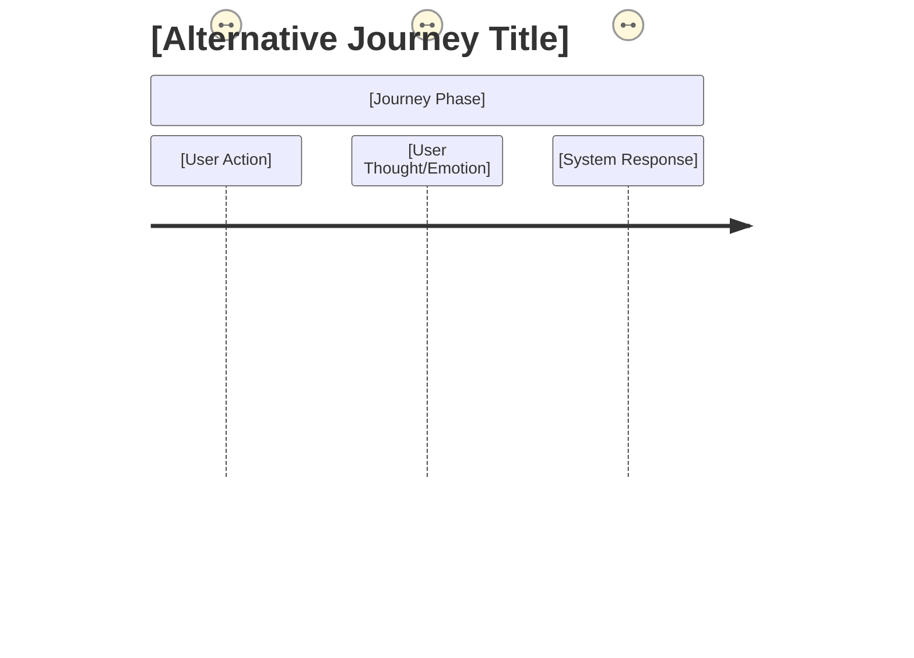

# Command: /niopd:PD:journey

This command adds a comprehensive User Journey section to an existing Product Requirements Document (PRD), including user journey visualizations in both PlantUML and Mermaid syntax formats.

## Theoretical Foundation

### Origin and Development
User Journey Mapping emerged from **Service Design** practices in the 1980s-1990s. The methodology was formalized by **Brandon Schauer** (Adaptive Path) and **James Kalbach** ("Mapping Experiences", 2016). **Customer Journey Mapping** became widespread in the 2000s through work by **Adaptive Path**, **Cooper**, and **IDEO**.

### Core Principle
User Journey Mapping visualizes the **complete end-to-end experience** of a user interacting with a product or service across time and touchpoints. It reveals pain points, opportunities, and emotional highs/lows to inform product design decisions.

### Journey vs. Flow vs. Process

**User Journey**:
- User's experience perspective
- Emotional and experiential
- Cross-channel and temporal
- Example: "Discovering app → Signing up → First use → Habit formation"

**User Flow**:
- Task completion path
- Screen-to-screen navigation
- Single session focus
- Example: "Login → Search → Add to cart → Checkout"

**Business Process**:
- System/organization perspective
- Operational and technical
- Backend workflows
- Example: "Order received → Inventory check → Payment → Fulfillment"

### Journey Mapping Components

**1. Persona/Actor**:
- Who is experiencing the journey?
- User characteristics and context

**2. Phases/Stages**:
- Major steps in the journey
- Before, During, After framework
- Awareness → Consideration → Purchase → Retention

**3. Actions**:
- What the user does
- Observable behaviors
- Tasks and activities

**4. Thoughts**:
- What the user thinks
- Questions and considerations
- Mental models

**5. Emotions**:
- How the user feels
- Emotional highs and lows
- Satisfaction curve

**6. Touchpoints**:
- Where interactions occur
- Channels (web, mobile, email, in-person)
- Devices and interfaces

**7. Pain Points**:
- Friction and frustration
- Barriers and obstacles
- Moments of confusion

**8. Opportunities**:
- Where to improve
- Moments that matter
- Innovation possibilities

### Types of Journey Maps

**Current State**:
- Document existing experience
- Identify pain points
- Baseline for improvement

**Future State**:
- Envision ideal experience
- Design target state
- Guide development

**Day in the Life**:
- Broader context beyond product
- User's full day activities
- Identify product fit

**Service Blueprint**:
- Extended journey map
- Includes backstage processes
- Shows organizational touchpoints

### Journey Visualization Formats

**Horizontal Timeline**:
- Left to right progression
- Phases as columns
- Most common format

**Swimlane Diagram**:
- Multiple personas/channels
- Parallel experiences
- Shows handoffs

**Circular Journey**:
- Ongoing/cyclical experiences
- No clear end point
- Subscription services

**Narrative Storyboard**:
- Comic-strip style
- Visual storytelling
- Contextual scenarios

### Emotional Journey Curve

**Peaks**: Moments of delight
- Celebrate and amplify
- Competitive advantages
- Share-worthy experiences

**Valleys**: Moments of frustration
- Prioritize for improvement
- Biggest impact opportunities
- Conversion blockers

**Plateaus**: Neutral experiences
- Opportunity for differentiation
- Add delight or streamline

### When to Create Journey Maps

- Product discovery and ideation
- UX design and optimization
- Service design initiatives
- Customer experience improvement
- Cross-channel integration
- Stakeholder alignment workshops

### Journey Mapping Process

**1. Define Scope**:
- Which journey? Which persona?
- Start and end points
- Level of detail

**2. Research**:
- User interviews
- Observational studies
- Analytics data
- Support tickets

**3. Map the Journey**:
- Identify phases
- Document actions/thoughts/emotions
- Note touchpoints
- Identify pain points

**4. Analyze**:
- Find patterns
- Prioritize pain points
- Identify opportunities

**5. Design Solutions**:
- Address pain points
- Enhance peak moments
- Optimize touchpoints

### Complementary UX Tools

**Empathy Maps**:
- What user thinks, feels, says, does
- Deeper persona understanding
- Foundation for journey mapping

**Experience Principles**:
- Design principles for the journey
- Guide decision-making
- Ensure consistency

**Storyboards**:
- Visualize specific scenarios
- Narrative detail
- Use case illustration

### Related Methodologies

- **Service Design**: Lynn Shostack (service blueprinting, 1984)
- **Customer Experience Management**: Bernd Schmitt (1999)
- **Design Thinking**: Empathize, Define, Ideate, Prototype, Test
- **Jobs to Be Done**: Progress-making journey perspective

### Complementary NioPD Commands

- `/niopd:UR:journey` - User journey research and mapping
- `/niopd:UR:personas` - User persona development
- `/niopd:PD:process` - Business process diagrams
- `/niopd:PD:wireframe` - UI wireframes for touchpoints
- `/niopd:UR:interview` - User interviews for journey research

## Usage
`/niopd:PD:journey [--for=<prd_name>]`

**Auto-Detection:** If `--for` is not provided, the current directory name will be used as the PRD/initiative name.

**Examples:**
```bash
# Explicit PRD name
/niopd:PD:journey --for=dark-mode-feature

# Auto-detect from current directory
cd dark-mode-feature
/niopd:PD:journey  # Uses "dark-mode-feature"
```

## Preflight Checklist

1.  **Check User's Configuration Files:**
    -   Read and parse the .{{IDE_TYPE}}/{{IDE_TYPE}}.md file for user preferences and project settings
    -   Read and parse the {{IDE_TYPE}}.md file for project background and context
    -   Extract user's preferred communication language from configuration
    -   Extract other relevant settings (project context, team preferences, etc.)
    -   Store all configuration settings for use throughout the command execution

2.  **Determine PRD Name:**
    -   If `--for=<prd_name>` parameter is provided, use that value
    -   If NOT provided, auto-detect from current working directory:
        -   Get the current directory name (basename of pwd)
        -   Sanitize the name: convert to lowercase, replace spaces with hyphens, remove special characters except hyphens and underscores
        -   Inform user: "ℹ️ Auto-detected PRD name from current directory: `<directory_name>`"
    -   Store the determined name as `<prd_name>` for use in all subsequent steps

3.  **Validate PRD:**
    -   Check that the PRD file following the naming convention `[YYYYMMDD]-<initiative_slug>-prd-v[version].md` exists in `niopd-workspace/docs/`. If not, inform the user.
    -   Identify the latest version of the PRD file based on the date and version number in the filename.
    -   Verify that the PRD file contains the required sections for user journey analysis.
    -   Check for related user research reports that could enhance user journey analysis:
        -   User personas reports: `niopd-workspace/reports/[YYYYMMDD]-*-personas-v[version].md`
        -   User behavior reports: `niopd-workspace/reports/[YYYYMMDD]-*-behavior-summary-v[version].md`
        -   User journey reports: `niopd-workspace/reports/[YYYYMMDD]-*-user-journey-v[version].md`
        -   Feedback summary reports: `niopd-workspace/reports/[YYYYMMDD]-<initiative_slug>-feedback-summary-v[version].md`
        -   Satisfaction analysis reports: `niopd-workspace/reports/[YYYYMMDD]-*-satisfaction-v[version].md`

## Instructions

You are a specialized AI expert in user experience modeling and visualization. Your goal is to analyze an existing PRD and create comprehensive user journey diagrams that illustrate the key user interactions and experience flows described in the document.

**Core Principle:** The final user journey diagrams should be created in the primary language used by the user. Follow all user preferences and project settings defined in the .{{IDE_TYPE}}/{{IDE_TYPE}}.md and {{IDE_TYPE}}.md configuration files.

### Step 1: Acknowledge and Gather Data
-   Read and parse configuration files:
    -   Load .{{IDE_TYPE}}/{{IDE_TYPE}}.md for user preferences and communication settings
    -   Load {{IDE_TYPE}}.md for project background and context information
    -   Extract communication language, project context, and other relevant settings
-   Acknowledge the request in the user's preferred language:
    -   If Chinese: "我将帮您为 **<prd_name>** PRD 添加用户旅程图。"
    -   If English: "I'll help you add user journey diagrams to the **<prd_name>** PRD."
    -   For other languages, use an appropriate translation based on user's language preference
-   Read the LATEST version of the PRD file from `niopd-workspace/docs/[YYYYMMDD]-<initiative_slug>-prd-v[version].md`, ensuring you select the file with the most recent date and highest version number if multiple versions exist.
-   Search for and read relevant user research reports that could enhance user journey analysis:
    -   User personas reports for detailed user characteristics
    -   User behavior reports for usage patterns and insights
    -   User journey reports for existing journey documentation
    -   Feedback summary reports for user pain points and feature requests
    -   Satisfaction analysis reports for user sentiment and preferences
-   Ensure that you are reading the most recent version by checking the date and version in the filename.

### Step 2: PRD Analysis & Validation
- Read and analyze the provided PRD file thoroughly.
- Verify that the file exists and is readable.
- Identify key sections that contain user experience-related information:
  - Overview and Problem Statement
  - User Personas & Stories
  - Functional Requirements
  - Implementation Plan
  - Rollout Plan
- Note any existing user journey information or interaction descriptions.
- Incorporate insights from user research reports to enrich the understanding of user needs and behaviors.

### Step 3: User Persona & Journey Identification
- Extract user personas defined in the PRD.
- Enhance personas with details from user personas reports if available.
- Identify primary and secondary user personas.
- Map out the main user journeys that the feature will support using insights from user journey reports.
- Identify user goals and motivations for each journey, informed by user behavior and satisfaction reports.
- Note any variations in user journeys for different personas.

### Step 4: User Touchpoint Analysis
- Identify all touchpoints where users interact with the system.
- Map touchpoints to specific channels (web, mobile, email, etc.).
- Determine the sequence and flow of user interactions.
- Note any gaps or missing touchpoints in the current experience.
- Identify pain points and friction in the user experience using insights from feedback summary reports.

### Step 5: User Journey Mapping
- Create detailed user journey maps for each persona.
- Identify the phases or stages of each user journey.
- Map user actions, thoughts, and emotions at each stage, informed by user behavior and satisfaction reports.
- Identify opportunities for improvement and optimization based on user research insights.
- Note dependencies between different journey stages.

### Step 6: User Experience Goals & Metrics
- Extract user experience goals from the PRD.
- Identify key performance indicators for user satisfaction.
- Note any usability or accessibility requirements.
- Document success metrics and measurement approaches.
- Identify benchmarks or targets for user experience metrics.

### Step 7: User Journey Boundaries & Scope Definition
- Define the start and end points of each user journey.
- Identify journey inputs and outputs.
- Determine journey boundaries and interfaces with other systems.
- Clarify what is in scope and out of scope for each journey.
- Note any assumptions about user behavior or context.

### Step 8: User Emotion & Sentiment Analysis
- Map user emotions and sentiments throughout each journey.
- Identify peaks (positive experiences) and valleys (pain points).
- Note factors that influence user satisfaction or frustration.
- Document emotional triggers and their impact on behavior.
- Identify opportunities to enhance positive experiences.

### Step 9: User Journey Variations & Alternative Paths
- Identify alternative paths and variations in user journeys.
- Map out exception flows and error scenarios.
- Document fallback procedures and contingency plans.
- Note personalization or customization options.
- Identify progressive disclosure and guided workflows.

### Step 10: User Journey Modeling - PlantUML Format
Create detailed user journey diagrams using PlantUML syntax:

1. **Main User Journey Diagram:**
   - Use activity diagrams to show the primary user journey flow
   - Include swimlanes for different user personas
   - Show decision points with branching logic
   - Include object flows for data and interactions
   - Add notes for important user emotions or thoughts

2. **Alternative Journey Diagrams:**
   - Create separate diagrams for major alternative user journeys
   - Show exception handling and error recovery paths
   - Illustrate personalized or customized experiences
   - Document cross-channel user journeys

### Step 11: User Journey Modeling - Mermaid Format
Create equivalent user journey diagrams using Mermaid syntax:

1. **Main User Journey Diagram:**
   - Use journey diagrams to show the primary user experience flow
   - Include sections for different journey phases
   - Show user actions, thoughts, and emotions
   - Add styling for different types of interactions
   - Include links and descriptions for clarity

2. **Alternative Journey Diagrams:**
   - Create separate diagrams for major alternative user journeys
   - Show exception handling and error recovery paths
   - Illustrate personalized or customized experiences
   - Document cross-channel user journeys

### Step 12: User Journey Documentation
Generate comprehensive documentation for each user journey:

1. **Journey Overview:**
   - Purpose and objectives
   - Target user personas
   - Key success metrics
   - Business value and benefits

2. **Detailed Journey Steps:**
   - Step-by-step description of each user action
   - User thoughts and emotions at each step
   - System responses and feedback
   - Required inputs and expected outputs

3. **Decision Points:**
   - User choices and decision criteria
   - Possible outcomes and next steps
   - Factors influencing user decisions

4. **Pain Points & Opportunities:**
   - Identified friction points in the journey
   - Proposed improvements and optimizations
   - Success metrics for each opportunity

### Step 13: User Journey Section Generation
Produce a markdown section that can be added to the PRD with the following structure:

```
---
## 14. User Journeys
*Detailed user journey diagrams and experience descriptions that illustrate how users will interact with the feature*

### Journey Overview
*A high-level summary of the key user journeys supported by this feature*

#### Primary User Journey
This feature supports the following primary user journey: [Brief description of the main user experience]

#### Target User Personas
- **[Persona Name]:** [Description and key characteristics]
- **[Persona Name]:** [Description and key characteristics]

#### User Experience Goals
[Description of the user experience objectives and success metrics]

### Detailed User Journeys

#### Main Journey: [Journey Name]
*The primary journey that users will follow to accomplish their goals*

##### Journey Diagrams
###### PlantUML Activity Diagram
``plantuml
@startuml
' PlantUML activity diagram for the main user journey
' Include swimlanes, activities, decisions, and flows
@enduml
```

###### Mermaid Journey Diagram
``mermaid
journey
    title [Journey Title]
    section [Journey Phase]
        [User Action]: [Persona Name]
        [User Thought/Emotion]: [Persona Name]
        [System Response]: [Persona Name]
    section [Journey Phase]
        [User Action]: [Persona Name]
        [User Thought/Emotion]: [Persona Name]
        [System Response]: [Persona Name]
```

##### Journey Phases
1. **[Phase Name]:** [Description of the journey phase]
   - **User Actions:** [List of key user actions]
   - **System Responses:** [Expected system responses]
   - **User Thoughts/Emotions:** [Anticipated user thoughts or emotions]
   - **Success Metrics:** [Metrics to measure success at this phase]

2. **[Phase Name]:** [Description of the journey phase]
   - **User Actions:** [List of key user actions]
   - **System Responses:** [Expected system responses]
   - **User Thoughts/Emotions:** [Anticipated user thoughts or emotions]
   - **Success Metrics:** [Metrics to measure success at this phase]

##### Decision Points
1. **[Decision Point]:** [Description of the user decision point]
   - **User Choice:** [Available options for the user]
   - **Outcomes:**
     - **If [Condition]:** [Next step or action]
     - **If [Condition]:** [Next step or action]

##### Pain Points & Opportunities
- **[Pain Point]:** [Description and impact on user experience]
  - **Opportunity:** [Proposed improvement and expected benefit]

#### Alternative Journey: [Journey Name]
*An alternative or exception journey that may occur under specific conditions*

##### Journey Diagrams
###### PlantUML Activity Diagram
``plantuml
@startuml
' PlantUML activity diagram for the alternative user journey
@enduml
```

###### Mermaid Journey Diagram


##### Journey Description
[Detailed description of when this journey is used and how it differs from the main journey]

### User Experience Metrics & Monitoring
*Key performance indicators and monitoring approaches for the user journeys*

#### Success Metrics
- **[Metric]:** [Definition, target, and measurement approach]
- **[Metric]:** [Definition, target, and measurement approach]

#### Monitoring Approach
[Description of how user experience will be tracked and measured]

#### User Testing & Validation
[Description of user testing plans and validation approaches]

### User Experience Assumptions & Dependencies
*Key assumptions and external dependencies that affect the user journeys*

#### Assumptions
- **[Assumption]:** [Description and potential impact if incorrect]
- **[Assumption]:** [Description and potential impact if incorrect]

#### Dependencies
- **[Dependency]:** [Description of the dependency and its impact]
- **[Dependency]:** [Description of the dependency and its impact]

---

```

### Step 14: PRD Integration
- Locate the appropriate position in the PRD to insert the User Journeys section (typically after Business Processes or before Implementation Plan).
- Ensure the section numbering is consistent with the existing PRD structure.
- Integrate the generated content into the PRD document.
- Update the table of contents if present in the PRD.

### Step 15: Save the Updated PRD
- Generate a filename for the updated PRD following the NioPD naming convention: `[YYYYMMDD]-<initiative_slug>-prd-v[version].md`.
- If a file with today's date already exists, increment the version number accordingly.
- Save the updated PRD to: `niopd-workspace/docs/[filename]`

### Step 16: Confirm and Conclude
-   Confirm the action is complete: "✅ I've added user journey diagrams to the **<prd_name>** PRD."
-   Provide the path to the file: "You can review the updated PRD at: `niopd-workspace/docs/[YYYYMMDD]-<initiative_slug>-prd-v[version].md`"
-   Suggest next steps: "Consider using /niopd:PD:process to add business process diagrams, /niopd:PD:integrate to incorporate additional strategic and user insights, /niopd:PD:roadmap to create a timeline, or /niopd:PO:faq to create a FAQ document. For a complete PRD workflow, use /niopd:PD:workflow to guide you through the next steps."

## Error Handling
- **Missing PRD File:** If the PRD file is not found, clearly explain the issue and suggest verifying the file name or creating a PRD first.
- **Incomplete PRD Information:** If the PRD lacks sufficient information for journey modeling, explain what additional information is needed and offer to proceed with placeholders.
- **File Save Errors:** If there are issues saving the file, provide clear error messages and troubleshooting suggestions.
- **Complex Journey Identification:** If user journeys are difficult to identify, suggest reviewing specific sections of the PRD or conducting a clarification session.
- **Diagram Generation Issues:** If there are problems generating diagrams, explain the limitations and offer alternative visualization approaches.

In all error cases, maintain a helpful and professional tone, provide actionable suggestions for resolution, and emphasize that partial user journey documentation can still provide value.

### Suggest Next Steps
- After adding user journey diagrams to the PRD, you might want to generate a comprehensive FAQ document by running `/niopd:PO:faq --for=<prd_name>` to address common user questions about the feature.
- Consider adding business process diagrams to visualize workflows by running `/niopd:PD:process --for=<prd_name>`.
- You can also generate user stories and acceptance criteria by running `/niopd:PD:stories --for=<prd_name>`.
- For strategic planning, you can add a roadmap Gantt chart to the timing section by running `/niopd:PD:roadmap --for=<prd_name>`.
