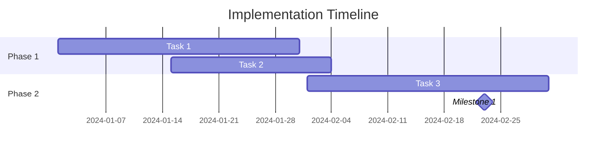

# Command: /niopd:PD:roadmap

This command adds a Gantt chart to the timing section of an existing Product Requirements Document (PRD), using PlantUML or Mermaid text-based diagramming.

## Theoretical Foundation

### Origin and Development
The Gantt chart was invented by **Karol Adamiecki** (Poland, 1896) and independently developed by **Henry Gantt** (USA, 1910-1915) for project scheduling in manufacturing. It became the standard project management visualization tool, integrated into modern methodologies by the **Project Management Institute (PMI)** and adapted for Agile with tools like roadmapping.

### Core Principle
A Gantt chart is a **bar chart that visualizes project schedules** over time, showing task duration, sequencing, dependencies, and milestones. It answers "What needs to be done, when, and in what order?" providing a timeline view of project execution.

### Gantt Chart vs. Roadmap vs. Timeline

**Gantt Chart**:
- **Detailed task scheduling**: Specific dates and durations
- **Dependencies**: Task relationships (finish-to-start, etc.)
- **Resource allocation**: Who does what
- **Use**: Project execution planning

**Product Roadmap**:
- **Strategic themes**: High-level initiatives
- **Flexible timing**: Quarters, not specific dates
- **Outcome-focused**: Goals, not tasks
- **Use**: Strategic communication

**Timeline**:
- **Sequential events**: Chronological order
- **Milestones**: Key dates and deliverables
- **No dependencies**: Simple progression
- **Use**: High-level planning

### Essential Gantt Chart Elements

**1. Tasks/Activities**:
- Bars representing work items
- Length = duration
- Position = start/end dates

**2. Timeline (X-Axis)**:
- Days, weeks, months, quarters
- Calendar dates or relative time
- Work days vs. calendar days

**3. Task List (Y-Axis)**:
- Work breakdown structure
- Hierarchical grouping
- Phases and sub-tasks

**4. Milestones**:
- Zero-duration markers (diamonds)
- Key deliverables or gates
- Decision points

**5. Dependencies**:
- Arrows connecting tasks
- Finish-to-Start (FS): B starts after A finishes
- Start-to-Start (SS): B starts when A starts
- Finish-to-Finish (FF): B finishes when A finishes
- Start-to-Finish (SF): B finishes when A starts (rare)

**6. Progress Indicators**:
- Percentage complete
- Actual vs. planned
- Behind/on/ahead of schedule

**7. Resource Assignment**:
- Who is responsible
- Resource availability
- Workload distribution

### Critical Path Method (CPM)

**Critical Path**:
- Longest sequence of dependent tasks
- Determines minimum project duration
- Tasks with zero slack/float
- Delays on critical path delay entire project

**Slack/Float**:
- Time a task can be delayed without affecting project
- **Total Float**: Delay without affecting project end
- **Free Float**: Delay without affecting next task

### Product Roadmap Principles

**Outcome-Oriented** (Marty Cagan, Teresa Torres):
- Focus on outcomes, not features
- "Increase engagement" not "Build notification system"
- Measurable results

**Theme-Based**:
- Group related initiatives
- Strategic pillars
- Easier to adjust than feature commitments

**Time-Horizons**:
- **Now** (0-3 months): High confidence, committed
- **Next** (3-6 months): Medium confidence, planned
- **Later** (6-12+ months): Low confidence, aspirational

**Flexible Timing**:
- Quarters, not exact dates
- Adapt based on learning
- Avoid over-committing

### Roadmap Types

**1. Internal Engineering Roadmap**:
- Detailed feature list
- Technical dependencies
- Sprint planning aligned
- For: Engineering teams

**2. External Customer Roadmap**:
- Strategic themes
- Benefits-focused
- Rough timeframes
- For: Customers, prospects

**3. Executive/Board Roadmap**:
- High-level initiatives
- Business impact
- Resource requirements
- For: Leadership, investors

**4. Sales/Marketing Roadmap**:
- Feature launches
- Messaging angles
- Competitive positioning
- For: GTM teams

### Agile and Roadmapping

**Tension with Agile Principles**:
- Agile values "responding to change"
- Roadmaps imply commitments
- **Resolution**: Outcome-based, flexible roadmaps

**SAFe PI Planning**:
- Program Increment (8-12 weeks)
- Fixed cadence
- Feature-based roadmap
- Regular sync points

**OKR-Driven Roadmaps**:
- Objectives as themes
- Key Results as milestones
- Quarterly rhythm

### Timeline Estimation Techniques

**Top-Down Estimation**:
- Expert judgment
- Analogous estimation (similar past projects)
- Parametric estimation (metrics-based)

**Bottom-Up Estimation**:
- Task-level estimates
- Sum to project total
- More accurate, more effort

**Three-Point Estimation (PERT)**:
- **Optimistic** (O): Best case
- **Most Likely** (M): Expected
- **Pessimistic** (P): Worst case
- **Expected** = (O + 4M + P) / 6

**Story Points** (Agile):
- Relative sizing (Fibonacci: 1, 2, 3, 5, 8, 13)
- Velocity-based planning
- Avoids false precision

### When to Use Gantt Charts vs. Roadmaps

**Use Gantt Charts When**:
- Fixed deadline projects
- Clear task dependencies
- Resource allocation needed
- Detailed execution planning
- Waterfall or hybrid approaches

**Use Product Roadmaps When**:
- Strategic communication
- Uncertain timelines
- Outcome-focused planning
- External stakeholders
- Agile environments

### Best Practices

**Gantt Charts**:
- Include buffer time (Murphy's Law)
- Update regularly (at least weekly)
- Highlight critical path
- Show progress visually
- Don't over-detail (task < 1 day too granular)

**Product Roadmaps**:
- Tie to company strategy
- Make trade-offs explicit
- Update quarterly
- Version and date roadmaps
- Use themes over features

### Related PM Concepts

- **WBS (Work Breakdown Structure)**: Hierarchical task decomposition
- **PERT Chart**: Network diagram showing dependencies
- **Burndown Chart**: Agile progress tracking
- **Kanban Board**: Work-in-progress visualization

### Complementary NioPD Commands

- `/niopd:PM:release` - Release planning and scheduling
- `/niopd:PM:kpis` - Track roadmap progress
- `/niopd:PD:stories` - User stories for roadmap items
- `/niopd:ST:moscow` - Prioritize roadmap features
- `/niopd:ST:rice` - Score and prioritize initiatives

## Usage
`/niopd:PD:roadmap [--for=<prd_name>]`

**Auto-Detection:** If `--for` is not provided, the current directory name will be used as the PRD/initiative name.

**Examples:**
```bash
# Explicit PRD name
/niopd:PD:roadmap --for=dark-mode-feature

# Auto-detect from current directory
cd dark-mode-feature
/niopd:PD:roadmap  # Uses "dark-mode-feature"
```

## Preflight Checklist

1.  **Check User's Configuration Files:**
    -   Read and parse the .{{IDE_TYPE}}/{{IDE_TYPE}}.md file for user preferences and project settings
    -   Read and parse the {{IDE_TYPE}}.md file for project background and context
    -   Extract user's preferred communication language from configuration
    -   Extract other relevant settings (project context, team preferences, etc.)
    -   Store all configuration settings for use throughout the command execution

2.  **Determine PRD Name:**
    -   If `--for=<prd_name>` parameter is provided, use that value
    -   If NOT provided, auto-detect from current working directory:
        -   Get the current directory name (basename of pwd)
        -   Sanitize the name: convert to lowercase, replace spaces with hyphens, remove special characters except hyphens and underscores
        -   Inform user: "ℹ️ Auto-detected PRD name from current directory: `<directory_name>`"
    -   Store the determined name as `<prd_name>` for use in all subsequent steps

3.  **Validate PRD:**
    -   Check that the PRD file following the naming convention `[YYYYMMDD]-<initiative_slug>-prd-v[version].md` exists in `niopd-workspace/docs/`. If not, inform the user.
    -   Identify the latest version of the PRD file based on the date and version number in the filename.
    -   Verify that the PRD file contains a timing section where the roadmap can be added.
    -   Check for related project management reports that could enhance roadmap planning:
        -   Project update reports: `niopd-workspace/reports/[YYYYMMDD]-*-update-v[version].md`
        -   KPI tracking reports: `niopd-workspace/reports/[YYYYMMDD]-*-kpis-v[version].md`
        -   Release planning reports: `niopd-workspace/reports/[YYYYMMDD]-*-release-plan-v[version].md`

## Instructions

You are a specialized AI expert in product planning and timeline visualization. Your goal is to analyze an existing PRD and add a comprehensive Gantt chart to the timing section that illustrates the implementation timeline and milestones described in the document.

**Core Principle:** The final roadmap documentation should be created in the primary language used by the user. Follow all user preferences and project settings defined in the .{{IDE_TYPE}}/{{IDE_TYPE}}.md and {{IDE_TYPE}}.md configuration files.

### Step 1: Acknowledge and Gather Data
-   Read and parse configuration files:
    -   Load .{{IDE_TYPE}}/{{IDE_TYPE}}.md for user preferences and communication settings
    -   Load {{IDE_TYPE}}.md for project background and context information
    -   Extract communication language, project context, and other relevant settings
-   Acknowledge the request in the user's preferred language:
    -   If Chinese: "我将帮您为 **<prd_name>** PRD 的时间节奏部分添加路线图甘特图。"
    -   If English: "I'll help you add a roadmap Gantt chart to the timing section of the **<prd_name>** PRD."
    -   For other languages, use an appropriate translation based on user's language preference
-   Read the LATEST version of the PRD file from `niopd-workspace/docs/[YYYYMMDD]-<initiative_slug>-prd-v[version].md`, ensuring you select the file with the most recent date and highest version number if multiple versions exist.
-   Search for and read relevant project management reports that could enhance roadmap planning:
    -   Project update reports for current status and progress
    -   KPI tracking reports for performance metrics
    -   Release planning reports for deployment schedules
-   Ensure that you are reading the most recent version by checking the date and version in the filename.
-   Check for existing roadmap files in `niopd-workspace/docs/` that might be related to this PRD.

### Step 2: PRD Analysis & Validation
- Read and analyze the provided PRD file thoroughly.
- Verify that the file exists and is readable.
- Locate the timing section (时间节奏 or similar) in the PRD.
- If no timing section exists, identify the most appropriate section to add the roadmap (typically Implementation Plan or Rollout Plan).
- Identify key sections that contain timeline-related information:
  - Overview and Problem Statement
  - Implementation Plan
  - Rollout Plan
  - Success Metrics
  - Risk Assessment
- Note any existing timeline information or milestone descriptions.
- Incorporate insights from project management reports to enhance timeline planning.

### Step 3: Timing Section Enhancement
- If a timing section already exists, prepare to enhance it with Gantt charts.
- If no timing section exists, create one in the appropriate location.
- Extract implementation phases and development stages from the PRD.
- Identify key milestones and deliverables mentioned in the document.
- Map out the expected timeline and duration for each phase.
- Note any dependencies between different phases or milestones.
- Enhance timeline planning with insights from KPI tracking reports.

### Step 4: Resource & Dependency Analysis
- Extract resource requirements from the PRD.
- Identify team dependencies and external factors.
- Note any constraints that might affect the timeline.
- Map out parallel work streams and concurrent activities.
- Identify risks that could impact the schedule.
- Enhance dependency analysis with insights from project update reports.

### Step 5: Roadmap Structure Definition
- Define the overall structure of the roadmap.
- Identify major themes or epics if mentioned in the PRD.
- Group related features or deliverables into logical categories.
- Determine the appropriate time granularity (weeks, months, quarters).
- Define the start and end dates for the roadmap.

### Step 6: Milestone & Deliverable Mapping
- Map all key milestones to specific dates or time periods.
- Identify major deliverables and their expected completion dates.
- Note any external dependencies or approvals required.
- Document any go/no-go decision points.
- Identify release dates and deployment schedules.

### Step 7: Roadmap Visualization - PlantUML or Mermaid Format
Create detailed roadmap Gantt charts using either PlantUML or Mermaid syntax:

1. **Main Roadmap Gantt Chart:**
   - Use Gantt diagrams to show the overall project timeline
   - Include sections for different phases or work streams
   - Show milestone markers and important dates
   - Include dependencies between tasks (for PlantUML)
   - Add styling for different task types and priorities

2. **Alternative Timeline Views:**
   - Create separate diagrams for different scenarios or phases
   - Show resource allocation and team assignments
   - Document critical path items

### Step 8: Timing Section Enhancement
Enhance the PRD's timing section with the generated Gantt charts:

---
### Timing Rhythm (时间节奏)
*Detailed timeline and Gantt chart that illustrates the implementation plan for this feature*

#### PlantUML Gantt Chart
``plantuml
@startgantt
' PlantUML Gantt chart for the implementation timeline
' Include project title, timeline scale, and task definitions
' Example structure:
' Project starts 2024-01-01
' [Task] starts 2024-01-01 and lasts 30 days
' [Milestone] happens at 2024-01-31
@endgantt
```

#### Mermaid Gantt Chart


#### Implementation Timeline
The implementation of this feature is planned to take approximately [duration] from [start date] to [end date].

#### Key Milestones
1. **[Milestone Name]:** [Target Date] - [Description]
2. **[Milestone Name]:** [Target Date] - [Description]

#### Dependencies
- **[Task A]** depends on **[Task B]**
- **[Task C]** can be done in parallel with **[Task D]**

---

### Step 9: Save the Updated PRD
- Generate a filename for the updated PRD following the NioPD naming convention: `[YYYYMMDD]-<initiative_slug>-prd-v[version].md`.
- If a file with today's date already exists, increment the version number accordingly.
- Save the updated PRD to: `niopd-workspace/docs/[filename]`

### Step 10: Confirm and Conclude
-   Confirm the action is complete: "✅ I've added a roadmap Gantt chart to the timing section of the **<prd_name>** PRD."
-   Provide the path to the file: "You can review the updated PRD at: `niopd-workspace/docs/[YYYYMMDD]-<initiative_slug>-prd-v[version].md`"
-   Suggest next steps: "Consider using /niopd:PO:stakeholder-update to generate project updates, /niopd:PM:kpis to track implementation progress, /niopd:PD:integrate to incorporate additional strategic insights, or /niopd:PO:faq to create a FAQ document. For a complete PRD workflow, use /niopd:PD:workflow to guide you through the next steps."

## Error Handling
- **Missing PRD File:** If the PRD file is not found, clearly explain the issue and suggest verifying the file name or creating a PRD first.
- **Incomplete PRD Information:** If the PRD lacks sufficient information for roadmap creation, explain what additional information is needed and offer to proceed with placeholders.
- **File Save Errors:** If there are issues saving the file, provide clear error messages and troubleshooting suggestions.
- **Complex Timeline Identification:** If the implementation timeline is difficult to identify, suggest reviewing specific sections of the PRD or conducting a clarification session.
- **Diagram Generation Issues:** If there are problems generating diagrams, explain the limitations and offer alternative visualization approaches.

In all error cases, maintain a helpful and professional tone, provide actionable suggestions for resolution, and emphasize that partial roadmap documentation can still provide value.

### Suggest Next Steps
- After adding the roadmap Gantt chart to the PRD, you might want to generate a comprehensive project update report by running `/niopd:PO:stakeholder-update --for=<initiative_name>` to communicate progress to stakeholders.
- Consider tracking project KPIs by running `/niopd:PM:kpis --for=<initiative_name>` to monitor the implementation progress.
- You can also generate a comprehensive FAQ document by running `/niopd:PO:faq --for=<prd_name>` to address common questions about the feature timeline.
- For detailed task breakdown, you might want to generate user stories and acceptance criteria by running `/niopd:PD:stories --for=<prd_name>`.
