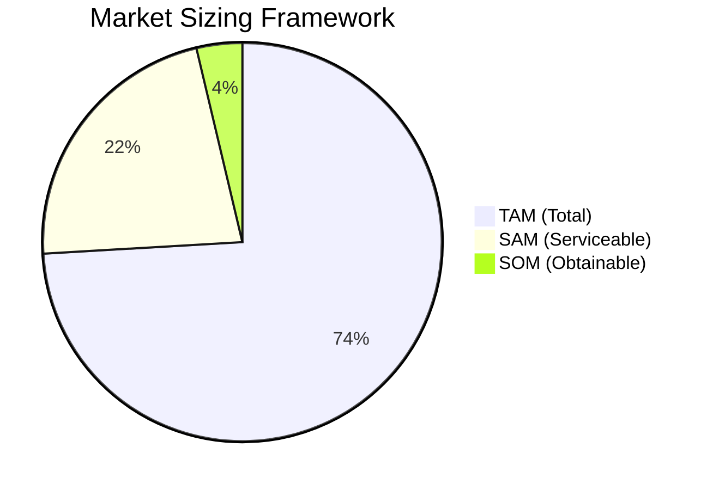

# Market Opportunity Analysis Skill

This skill provides rigorous market sizing and opportunity analysis using the TAM/SAM/SOM framework to quantify addressable markets.

## Theoretical Foundation

### TAM/SAM/SOM Framework

| Metric | Definition | Question |
|--------|------------|----------|
| **TAM** | Total Addressable Market | How big is the universe? |
| **SAM** | Serviceable Addressable Market | What can we reach? |
| **SOM** | Serviceable Obtainable Market | What can we realistically capture? |

### Sizing Approaches
1. **Top-Down**: Start with industry data, narrow down
2. **Bottom-Up**: Build from unit economics and segments
3. **Value Theory**: Calculate value created for customers

### When to Use
- New product evaluation
- Investor presentations
- Market entry decisions
- Strategic planning
- Resource allocation

## Instructions

### Step 1: Configuration
1. Read `.claude/AGENTS.md` for preferences
2. Identify product/service to analyze
3. Define geographic and temporal scope

### Step 2: Define Market Context
- What problem does the product solve?
- Who experiences this problem?
- What is the current spending in this area?

### Step 3: Calculate TAM
Research total market size:
- Industry reports and analyst data
- Government statistics
- Trade association data
- Calculate: Total potential customers × Average spend

### Step 4: Calculate SAM
Narrow to serviceable market:
- Geographic limitations
- Segment focus
- Distribution capabilities
- Technology requirements

### Step 5: Calculate SOM
Estimate realistic capture:
- Competitive intensity
- Go-to-market capability
- Time horizon (1-3 years)
- Historical benchmarks

### Step 6: Identify Market Gaps
Analyze opportunities:
- Underserved segments
- Unmet needs
- Competitive weaknesses
- Emerging trends

### Step 7: Generate Report
**File path**: `01-sources/[YYYYMMDD]-market-opportunity-v0.md`

**Contents:**
1. Executive Summary
2. Market Definition
3. TAM Analysis ($X, methodology)
4. SAM Analysis ($Y, rationale)
5. SOM Analysis ($Z, assumptions)
6. Market Dynamics
7. Competitive Landscape Summary
8. Key Opportunities
9. Risks and Limitations
10. Recommendations

## Output Specifications
- **File Naming**: `[YYYYMMDD]-market-opportunity-v0.md`
- **Location**: `01-sources/`
- **Template**: `references/market-opportunity-template.md`

## Related Skills
- `niopd-mr-competitor`: Competitive analysis
- `niopd-mr-segmentation`: Market segments
- `niopd-dt-scenarios`: Future market scenarios
- `niopd-st-canvas`: Business model fit
