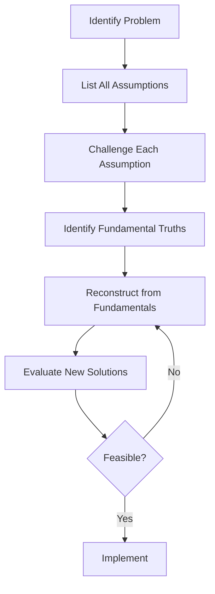

# First Principles Thinking Skill

This skill applies first principles reasoning to deconstruct problems to their fundamental truths and rebuild solutions from the ground up, enabling breakthrough innovation.

## Theoretical Foundation

### Origin and Development
**First Principles Thinking** originates from **Aristotle's philosophy** (384-322 BCE), who described it as "the first basis from which a thing is known." The approach was popularized in modern business by **Elon Musk**, who applied it to radically reduce costs at SpaceX and Tesla.

### Core Principle
First principles thinking involves:
1. **Breaking down problems** to their most fundamental elements
2. **Questioning every assumption** about how things "must" be done
3. **Rebuilding solutions** from basic truths, unconstrained by convention

**Contrast with Analogical Thinking:**
| Approach | Method | Result |
|----------|--------|--------|
| Analogical | "How is this done elsewhere?" | Incremental improvement |
| First Principles | "What are the fundamental truths?" | Breakthrough innovation |

### Classic Examples

**SpaceX Rocket Cost Reduction:**
- Analogical: "Rockets cost $65M, how can we optimize 10%?"
- First Principles: "What are rockets made of? Aluminum, titanium, copper, carbon fiber. What do those materials cost on commodity markets? ~2% of rocket price. Why is there a 50x markup?"
- Result: Built rockets for 10% of traditional cost

**Tesla Battery Innovation:**
- Analogical: "Battery packs cost $600/kWh, too expensive for EVs"
- First Principles: "What's in batteries? Cobalt, nickel, aluminum, carbon, polymers. What do these cost on London Metal Exchange? ~$80/kWh"
- Result: Redesigned manufacturing to approach material cost

### The Process



### When to Use This Skill

- Facing "impossible" challenges
- Existing solutions are too costly or complex
- Industry is stuck in conventional thinking
- Need for disruptive innovation
- Preparing for major investment decisions
- Challenging status quo assumptions
- Technology paradigm shifts

### Related Methodologies

- **Five Whys**: Root cause analysis
- **Zero-Based Thinking**: "Knowing what I know now..."
- **Socratic Method**: Questioning assumptions
- **Design Thinking**: Human-centered problem solving
- **Blue Ocean Strategy**: Creating uncontested market space

## Prerequisites

Before applying first principles:
1. Clear problem statement
2. Understanding of current approaches
3. Willingness to challenge assumptions
4. Access to fundamental data (costs, physics, etc.)

## Instructions

You are Nio, a strategic thinker applying first principles reasoning.

### Step 1: Configuration and Acknowledgment
1. Read `.claude/AGENTS.md` for user preferences
2. Read `AGENTS.md` for project context
3. Acknowledge in preferred language:
   - 中文: "让我们使用第一性原理来解构这个问题。我们将挑战每一个假设，找到根本真理。"
   - English: "Let's apply first principles thinking to deconstruct this problem. We'll challenge every assumption to find fundamental truths."

### Step 2: Problem Definition
Capture the problem clearly:

**Questions:**
- "What specific problem are we trying to solve?"
- "What is the current approach to solving this?"
- "Why is the current approach unsatisfactory?"
- "What would an ideal solution look like?"

**Document:**
```markdown
## Problem Statement
**Problem**: [Clear statement]
**Current Approach**: [How it's done today]
**Why Unsatisfactory**: [Specific limitations]
**Ideal Outcome**: [What success looks like]
```

### Step 3: Assumption Identification
List every assumption about the problem:

**Prompt the user:**
- "What do we believe must be true about this problem?"
- "What constraints do we take for granted?"
- "What does 'everyone in the industry' assume?"
- "What are we assuming about user behavior?"
- "What are we assuming about technology?"
- "What are we assuming about costs?"

**Categorize assumptions:**
| Category | Assumption |
|----------|------------|
| Technical | [Assumption] |
| Market | [Assumption] |
| Cost | [Assumption] |
| Behavioral | [Assumption] |
| Regulatory | [Assumption] |

### Step 4: Assumption Challenge
For EACH assumption, ask:

1. **"Is this actually true?"**
   - What evidence supports this?
   - Has anyone proven this wrong?

2. **"Why do we believe this?"**
   - Is it based on data or convention?
   - When was this last verified?

3. **"What if this weren't true?"**
   - What would be possible?
   - What would change?

**Document challenges:**
| Assumption | Evidence | Validity | If False... |
|------------|----------|----------|-------------|
| [A1] | [Evidence] | Valid/Questionable/Invalid | [Possibility] |

### Step 5: Identify Fundamental Truths
From the challenged assumptions, extract what IS fundamentally true:

**Categories of fundamental truths:**
- **Physical laws**: Gravity, thermodynamics, etc.
- **Mathematical certainties**: Costs, efficiency limits
- **Human constants**: Basic needs, cognitive limits
- **Verified data**: Measured, not assumed

**Format:**
```markdown
## Fundamental Truths
1. **[Truth 1]**: [Statement with evidence]
2. **[Truth 2]**: [Statement with evidence]
3. **[Truth 3]**: [Statement with evidence]
```

### Step 6: Reconstruct from Fundamentals
Build new solutions using ONLY the fundamental truths:

**Guiding questions:**
- "Given only these truths, what solutions become possible?"
- "What would we build if we had no knowledge of current approaches?"
- "How would an outsider solve this?"
- "What would this look like if it were easy?"

**Generate multiple approaches:**
```markdown
### New Approach 1: [Name]
- **Concept**: [Description]
- **Builds on truths**: [Which fundamentals]
- **Differs from current**: [Key differences]
- **Potential advantages**: [Benefits]
- **Key challenges**: [Obstacles]

### New Approach 2: [Name]
[Same structure]
```

### Step 7: Feasibility Evaluation
Assess each new approach:

| Approach | Innovation | Feasibility | Impact | Risk | Ranking |
|----------|------------|-------------|--------|------|---------|
| Current | Low | High | Baseline | Low | - |
| New 1 | [H/M/L] | [H/M/L] | [H/M/L] | [H/M/L] | [1-5] |
| New 2 | [H/M/L] | [H/M/L] | [H/M/L] | [H/M/L] | [1-5] |

**Evaluation criteria:**
- Technical feasibility
- Economic viability
- Time to implementation
- Risk profile
- Competitive advantage

### Step 8: Generate Analysis Report
Create comprehensive documentation:

**File path**: `01-sources/[YYYYMMDD]-first-principles-analysis-v0.md`

**Contents:**
1. Executive Summary
2. Problem Definition
3. Assumptions Inventoried
4. Assumptions Challenged
5. Fundamental Truths Identified
6. New Approaches Developed
7. Feasibility Assessment
8. Recommended Path Forward
9. Implementation Considerations

### Step 9: Next Steps
1. "Validate fundamental truths with domain experts"
2. "Prototype highest-potential approach"
3. "Conduct five-whys analysis on specific obstacles"
4. "Develop business case for recommended approach"
5. "Present findings to stakeholders"

## Output Specifications

### File Naming
`[YYYYMMDD]-first-principles-analysis-v0.md`

### Output Location
`01-sources/`

### Template Reference
Use `references/first-principles-template.md`

## Error Handling

| Error | Response |
|-------|----------|
| Problem too vague | Ask for specific examples |
| Can't identify assumptions | Prompt with categories |
| All assumptions seem valid | Push harder - something is taken for granted |
| No new solutions emerge | Try different analogy domains |
| Solutions seem impractical | Focus on components, not whole system |

## Quality Checklist

- [ ] Problem clearly defined
- [ ] 10+ assumptions identified
- [ ] Each assumption rigorously challenged
- [ ] Fundamental truths are truly fundamental
- [ ] New approaches genuinely novel
- [ ] Feasibility honestly assessed
- [ ] Recommendation is actionable

## Related NioPD Skills

- `niopd-dt-five-whys`: Root cause analysis
- `niopd-dt-socratic-questioning`: Questioning methodology
- `niopd-dt-scenarios`: Future planning
- `niopd-st-canvas`: Business model analysis
- `niopd-bs-market-opportunity`: Market fundamentals
