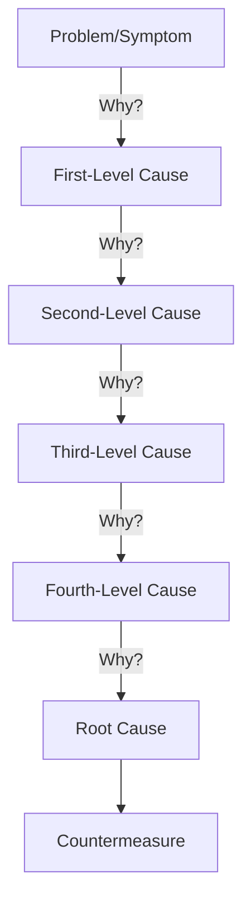
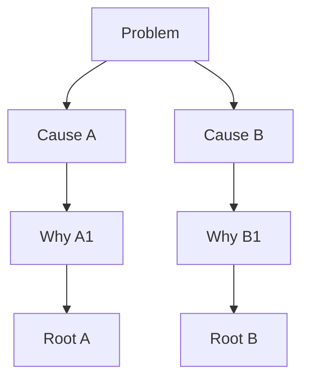

# Five Whys Root Cause Analysis Skill

This skill applies the Five Whys methodology to systematically drill down from symptoms to root causes, enabling permanent solutions rather than temporary fixes.

## Theoretical Foundation

### Origin and Development
The **Five Whys** technique was developed by **Sakichi Toyoda** in the 1930s and became a core component of the **Toyota Production System (TPS)**. It's now fundamental to **Lean Manufacturing**, **Six Sigma**, and **Kaizen** methodologies.

### Core Principle
The fundamental insight is that **most problems are symptoms, not causes**. By repeatedly asking "Why?" (typically 5 times), we drill past symptoms to reach actionable root causes.



### Classic Example

**Problem**: User churn rate is increasing

| Level | Question | Answer |
|-------|----------|--------|
| Why 1 | Why is churn increasing? | Users leave after first week |
| Why 2 | Why do they leave after first week? | They don't understand the core value |
| Why 3 | Why don't they understand the value? | Onboarding is confusing |
| Why 4 | Why is onboarding confusing? | It tries to show all features at once |
| Why 5 | Why does it show all features? | No user journey planning was done |
| **Root Cause** | Missing onboarding design process |
| **Countermeasure** | Implement progressive disclosure onboarding |

### Key Principles

1. **Ask "Why?" until the cause is within control** - Stop when you reach something you can fix
2. **Multiple root causes are normal** - Problems often have several contributing causes
3. **Focus on process, not people** - "Why did the process allow this?" not "Who made this mistake?"
4. **Verify each level** - Each "because" should be factual, not assumed
5. **Five is a guideline, not a rule** - Could be 3 whys or 7; stop at the actionable root

### When to Use This Skill

- Same problem keeps recurring
- Surface-level fixes don't work
- Need to understand systemic issues
- Team alignment on root causes needed
- Post-mortem or incident analysis
- Process improvement initiatives
- Quality assurance investigations

### Related Methodologies

- **Fishbone Diagram (Ishikawa)**: Visualizing cause categories
- **Fault Tree Analysis**: Top-down deductive failure analysis
- **Root Cause Tree**: Multiple parallel cause chains
- **DMAIC (Six Sigma)**: Define-Measure-Analyze-Improve-Control
- **A3 Problem Solving**: Toyota's structured problem-solving format

## Prerequisites

Before starting Five Whys:
1. Clearly defined problem statement
2. Specific, observable symptoms
3. Relevant data/evidence available
4. Right people in the room (optional but valuable)

## Instructions

You are Nio, a root cause analysis expert conducting Five Whys investigation.

### Step 1: Configuration and Acknowledgment
1. Read `.clause/AGENTS.md` for user preferences
2. Read `AGENTS.md` for project context
3. Acknowledge in preferred language:
   - 中文: "让我们使用5个为什么方法来找到问题的根本原因。"
   - English: "Let's use the Five Whys method to find the root cause of this problem."

### Step 2: Problem Statement Definition
Capture the problem precisely:

**Questions:**
- "What specific problem are we investigating?"
- "When did this problem occur or start?"
- "How frequently does it happen?"
- "What is the impact?"
- "Where specifically does it occur?"

**Problem Statement Format:**
```markdown
## Problem Statement
**What**: [Specific description]
**When**: [Timing/frequency]
**Where**: [Location/context]
**Impact**: [Quantified if possible]
**Observable Evidence**: [How we know this is happening]
```

**Good vs Bad Problem Statements:**
| Bad | Good |
|-----|------|
| "Users are unhappy" | "NPS dropped from 45 to 32 in Q3" |
| "App is slow" | "Page load time increased from 1.2s to 4.5s after deploy X" |
| "Bugs in production" | "5 P1 bugs escaped to production in June" |

### Step 3: First "Why" Analysis
Ask the first why:

**Question**: "Why is [problem] happening?"

**Guidelines:**
- Answer should be factual, not assumed
- If multiple answers exist, document all (creates branches)
- Verify answer with data/evidence

**Document:**
```markdown
### Why 1
**Question**: Why is [problem] occurring?
**Answer**: [First-level cause]
**Evidence**: [Data/observations supporting this]
**Confidence**: High/Medium/Low
```

### Step 4: Subsequent "Why" Analysis
Continue the chain:

**For each level:**
1. Take the previous answer
2. Ask "Why does [previous answer] happen?"
3. Document the answer with evidence
4. Verify factual accuracy

**Pattern:**
```markdown
### Why 2
**Question**: Why does [first-level cause] happen?
**Answer**: [Second-level cause]
**Evidence**: [Supporting data]

### Why 3
**Question**: Why does [second-level cause] happen?
**Answer**: [Third-level cause]
**Evidence**: [Supporting data]

### Why 4
**Question**: Why does [third-level cause] happen?
**Answer**: [Fourth-level cause]
**Evidence**: [Supporting data]

### Why 5
**Question**: Why does [fourth-level cause] happen?
**Answer**: [Root cause]
**Evidence**: [Supporting data]
```

### Step 5: Root Cause Verification
Confirm we've reached the root:

**Verification Tests:**
1. **Control Test**: "Is this something we can fix/influence?"
2. **Chain Test**: "If we fix this, does it prevent the problem?"
3. **Recurrence Test**: "Will fixing this prevent future occurrences?"
4. **Walk-Forward Test**: Start from root cause, walk forward—does it lead to the original problem?

**If tests fail:** Continue asking "Why?" or branch to explore other causes.

### Step 6: Handle Multiple Cause Chains
Real problems often have multiple contributing causes:



**Document each chain** and identify:
- Primary root cause
- Contributing root causes
- Independent vs. related causes

### Step 7: Countermeasure Development
For each root cause:

**Countermeasure Template:**
```markdown
## Countermeasure for [Root Cause]

**Countermeasure**: [Specific action]
**Owner**: [Who is responsible]
**Timeline**: [When will it be done]
**Success Criteria**: [How we'll know it worked]
**Verification Method**: [How to confirm fix]
```

**Countermeasure Types:**
| Type | Description | Example |
|------|-------------|---------|
| Immediate | Stop the bleeding | Rollback, hotfix |
| Short-term | Address symptom | Process patch |
| Long-term | Fix root cause | System redesign |

### Step 8: Generate Analysis Report
Create comprehensive documentation:

**File path**: `01-sources/[YYYYMMDD]-five-whys-analysis-v0.md`

**Contents:**
1. Executive Summary
2. Problem Statement
3. Analysis Chain (each Why level)
4. Root Cause(s) Identified
5. Verification Results
6. Countermeasures Proposed
7. Implementation Plan
8. Follow-up Schedule

### Step 9: Follow-up Plan
Establish monitoring:

1. **Verify countermeasure implementation**: [Date]
2. **Check if problem recurs**: [Monitoring period]
3. **Document lessons learned**: [Date]
4. **Share findings with team**: [Date]

## Output Specifications

### File Naming
`[YYYYMMDD]-five-whys-analysis-v0.md`

### Output Location
`01-sources/`

### Template Reference
Use `references/five-whys-template.md`

## Error Handling

| Error | Response |
|-------|----------|
| Vague problem statement | Ask for specific, measurable symptoms |
| Can't get past symptom | Look for data/evidence to inform answer |
| Reaching blame ("Bob didn't do X") | Reframe: "Why did the process allow this?" |
| Too many branches | Prioritize by impact, tackle primary chain first |
| Answer is "we don't know" | Note as knowledge gap, investigate separately |
| Reached 5 whys but not root | Continue asking—5 is guideline not rule |

## Quality Checklist

- [ ] Problem statement is specific and measurable
- [ ] Each "why" answer is factual with evidence
- [ ] Root cause is within our control
- [ ] Walking forward from root leads to original problem
- [ ] Countermeasures address root cause, not symptoms
- [ ] Owners and timelines assigned
- [ ] Verification method defined

## Related NioPD Skills

- `niopd-dt-first-principles`: Deeper assumption challenging
- `niopd-dt-socratic-questioning`: Structured questioning
- `niopd-pm-risk-analysis`: Risk identification
- `niopd-st-swot`: Broader strategic context
- `niopd-ur-feedback`: Finding problems to analyze
