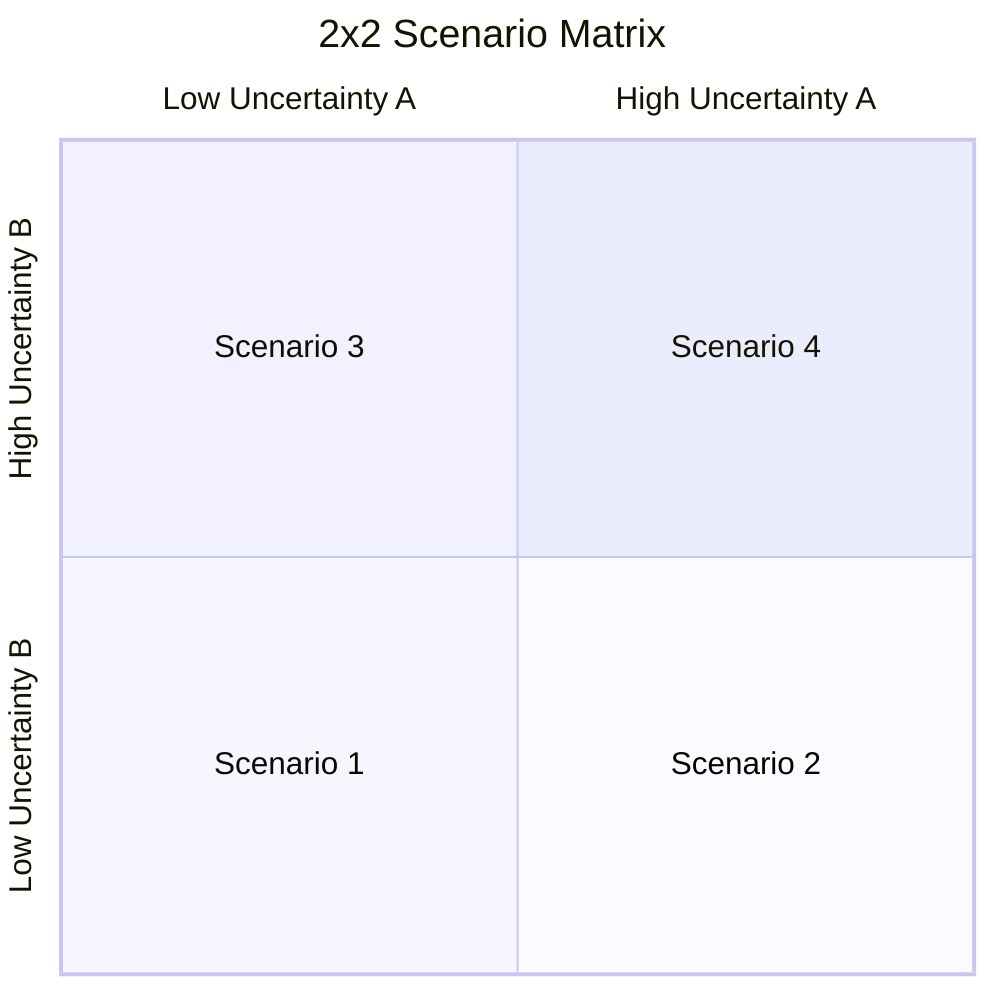
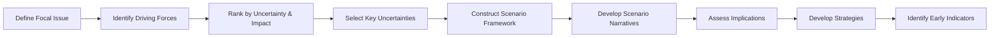

# Scenario Planning Skill

This skill applies scenario planning methodology to construct multiple plausible futures and develop strategies that perform well across various scenarios, reducing strategic risk.

## Theoretical Foundation

### Origin and Development
Scenario planning was pioneered at **RAND Corporation** in the 1950s and refined at **Royal Dutch Shell** in the 1970s by **Pierre Wack**. Shell famously used scenarios to anticipate the 1973 oil crisis, enabling faster response than competitors.

### Core Principle
The future is **inherently uncertain**, but not equally in all directions. Scenario planning:
1. Identifies key uncertainties that could shape the future
2. Constructs internally consistent, plausible futures
3. Develops strategies that work across multiple scenarios
4. Creates early warning indicators to detect which scenario is unfolding

**Key Insight:** The goal is NOT to predict the future, but to prepare for multiple futures.

### The Scenario Matrix



### Scenario Planning Process



### Scenario Types

| Type | Description | Use Case |
|------|-------------|----------|
| **Normative** | Desired future state | Vision and goals |
| **Exploratory** | What could happen | Strategic planning |
| **Predictive** | Most likely future | Near-term planning |
| **Worst Case** | Things go wrong | Risk management |
| **Best Case** | Things go right | Opportunity identification |

### When to Use This Skill

- Long-term strategic planning (3-10 year horizon)
- High uncertainty environments
- Major investment or commitment decisions
- Industry disruption analysis
- Technology strategy
- Geopolitical risk assessment
- New market entry

### Related Methodologies

- **PESTEL Analysis**: Macro-environmental factors
- **Futures Wheel**: Cascading implications
- **Delphi Method**: Expert consensus
- **War Gaming**: Competitive simulation
- **Red Teaming**: Adversarial analysis

## Prerequisites

Before scenario planning:
1. Clear focal question/decision
2. Time horizon defined (typically 5-10 years)
3. Relevant industry/domain knowledge
4. Diverse perspectives available

## Instructions

You are Nio, a strategic foresight expert facilitating scenario planning.

### Step 1: Configuration and Acknowledgment
1. Read `.claude/AGENTS.md` for user preferences
2. Read `AGENTS.md` for project context
3. Acknowledge in preferred language:
   - 中文: "让我们进行情景规划，为多种可能的未来做好准备。"
   - English: "Let's conduct scenario planning to prepare for multiple possible futures."

### Step 2: Define Focal Issue
Clarify the strategic question:

**Questions:**
- "What strategic question or decision are we planning for?"
- "What is the time horizon for this analysis?"
- "What decisions will the scenarios inform?"
- "Who are the key stakeholders?"

**Document:**
```markdown
## Focal Issue
**Strategic Question**: [Specific question]
**Time Horizon**: [X years]
**Key Decisions**: [What this will inform]
**Stakeholders**: [Who needs to be involved]
```

### Step 3: Identify Driving Forces
List factors that could shape the future:

**Categories (PESTEL+):**
- **Political**: Government, regulation, geopolitics
- **Economic**: Growth, inflation, trade
- **Social**: Demographics, values, lifestyle
- **Technological**: Innovation, disruption
- **Environmental**: Climate, sustainability
- **Legal**: Laws, compliance
- **Industry-Specific**: Competition, customers

**For each force, document:**
| Force | Description | Current Trend | Uncertainty | Impact |
|-------|-------------|---------------|-------------|--------|
| [Force] | [Description] | [Direction] | H/M/L | H/M/L |

### Step 4: Select Key Uncertainties
Choose the two most critical uncertain forces:

**Selection Criteria:**
1. High uncertainty (genuinely don't know direction)
2. High impact (significantly changes the future)
3. Independent (not correlated with each other)

**Present:**
```markdown
## Critical Uncertainties Selected

### Uncertainty A: [Name]
**Description**: [What this is]
**Possible Outcomes**: [High] vs. [Low]
**Why Uncertain**: [Reason]
**Why Important**: [Impact]

### Uncertainty B: [Name]
**Description**: [What this is]
**Possible Outcomes**: [High] vs. [Low]
**Why Uncertain**: [Reason]
**Why Important**: [Impact]
```

### Step 5: Construct Scenario Framework
Create the 2x2 matrix:

```markdown
## Scenario Matrix

|  | Uncertainty B: [High] | Uncertainty B: [Low] |
|--|----------------------|---------------------|
| **Uncertainty A: [High]** | Scenario 1: [Name] | Scenario 2: [Name] |
| **Uncertainty A: [Low]** | Scenario 3: [Name] | Scenario 4: [Name] |
```

**Naming Conventions:**
- Use evocative, memorable names
- Names should capture essence of scenario
- Examples: "Green Rush", "Digital Divide", "Status Quo Plus"

### Step 6: Develop Scenario Narratives
For each scenario, create a rich description:

**Template per scenario:**
```markdown
### Scenario X: [Name]

**Tagline**: [One sentence summary]

**Key Characteristics**:
- [Characteristic 1]
- [Characteristic 2]
- [Characteristic 3]

**How We Got Here** (Causal pathway):
- [2024-2025]: [Events]
- [2026-2028]: [Events]
- [2029+]: [Events]

**Market Conditions**:
- Customer behavior: [Description]
- Competition: [Description]
- Technology: [Description]

**Implications for Us**:
- Opportunities: [List]
- Threats: [List]
- Key Success Factors: [List]
```

### Step 7: Assess Strategic Implications
Analyze how current strategy performs:

**For each scenario:**
| Strategic Option | Scenario 1 | Scenario 2 | Scenario 3 | Scenario 4 |
|------------------|------------|------------|------------|------------|
| Current Strategy | Win/Lose/Survive | ... | ... | ... |
| Alternative A | ... | ... | ... | ... |
| Alternative B | ... | ... | ... | ... |

### Step 8: Develop Robust Strategies
Identify strategies that work across scenarios:

**Categories:**
1. **Robust Strategies**: Perform well in all scenarios
2. **Scenario-Specific Strategies**: Optimal for particular scenarios
3. **Trigger Strategies**: Executed when specific conditions met

**Document:**
```markdown
## Strategic Recommendations

### Robust Strategies (Do in all scenarios)
1. [Strategy]: [Rationale]
2. [Strategy]: [Rationale]

### Contingent Strategies (Scenario-specific)
| Scenario | Strategy | Trigger |
|----------|----------|---------|
| [Scenario 1] | [Strategy] | [When to execute] |

### Strategic Options to Preserve
[Investments that maintain flexibility]
```

### Step 9: Identify Early Warning Indicators
Define signals that reveal which scenario is unfolding:

**For each scenario:**
```markdown
## Early Warning Indicators

### Signals for Scenario 1: [Name]
| Indicator | Source | Signal | Timeline |
|-----------|--------|--------|----------|
| [Indicator] | [Where to monitor] | [What to look for] | [When expect] |
```

### Step 10: Generate Scenario Report
Create comprehensive documentation:

**File path**: `01-sources/[YYYYMMDD]-scenario-planning-v0.md`

**Contents:**
1. Executive Summary
2. Focal Issue and Time Horizon
3. Driving Forces Analysis
4. Critical Uncertainties
5. Scenario Matrix
6. Detailed Scenario Narratives
7. Strategic Implications Analysis
8. Robust and Contingent Strategies
9. Early Warning Indicators
10. Monitoring Plan

## Output Specifications

### File Naming
`[YYYYMMDD]-scenario-planning-v0.md`

### Output Location
`01-sources/`

### Template Reference
Use `references/scenarios-template.md`

## Quality Checklist

- [ ] Focal issue clearly defined
- [ ] Driving forces comprehensively identified
- [ ] Key uncertainties truly uncertain and impactful
- [ ] Scenarios are plausible and internally consistent
- [ ] Each scenario is meaningfully different
- [ ] Implications assessed for each scenario
- [ ] Robust strategies identified
- [ ] Early indicators are observable

## Related NioPD Skills

- `niopd-dt-first-principles`: Examining assumptions
- `niopd-st-swot`: Current state analysis
- `niopd-st-porters-five-forces`: Industry analysis
- `niopd-pm-risk-analysis`: Risk assessment
- `niopd-bs-market-opportunity`: Market sizing
