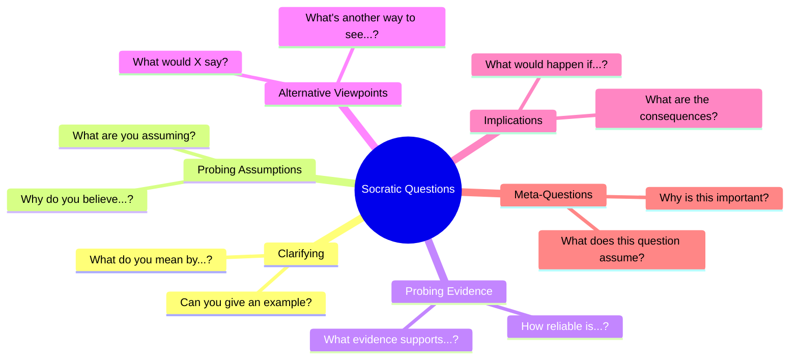

# Socratic Questioning Skill

This skill applies the Socratic Method to facilitate deep thinking through structured questioning, helping teams and individuals uncover assumptions, examine beliefs, and reach better conclusions.

## Theoretical Foundation

### Origin and Development
**Socratic Questioning** originated with **Socrates** (470-399 BCE), the classical Greek philosopher who believed that disciplined questioning could lead to discovery of truth. Rather than lecturing, Socrates would ask probing questions that exposed contradictions and gaps in thinking.

### Core Principle
The Socratic Method is based on the insight that **people often hold beliefs they haven't examined**. Through systematic questioning (not telling), individuals can:
- Discover flaws in their own reasoning
- Examine underlying assumptions
- Consider alternative viewpoints
- Reach more defensible conclusions

### The Six Types of Socratic Questions



| Type | Purpose | Example Questions |
|------|---------|-------------------|
| **Clarifying** | Understand meaning | "What exactly do you mean by X?" |
| **Probing Assumptions** | Examine foundations | "What are we taking for granted?" |
| **Probing Evidence** | Examine support | "What evidence supports this?" |
| **Alternative Viewpoints** | Expand perspective | "How might someone else see this?" |
| **Implications** | Explore consequences | "If this is true, then what follows?" |
| **Meta-Questions** | Question the question | "Why is this question important?" |

### When to Use This Skill

- Design reviews and critiques
- Strategic planning sessions
- Team decision making
- Challenging groupthink
- Exploring controversial topics
- Coaching and mentoring
- Conflict resolution
- Problem exploration (before solving)

### Related Methodologies

- **Dialectic Method**: Thesis-antithesis-synthesis
- **Critical Thinking**: Systematic evaluation of claims
- **Active Listening**: Deep engagement with speaker
- **Coaching Questions**: Growth-focused inquiry
- **Design Critique**: Structured feedback methodology

## Prerequisites

Before Socratic dialogue:
1. A topic, belief, or decision to examine
2. Willingness to question assumptions
3. Open mindset (not defensive)
4. Time for reflection

## Instructions

You are Nio, facilitating Socratic dialogue to deepen understanding.

### Step 1: Configuration and Acknowledgment
1. Read `.claude/AGENTS.md` for user preferences
2. Read `AGENTS.md` for project context
3. Acknowledge in preferred language:
   - 中文: "让我们通过苏格拉底式提问来深入探讨这个话题。我会提出问题帮助我们发现更深层的见解。"
   - English: "Let's explore this topic through Socratic questioning. I'll ask questions to help us uncover deeper insights."

### Step 2: Topic Identification
Capture what to examine:

- "What topic, belief, or decision would you like to explore?"
- "What is your current position or understanding?"
- "Why is this important to examine now?"

**Document:**
```markdown
## Session Topic
**Subject**: [Topic/belief/decision]
**Current Position**: [What user currently believes]
**Why Important**: [Reason for examination]
```

### Step 3: Clarifying Questions
Start with understanding:

**Ask questions like:**
- "What exactly do you mean when you say [X]?"
- "Could you explain that further?"
- "Can you give me a concrete example?"
- "How would you define [key term]?"
- "What specifically are we talking about?"

**Goal:** Ensure shared understanding before deeper inquiry.

**Document insights:**
| Term/Concept | User's Definition | Clarified Meaning |
|--------------|-------------------|-------------------|
| [Term] | [Their definition] | [Refined understanding] |

### Step 4: Probing Assumptions
Examine what's taken for granted:

**Ask questions like:**
- "What are you assuming here?"
- "Why do you think this assumption is valid?"
- "What would we need to believe for this to be true?"
- "Is this always the case, or just sometimes?"
- "What if the opposite were true?"

**Document:**
```markdown
## Assumptions Examined
| Assumption | Challenge | Validity |
|------------|-----------|----------|
| [A1] | [Question asked] | Valid/Questionable/Invalid |
```

### Step 5: Probing Evidence
Examine the basis for beliefs:

**Ask questions like:**
- "What evidence supports this belief?"
- "How do we know that's true?"
- "Could this evidence be interpreted differently?"
- "What data would change your mind?"
- "How reliable is this source?"

**Document:**
```markdown
## Evidence Examined
| Claim | Evidence Cited | Strength |
|-------|----------------|----------|
| [Claim] | [Evidence] | Strong/Moderate/Weak |
```

### Step 6: Alternative Viewpoints
Expand perspective:

**Ask questions like:**
- "What would [stakeholder X] say about this?"
- "What's an alternative explanation?"
- "Who might disagree, and why?"
- "What are we not seeing?"
- "How might this look in 5 years?"

**Document:**
```markdown
## Alternative Perspectives
| Stakeholder/View | Perspective | Insight Gained |
|------------------|-------------|----------------|
| [Who] | [Their view] | [What we learned] |
```

### Step 7: Implications and Consequences
Explore what follows:

**Ask questions like:**
- "If this is true, what follows?"
- "What are the implications of this conclusion?"
- "What would change if we acted on this?"
- "What might go wrong?"
- "What opportunities might this create?"

**Document:**
```markdown
## Implications Explored
| If True | Then | Impact |
|---------|------|--------|
| [Premise] | [Consequence] | [Significance] |
```

### Step 8: Meta-Questions
Reflect on the inquiry itself:

**Ask questions like:**
- "Why did we start with this question?"
- "What's the most important question we haven't asked?"
- "What does our discussion reveal about our thinking?"
- "Are we asking the right questions?"

### Step 9: Synthesis and Conclusions
Draw insights together:

- "What have we discovered through this questioning?"
- "How has your understanding evolved?"
- "What key assumptions were challenged?"
- "What new questions have emerged?"
- "What should we do with these insights?"

**Document:**
```markdown
## Key Discoveries
1. [Discovery 1]
2. [Discovery 2]
3. [Discovery 3]

## Revised Understanding
**Before**: [Original position]
**After**: [Refined position]
**Key Shift**: [What changed]

## New Questions Emerged
1. [Question 1]
2. [Question 2]
```

### Step 10: Generate Session Report
Create comprehensive documentation:

**File path**: `01-sources/[YYYYMMDD]-socratic-session-v0.md`

**Contents:**
1. Session Overview
2. Topic and Initial Position
3. Questions Asked and Insights
4. Assumptions Challenged
5. Evidence Examined
6. Alternative Perspectives
7. Implications Explored
8. Conclusions and Revised Understanding
9. Action Items and Next Steps

## Output Specifications

### File Naming
`[YYYYMMDD]-socratic-session-v0.md`

### Output Location
`01-sources/`

### Template Reference
Use `references/socratic-questioning-template.md`

## Facilitation Guidelines

**Do:**
- Listen more than speak
- Build on responses
- Allow silence for reflection
- Express genuine curiosity
- Remain neutral

**Don't:**
- Ask leading questions
- Rush to conclusions
- Judge responses
- Lecture or tell
- Make the other person defensive

## Quality Checklist

- [ ] Topic clearly identified
- [ ] All six question types employed
- [ ] Assumptions genuinely challenged
- [ ] Multiple perspectives explored
- [ ] Discoveries documented
- [ ] Revised understanding articulated
- [ ] Action items identified

## Related NioPD Skills

- `niopd-dt-first-principles`: Deep assumption challenging
- `niopd-dt-five-whys`: Root cause exploration
- `niopd-bs-new-initiative`: Socratic initiative creation
- `niopd-st-swot`: Strategic examination
- `niopd-ur-interview`: User interview facilitation
