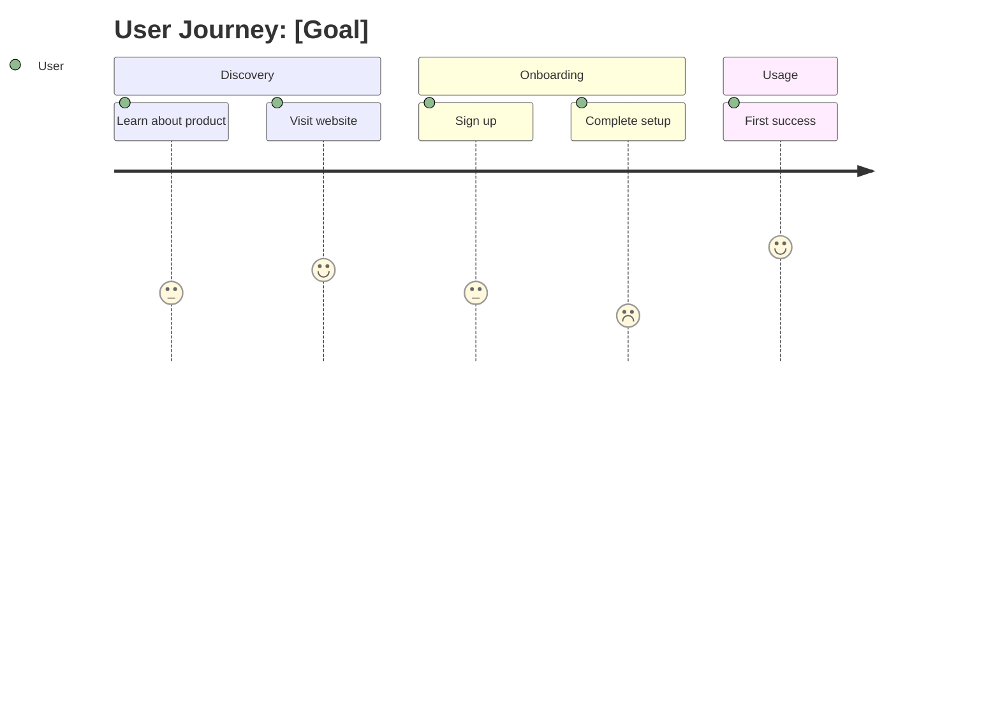

# Product Journey Mapping Skill

This skill creates visual user journey diagrams for product flows.

## Instructions

### Step 1: Define Journey
- Start point
- End goal
- Key milestones

### Step 2: Create Flow Diagram

### Step 3: Identify Pain Points
Where do users struggle?

### Step 4: Note Opportunities
Where can we improve?

### Step 5: Generate Document
**File path**: `03-docs/[YYYYMMDD]-journey-v0.md`

## Output Specifications
- **File Naming**: `[YYYYMMDD]-journey-v0.md`
- **Location**: `03-docs/`
- **Template**: `references/journey-template.md`
