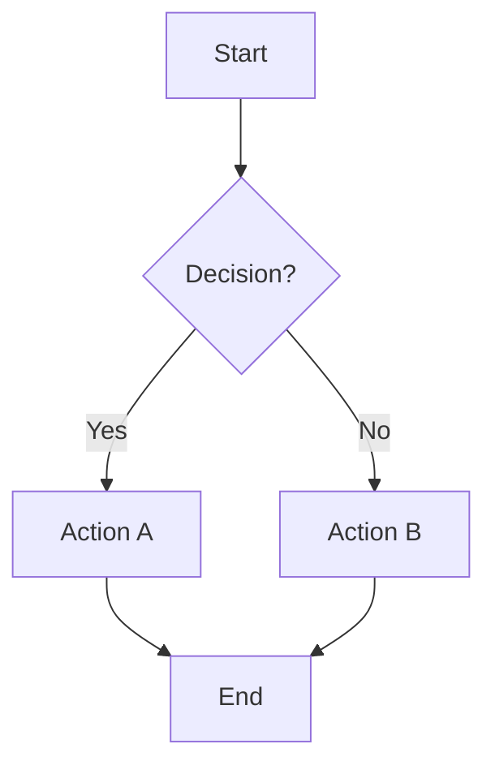

# Business Process Documentation Skill

This skill documents business processes with visual flowcharts.

## Instructions

### Step 1: Define Process Scope
- Process name
- Trigger (what starts it)
- End state (what completes it)

### Step 2: Identify Steps
List all steps in sequence

### Step 3: Create Flowchart

### Step 4: Document Each Step
| Step | Description | Owner | System |
|------|-------------|-------|--------|
| [Step] | [What happens] | [Who] | [Where] |

### Step 5: Generate Document
**File path**: `03-docs/[YYYYMMDD]-process-v0.md`

## Output Specifications
- **File Naming**: `[YYYYMMDD]-process-v0.md`
- **Location**: `03-docs/`
- **Template**: `references/process-template.md`
