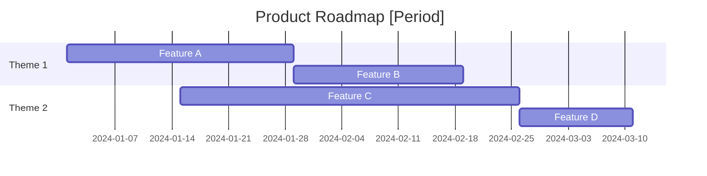

# Product Roadmap Skill

This skill creates visual product roadmaps using Mermaid Gantt diagrams to communicate delivery timelines.

## Theoretical Foundation

### Roadmap Types

| Type | Focus | Audience |
|------|-------|----------|
| **Now/Next/Later** | Simplicity, flexibility | External/Executive |
| **Timeline-based** | Specific dates, dependencies | Internal teams |
| **Theme-based** | Strategic goals | Stakeholders |
| **Outcome-based** | OKR alignment | Leadership |

### Key Principles
1. **Outcomes over outputs**: Focus on goals, not just features
2. **Flexibility over precision**: Acknowledge uncertainty
3. **Alignment over detail**: Ensure shared understanding
4. **Communication over planning**: Roadmap is a communication tool

### When to Use
- Quarterly planning
- Executive presentations
- Team alignment
- Customer/partner communication
- Resource planning

## Instructions

### Step 1: Gather Inputs
- PRD or initiative documents
- Prioritized backlog
- Resource availability
- External dependencies
- Strategic timeline constraints

### Step 2: Define Timeframe
- What period does the roadmap cover?
- Quarterly? Annual? Multi-year?
- What's the right level of detail?

### Step 3: Group by Theme/Goal
- What strategic themes organize the work?
- How do features map to goals?
- What outcomes are we driving?

### Step 4: Estimate Durations
For each item:
- Start date (or dependency)
- Duration (weeks)
- Dependencies

### Step 5: Generate Mermaid Gantt

### Step 6: Add Milestones
Include key dates:
- Release dates
- External events
- Dependencies

### Step 7: Generate Document
**File path**: `04-plans/[YYYYMMDD]-roadmap-v0.md`

**Contents:**
1. Roadmap Overview
2. Strategic Themes
3. Feature Timeline (Mermaid)
4. Key Milestones
5. Dependencies
6. Assumptions and Risks

## Output Specifications
- **File Naming**: `[YYYYMMDD]-roadmap-v0.md`
- **Location**: `04-plans/`
- **Template**: `references/roadmap-template.md`

## Related Skills
- `niopd-st-rice`: Feature prioritization
- `niopd-pm-release`: Release planning
- `niopd-pm-dependencies`: Dependency mapping
- `niopd-st-okr`: Outcome alignment
