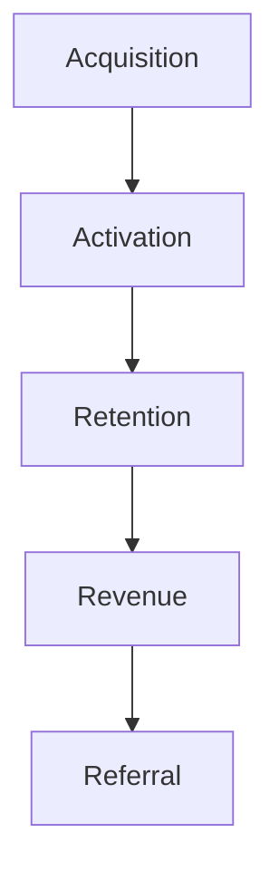

# AARRR Pirate Metrics Skill

This skill applies the AARRR framework to systematically analyze and optimize each stage of the customer lifecycle.

## Theoretical Foundation

### Origin
AARRR was developed by **Dave McClure** (500 Startups) as a simple framework for startup metrics. The name comes from the pirate sound and the five stages.

### The AARRR Funnel

| Stage | Question | Key Metrics |
|-------|----------|-------------|
| **Acquisition** | How do users find us? | Traffic, Signups, CAC |
| **Activation** | Do they have a great first experience? | Completion Rate, Time to Value |
| **Retention** | Do they come back? | D7/D30 Retention, Churn |
| **Revenue** | Do they pay? | Conversion, ARPU, LTV |
| **Referral** | Do they tell others? | NPS, Viral Coefficient |

### When to Use
- Growth strategy planning
- Identifying funnel bottlenecks
- Prioritizing optimization efforts
- Benchmarking performance
- Stakeholder reporting

## Instructions

### Step 1: Define Each Stage
For the specific product/feature:
- What counts as acquisition?
- What is the activation moment?
- How do we measure retention?
- What are revenue events?
- How do users refer others?

### Step 2: Gather Metrics
For each stage:

| Stage | Metric | Value | Benchmark | Gap |
|-------|--------|-------|-----------|-----|
| Acquisition | [Metric] | [Value] | [Industry] | [+/-] |
| Activation | [Metric] | [Value] | [Industry] | [+/-] |
| Retention | [Metric] | [Value] | [Industry] | [+/-] |
| Revenue | [Metric] | [Value] | [Industry] | [+/-] |
| Referral | [Metric] | [Value] | [Industry] | [+/-] |

### Step 3: Identify Bottlenecks
- Where is the biggest drop-off?
- What's the lowest-performing stage?
- Where is the biggest gap to benchmark?

### Step 4: Prioritize Improvements
Apply "One Metric That Matters" (OMTM):
- Focus on one stage at a time
- Highest impact / easiest to improve
- Clear ownership and timeline

### Step 5: Define Experiments
For the priority stage:
- What hypothesis are we testing?
- What change will we make?
- How will we measure success?

### Step 6: Generate Report
**File path**: `02-reports/[YYYYMMDD]-aarrr-analysis-v0.md`

## Output Specifications
- **File Naming**: `[YYYYMMDD]-aarrr-analysis-v0.md`
- **Location**: `02-reports/`
- **Template**: `references/aarrr-template.md`

## Related Skills
- `niopd-po-north-star`: North Star focus
- `niopd-pm-kpis`: KPI definition
- `niopd-pd-experiment`: Experiment design
- `niopd-ur-satisfaction`: Satisfaction analysis
