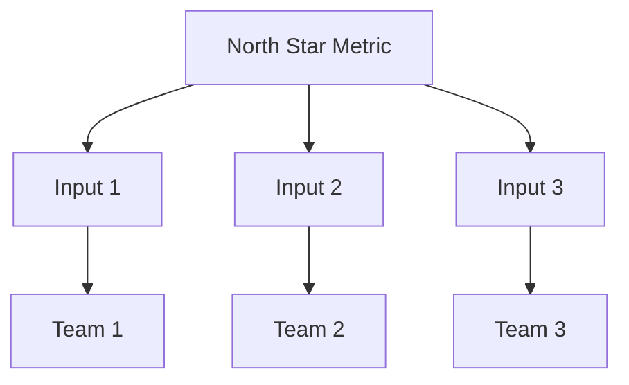

# North Star Metric Skill

This skill helps define the one metric that best captures the core value your product delivers to customers.

## Theoretical Foundation

### What is a North Star Metric?
A North Star Metric (NSM) is a single metric that:
1. Reflects the value delivered to customers
2. Correlates with long-term business success
3. Focuses the entire organization

### Characteristics of Good North Star
- **Leading indicator** of business success
- **Reflects customer value** (not just business value)
- **Actionable** (teams can influence it)
- **Understandable** (everyone gets it)

### Examples by Product Type

| Product Type | North Star Metric |
|--------------|-------------------|
| Marketplace | Transactions per week |
| Social | Daily active users |
| SaaS | Active users × Features used |
| Media | Total time reading |
| E-commerce | Purchases per buyer |

### North Star Framework

### When to Use
- Strategic planning
- OKR setting
- Team alignment
- Metric rationalization
- New product development

## Instructions

### Step 1: Define Product Value
- "What value does our product deliver?"
- "What job does it do for users?"
- "What would users miss most if it disappeared?"

### Step 2: Identify Candidate Metrics
List metrics that could represent success:
- Usage metrics
- Engagement metrics
- Transaction metrics
- Retention metrics

### Step 3: Evaluate Candidates
| Metric | Customer Value | Business Value | Actionable | Simple |
|--------|----------------|----------------|------------|--------|
| [Metric A] | ✓/✗ | ✓/✗ | ✓/✗ | ✓/✗ |

### Step 4: Select North Star
Choose the metric that best balances all criteria

### Step 5: Define Input Metrics
What drives the North Star?
- Input Metric 1: [Description] - [Team owner]
- Input Metric 2: [Description] - [Team owner]

### Step 6: Set Targets
| Metric | Baseline | Target | Timeline |
|--------|----------|--------|----------|
| North Star | [Current] | [Goal] | [When] |
| Input 1 | [Current] | [Goal] | [When] |

### Step 7: Generate Document
**File path**: `04-plans/[YYYYMMDD]-north-star-v0.md`

## Output Specifications
- **File Naming**: `[YYYYMMDD]-north-star-v0.md`
- **Location**: `04-plans/`
- **Template**: `references/north-star-template.md`

## Related Skills
- `niopd-st-okr`: OKR alignment
- `niopd-pm-kpis`: KPI framework
- `niopd-po-aarrr-metrics`: Funnel metrics
- `niopd-ur-jtbd`: Customer jobs
