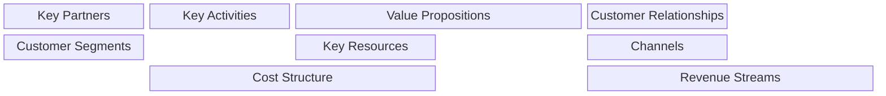

# Business Model Canvas Skill

This skill applies the Business Model Canvas framework to systematically analyze and design business models.

## Theoretical Foundation

### Origin
The Business Model Canvas was developed by **Alexander Osterwalder** and **Yves Pigneur** in "Business Model Generation" (2010). It provides a visual template for developing new or documenting existing business models.

### The Nine Building Blocks

| Block | Description | Key Questions |
|-------|-------------|---------------|
| **Customer Segments** | Who are we creating value for? | Who are our most important customers? |
| **Value Propositions** | What value do we deliver? | What problem are we solving? |
| **Channels** | How do we reach customers? | How do customers want to be reached? |
| **Customer Relationships** | What type of relationship? | How do we get, keep, and grow customers? |
| **Revenue Streams** | How do we make money? | What are customers willing to pay for? |
| **Key Resources** | What do we need? | What assets are required? |
| **Key Activities** | What do we do? | What activities are required? |
| **Key Partners** | Who helps us? | What do partners provide? |
| **Cost Structure** | What does it cost? | What are the main costs? |

### When to Use
- Startup planning
- Business model innovation
- Strategic pivots
- Investor presentations
- Competitive analysis
- Team alignment

## Instructions

### Step 1: Start with Value Proposition
- What unique value do we provide?
- What customer problem are we solving?
- What needs are we satisfying?

### Step 2: Define Customer Segments
- Who are the target customers?
- What are their characteristics?
- Are there multiple segments?

### Step 3: Map Channels and Relationships
- How do we reach each segment?
- What relationship type is expected?
- How do we retain customers?

### Step 4: Define Revenue Model
- How do customers pay?
- What is the pricing model?
- What are ancillary revenues?

### Step 5: Identify Key Activities and Resources
- What must we do well?
- What resources are essential?
- What capabilities are required?

### Step 6: Map Partners and Costs
- Who are essential partners?
- What is the cost structure?
- What are fixed vs. variable costs?

### Step 7: Generate Canvas Document
**File path**: `02-reports/[YYYYMMDD]-business-model-canvas-v0.md`

## Output Specifications
- **File Naming**: `[YYYYMMDD]-business-model-canvas-v0.md`
- **Location**: `02-reports/`
- **Template**: `references/canvas-template.md`

## Related Skills
- `niopd-st-value-proposition`: Value proposition design
- `niopd-st-swot`: Strategic assessment
- `niopd-bs-market-opportunity`: Market sizing
- `niopd-mr-competitor`: Competitive models
