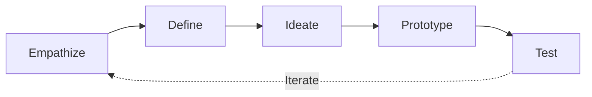

# Design Thinking Skill

This skill applies the Design Thinking methodology to solve complex problems through human-centered, iterative innovation.

## Theoretical Foundation

### Origin
Design Thinking was developed at **IDEO** and **Stanford d.school**, building on work by **Tim Brown**, **David Kelley**, and **Roger Martin**.

### The Five Phases

| Phase | Purpose | Activities |
|-------|---------|------------|
| **Empathize** | Understand users | Interviews, observation, immersion |
| **Define** | Frame the problem | Problem statement, POV |
| **Ideate** | Generate solutions | Brainstorming, sketching |
| **Prototype** | Make ideas tangible | Quick prototypes, mockups |
| **Test** | Validate solutions | User feedback, iteration |

### Key Mindsets
- Human-centered
- Bias toward action
- Embrace ambiguity
- Radical collaboration
- Learn from failure

### When to Use
- Complex, ill-defined problems
- Innovation challenges
- Service design
- User experience improvement
- Organizational change

## Instructions

### Step 1: Empathize
- Conduct user interviews
- Observe users in context
- Create empathy maps
- Document insights

### Step 2: Define
Create problem statement:
- **POV (Point of View)**: [User] needs [need] because [insight]
- Challenge: "How Might We...?"

### Step 3: Ideate
Generate solutions:
- Brainstorming rules: defer judgment, encourage wild ideas
- Quantity over quality
- Build on others' ideas
- Select promising concepts

### Step 4: Prototype
Make ideas tangible:
- Quick and cheap
- Fail early to learn
- Test-worthy artifacts

### Step 5: Test
Validate with users:
- Get feedback
- Observe reactions
- Iterate based on learning

### Step 6: Generate Report
**File path**: `01-sources/[YYYYMMDD]-design-thinking-v0.md`

## Output Specifications
- **File Naming**: `[YYYYMMDD]-design-thinking-v0.md`
- **Location**: `01-sources/`
- **Template**: `references/design-thinking-template.md`

## Related Skills
- `niopd-ur-feedback`: User empathy
- `niopd-pd-wireframe`: Prototyping
- `niopd-pd-experiment`: Testing
- `niopd-st-design-sprint`: Structured sprint
