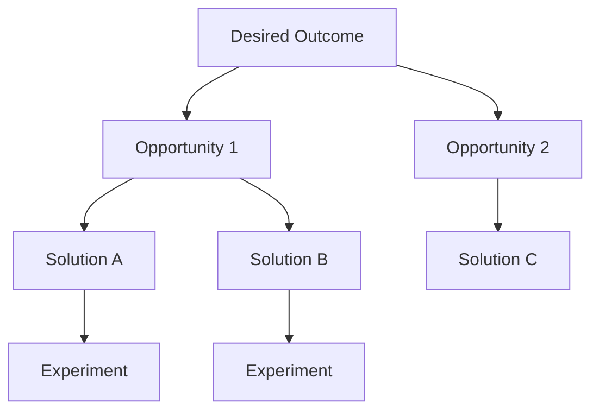

# Opportunity Solution Tree Skill

This skill applies the Opportunity Solution Tree framework to systematically connect desired outcomes to validated solutions.

## Theoretical Foundation

### Origin
The Opportunity Solution Tree (OST) was developed by **Teresa Torres** as part of her "Continuous Discovery Habits" methodology (2021).

### OST Structure



| Level | Description |
|-------|-------------|
| **Outcome** | Measurable business/product result |
| **Opportunity** | User/customer need or pain point |
| **Solution** | Possible way to address opportunity |
| **Experiment** | Way to validate solution |

### Key Principles
1. **Outcome-focused**: Start with what we want to achieve
2. **Multiple opportunities**: Explore the problem space
3. **Multiple solutions**: Don't jump to one answer
4. **Experiment-driven**: Validate before building

### When to Use
- Continuous discovery process
- Feature planning
- Solution validation
- Connecting research to roadmap
- Team alignment on priorities

## Instructions

### Step 1: Define Desired Outcome
- "What measurable outcome are we trying to achieve?"
- "What metric will move?"
- "Why is this outcome important?"

### Step 2: Map Opportunities
For each outcome:
- "What user needs or pain points could we address?"
- "What opportunities exist in the problem space?"
- Generate 3-5 opportunities per outcome

### Step 3: Generate Solutions
For each opportunity:
- "What are different ways we could address this?"
- "What have competitors done?"
- "What's a creative alternative?"
- Generate 2-3 solutions per opportunity

### Step 4: Design Experiments
For promising solutions:
- "How can we test this cheaply and quickly?"
- "What's the riskiest assumption?"
- "What would we need to see to proceed?"

### Step 5: Prioritize the Tree
- Which outcomes matter most now?
- Which opportunities have highest impact?
- Which solutions have best experiment results?

### Step 6: Generate OST Document
**File path**: `04-plans/[YYYYMMDD]-opportunity-tree-v0.md`

**Visual Format:**
```markdown
## Desired Outcome: [Outcome]

### Opportunity 1: [Opportunity]
- Solution A: [Solution] → Experiment: [Test]
- Solution B: [Solution] → Experiment: [Test]

### Opportunity 2: [Opportunity]
- Solution C: [Solution] → Experiment: [Test]
```

## Output Specifications
- **File Naming**: `[YYYYMMDD]-opportunity-tree-v0.md`
- **Location**: `04-plans/`
- **Template**: `references/ost-template.md`

## Related Skills
- `niopd-ur-jtbd`: Understanding opportunities
- `niopd-pd-experiment`: Experiment design
- `niopd-st-rice`: Solution prioritization
- `niopd-bs-new-initiative`: Initiative from opportunities
