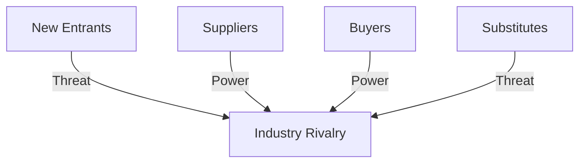

# Porter's Five Forces Analysis Skill

This skill applies Porter's Five Forces framework to systematically analyze industry structure and competitive dynamics.

## Theoretical Foundation

### Origin
Porter's Five Forces was developed by **Michael Porter** (Harvard Business School) in "Competitive Strategy" (1979). It remains the foundational framework for industry analysis.

### The Five Forces

| Force | Description | Key Factors |
|-------|-------------|-------------|
| **Rivalry** | Competition intensity | Number, diversity, growth rate |
| **Buyer Power** | Customer bargaining | Concentration, switching costs |
| **Supplier Power** | Supplier bargaining | Concentration, differentiation |
| **New Entrants** | Entry threat | Barriers, capital needs, regulation |
| **Substitutes** | Alternative threat | Price/performance, switching ease |

### Industry Attractiveness
- **High barriers, weak forces** = Attractive (high profits)
- **Low barriers, strong forces** = Unattractive (low profits)

### When to Use
- Market entry decisions
- Competitive strategy development
- Investment analysis
- Industry understanding
- Strategic positioning

## Instructions

### Step 1: Define Industry Boundaries
- What industry are we analyzing?
- What are the industry boundaries?
- What's the geographic scope?

### Step 2: Analyze Each Force
For each of the five forces:

**Rate:** High / Medium / Low
**Key Factors:** [Specific drivers]
**Evidence:** [Data supporting rating]
**Implications:** [Strategic meaning]

### Step 3: Assess Industry Rivalry
- Number and diversity of competitors
- Industry growth rate
- Exit barriers
- Product differentiation
- Switching costs

### Step 4: Assess Buyer Power
- Buyer concentration
- Volume per buyer
- Switching costs
- Price sensitivity
- Backward integration threat

### Step 5: Assess Supplier Power
- Supplier concentration
- Input differentiation
- Switching costs
- Forward integration threat
- Importance of volume

### Step 6: Assess New Entrant Threat
- Capital requirements
- Economies of scale
- Brand loyalty
- Government regulation
- Access to distribution

### Step 7: Assess Substitute Threat
- Substitute availability
- Relative price/performance
- Switching costs
- Buyer propensity to switch

### Step 8: Generate Report
**File path**: `02-reports/[YYYYMMDD]-five-forces-v0.md`

**Summary Table:**
| Force | Rating | Key Factors | Strategic Implication |
|-------|--------|-------------|----------------------|
| Rivalry | H/M/L | [Factors] | [Implication] |

## Output Specifications
- **File Naming**: `[YYYYMMDD]-five-forces-v0.md`
- **Location**: `02-reports/`
- **Template**: `references/porters-five-forces-template.md`

## Related Skills
- `niopd-st-swot`: Strategic assessment
- `niopd-mr-competitor`: Competitor analysis
- `niopd-bs-market-opportunity`: Market sizing
- `niopd-dt-scenarios`: Future scenarios
