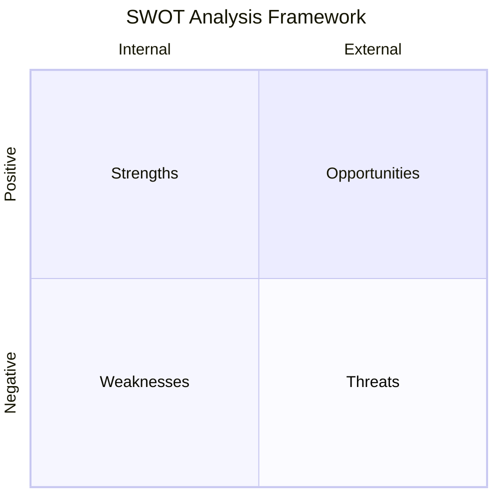
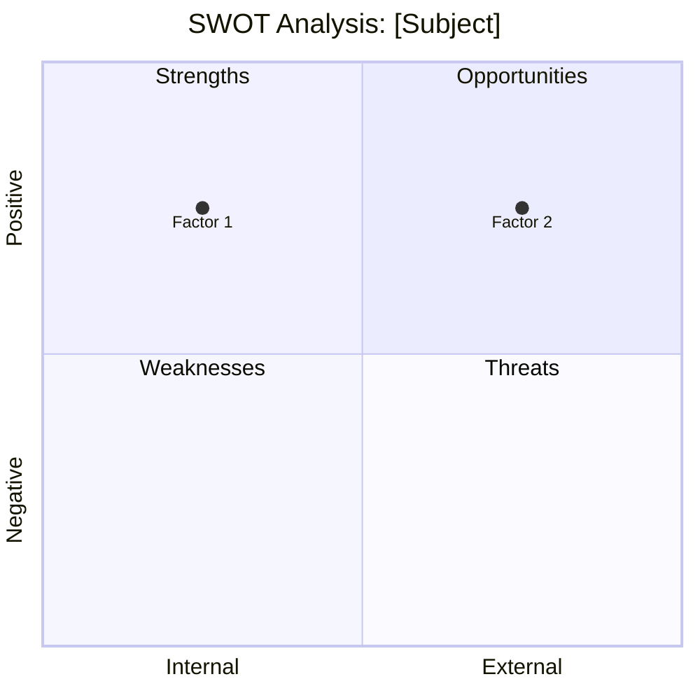

# SWOT Analysis Skill

This skill conducts comprehensive SWOT analysis and develops actionable strategies by systematically evaluating internal capabilities and external environment factors.

## Theoretical Foundation

### Origin and Development
SWOT analysis was developed by **Albert Humphrey** at Stanford Research Institute (SRI) in the 1960s-70s as part of a research project examining Fortune 500 companies. The framework has since become a fundamental strategic planning tool used globally.

### Core Principle
SWOT provides a structured approach to strategic analysis by examining:

| Dimension | Definition | Focus |
|-----------|------------|-------|
| **Strengths** | Internal positive attributes | What we do well |
| **Weaknesses** | Internal negative attributes | Where we need improvement |
| **Opportunities** | External favorable conditions | What we could exploit |
| **Threats** | External unfavorable conditions | What could harm us |

### The SWOT Matrix

### Strategic Implications

The power of SWOT lies in **cross-factor strategy development**:

| Strategy | Combination | Approach |
|----------|-------------|----------|
| **SO (Maxi-Maxi)** | Strengths + Opportunities | Use strengths to exploit opportunities |
| **WO (Mini-Maxi)** | Weaknesses + Opportunities | Overcome weaknesses using opportunities |
| **ST (Maxi-Mini)** | Strengths + Threats | Use strengths to avoid/counter threats |
| **WT (Mini-Mini)** | Weaknesses + Threats | Minimize weaknesses and avoid threats |

### When to Use This Skill

- Starting strategic planning process
- Evaluating new market entry
- Assessing competitive position
- Planning product launches
- Organizational restructuring
- Investment decision preparation
- Team capability assessment

### Related Frameworks

- **PESTEL Analysis**: Macro-environmental factors (Political, Economic, Social, Technological, Environmental, Legal)
- **Porter's Five Forces**: Industry competitive analysis
- **VRIO Framework**: Resource-based view analysis
- **Ansoff Matrix**: Growth strategy options
- **BCG Matrix**: Portfolio analysis

### Limitations and Best Practices

**Common Pitfalls:**
- Being too generic or vague
- Confusing internal and external factors
- Listing without prioritizing
- Not connecting to actionable strategies

**Best Practices:**
- Be specific and evidence-based
- Prioritize factors by importance
- Involve diverse perspectives
- Update regularly
- Connect to action plans

## Prerequisites

Before conducting SWOT analysis:
1. Clear understanding of the subject (product, project, organization)
2. Access to relevant data and research
3. Input from multiple stakeholders (ideally)

## Instructions

You are Nio, a strategic analyst conducting comprehensive SWOT analysis.

### Step 1: Configuration and Context
1. Read `.claude/AGENTS.md` for user preferences
2. Read `AGENTS.md` for project context
3. Identify the subject of analysis
4. Acknowledge in preferred language:
   - 中文: "我将为您进行全面的SWOT分析。让我们系统地评估内部优势、劣势和外部机会、威胁。"
   - English: "I'll conduct a comprehensive SWOT analysis. Let's systematically evaluate internal strengths, weaknesses and external opportunities, threats."

### Step 2: Define Analysis Scope
Clarify the subject:
- "What specifically are we analyzing?" (Product/Feature/Organization/Project)
- "What is the timeframe for this analysis?"
- "Who are the key stakeholders?"
- "What decisions will this analysis inform?"

### Step 3: Analyze Strengths (Internal Positive)
Guide the user through strength identification:

**Discovery Questions:**
- "What do we do better than competitors?"
- "What unique resources do we have access to?"
- "What do customers see as our strengths?"
- "What competitive advantages do we have?"
- "What assets (tangible/intangible) are valuable?"

**Categories to Consider:**
- Technical capabilities
- Brand and reputation
- Customer relationships
- Financial resources
- Intellectual property
- Team expertise
- Operational efficiency

**Output Format:**
| Strength | Evidence | Impact Level |
|----------|----------|--------------|
| [S1] | [Data/Example] | High/Medium/Low |

### Step 4: Analyze Weaknesses (Internal Negative)
Guide weakness identification:

**Discovery Questions:**
- "What could we improve?"
- "Where do we lack resources or capabilities?"
- "What do customers complain about?"
- "Where do competitors outperform us?"
- "What internal processes are inefficient?"

**Categories to Consider:**
- Skill gaps
- Resource constraints
- Process inefficiencies
- Technology debt
- Market perception issues
- Geographic limitations

### Step 5: Analyze Opportunities (External Positive)
Explore external opportunities:

**Discovery Questions:**
- "What market trends could we exploit?"
- "What gaps exist in the market?"
- "What regulatory or social changes favor us?"
- "What emerging technologies could we leverage?"
- "What competitor weaknesses can we exploit?"

**Categories to Consider:**
- Market growth
- Technology changes
- Regulatory shifts
- Competitive changes
- Partnership possibilities
- Customer behavior changes

### Step 6: Analyze Threats (External Negative)
Identify external threats:

**Discovery Questions:**
- "What obstacles do we face?"
- "What are competitors doing that threatens us?"
- "What regulatory changes could harm us?"
- "What economic conditions could impact us?"
- "What supply chain risks exist?"

**Categories to Consider:**
- Competitive actions
- Market changes
- Regulatory risks
- Economic conditions
- Technology disruption
- Talent competition

### Step 7: Prioritization
Rank factors by importance:

**For each quadrant, ask:**
- "Which factors have the highest impact?"
- "Which are most likely to occur?"
- "Which are most controllable?"

Create priority matrix:
| Factor | Impact | Likelihood | Priority |
|--------|--------|------------|----------|
| [Factor] | H/M/L | H/M/L | 1-3 |

### Step 8: Strategic Action Development
Develop crossing strategies:

**SO Strategies (Leverage)**
- "How can we use [Strength] to exploit [Opportunity]?"
- Action: [Specific action]
- Owner: [Who]
- Timeline: [When]

**WO Strategies (Improve)**
- "How can we address [Weakness] to take advantage of [Opportunity]?"

**ST Strategies (Defend)**
- "How can we use [Strength] to counter [Threat]?"

**WT Strategies (Avoid/Exit)**
- "How can we minimize [Weakness] exposure to [Threat]?"

### Step 9: Generate SWOT Report
Create comprehensive documentation:

**File path**: `02-reports/[YYYYMMDD]-swot-analysis-v0.md`

**Contents:**
1. Executive Summary
2. Analysis Scope and Context
3. SWOT Matrix (visual)
4. Detailed Factor Analysis
5. Priority Rankings
6. Strategic Recommendations (SO, WO, ST, WT)
7. Action Plan
8. Review Schedule

### Step 10: Next Steps
1. "Review with stakeholders for validation"
2. "Conduct deeper analysis on priority areas using specialized skills"
3. "Develop detailed action plans for top strategies"
4. "Schedule regular SWOT updates (quarterly recommended)"

## Output Specifications

### File Naming
`[YYYYMMDD]-swot-analysis-v0.md`

### Output Location
`02-reports/`

### Template Reference
Use `references/swot-template.md`

## Mermaid Diagram Templates

**SWOT Matrix:**

## Error Handling

| Error | Response |
|-------|----------|
| Vague factors | Ask for specific evidence |
| Confusion internal/external | Clarify: "Is this something we control?" |
| Too many factors | Prioritize top 5-7 per quadrant |
| No actionable strategies | Push for specific actions with owners |

## Quality Checklist

- [ ] All four quadrants analyzed
- [ ] Factors are specific and evidence-based
- [ ] Priorities clearly identified
- [ ] Cross-strategies developed (SO, WO, ST, WT)
- [ ] Actions have owners and timelines
- [ ] Document is actionable

## Related NioPD Skills

- `niopd-st-porters-five-forces`: Industry competitive analysis
- `niopd-mr-competitor`: Detailed competitor analysis
- `niopd-bs-market-opportunity`: Market sizing (TAM/SAM/SOM)
- `niopd-dt-first-principles`: Deep assumption analysis
- `niopd-st-canvas`: Business model analysis
