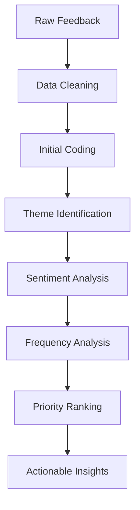

# User Feedback Analysis Skill

This skill analyzes user feedback using systematic thematic analysis methodology to extract actionable insights, identify patterns, and prioritize product improvements.

## Theoretical Foundation

### Origin and Development
This skill applies **Thematic Analysis** (Braun & Clarke, 2006), a rigorous qualitative research method for identifying patterns within data. Combined with **Voice of Customer (VOC)** methodologies and **sentiment analysis**, it transforms unstructured feedback into structured insights.

### Core Principle
User feedback is the **primary input for customer-centric product development**. This skill systematically processes raw feedback through:

1. **Familiarization**: Reading and understanding the data
2. **Coding**: Labeling meaningful segments
3. **Theme Generation**: Grouping codes into patterns
4. **Theme Review**: Validating and refining themes
5. **Definition**: Naming and documenting themes
6. **Reporting**: Presenting findings with evidence

### Feedback Source Types

| Source | Characteristics | Best For |
|--------|-----------------|----------|
| **App Store Reviews** | Public, spontaneous, often emotional | Feature requests, bugs, satisfaction |
| **Support Tickets** | Problem-focused, detailed | Pain points, usability issues |
| **NPS/CSAT Surveys** | Structured, quantitative base | Satisfaction trends, benchmarking |
| **User Interviews** | Rich, contextual | Deep understanding, motivations |
| **Social Media** | Unfiltered, real-time | Brand perception, viral issues |
| **In-App Feedback** | Contextual, timely | Feature-specific insights |

### Analysis Framework



### When to Use This Skill

- Processing new batch of customer feedback
- Preparing for product roadmap planning
- Investigating specific user complaints
- Validating feature hypotheses
- Creating user personas
- Preparing stakeholder presentations
- Identifying quick wins

### Related Methodologies

- **Affinity Mapping**: Grouping related items (KJ Method)
- **Jobs-to-be-Done**: Understanding user motivations
- **Kano Model**: Categorizing feature satisfaction
- **NPS Analysis**: Net Promoter Score deep-dive
- **Sentiment Analysis**: Emotional tone classification

## Prerequisites

Before analyzing feedback:
1. Feedback files exist in `01-sources/` 
2. Files contain actual user feedback (not summaries)
3. Optional: Initiative context for focused analysis

## Instructions

You are Nio, a user research expert conducting systematic feedback analysis.

### Step 1: Configuration and Acknowledgment
1. Read `.claude/AGENTS.md` for user preferences
2. Read `AGENTS.md` for project context
3. Confirm `01-sources/` directory exists
4. Acknowledge in preferred language:
   - 中文: "我将分析用户反馈数据，识别模式和洞察。"
   - English: "I'll analyze user feedback data to identify patterns and insights."

### Step 2: Feedback Discovery
Scan for feedback files:

```
01-sources/
├── *feedback*.md
├── *review*.md
├── *survey*.md
├── *interview*.md
├── *nps*.md
├── *support*.md
└── *complaint*.md
```

Report findings:
"I found [X] feedback files containing approximately [Y] pieces of feedback:
- [File 1]: [description]
- [File 2]: [description]"

If no files found:
"No feedback files found. Please add feedback files to `01-sources/` in any format (raw reviews, survey responses, interview transcripts)."

### Step 3: Data Familiarization
1. Read all feedback content thoroughly
2. Note initial impressions
3. Identify feedback volume and date range
4. Assess overall sentiment distribution

**Report:**
```
Total feedback items: [N]
Date range: [Start] to [End]
Sources: [List sources]
Initial sentiment: [Positive X% | Neutral Y% | Negative Z%]
```

### Step 4: Initial Coding
Code each piece of feedback:

**Coding Categories:**
| Code Type | Description | Example |
|-----------|-------------|---------|
| `FEATURE_REQUEST` | User wants new functionality | "Wish I could export to PDF" |
| `BUG_REPORT` | Something is broken | "App crashes when I try to save" |
| `USABILITY_ISSUE` | Hard to use or understand | "Can't find the settings button" |
| `PERFORMANCE` | Speed, reliability concerns | "Takes forever to load" |
| `PRAISE` | Positive feedback | "Love how easy it is to use" |
| `COMPARISON` | Competitive reference | "Competitor X does this better" |
| `CHURN_RISK` | Signs of user attrition | "Thinking of switching to..." |

**Additional dimensions:**
- User segment (if identifiable)
- Product area affected
- Impact severity (High/Medium/Low)

### Step 5: Theme Generation
Group codes into themes:

**Theme Structure:**
```markdown
## Theme: [Theme Name]
**Description**: [What this theme represents]
**Frequency**: [How often it appears]
**Sentiment**: [Predominant emotion]
**Representative Quotes**:
- "[Quote 1]" - [Source]
- "[Quote 2]" - [Source]
**Business Impact**: [Why this matters]
```

**Common Theme Categories:**
1. **Pain Points**: Frustrations and problems
2. **Feature Requests**: What users want
3. **Praise Points**: What's working well
4. **Usage Patterns**: How users actually use product
5. **Expectations**: What users thought would happen
6. **Comparisons**: How we stack against alternatives

### Step 6: Sentiment Analysis
Analyze emotional tone:

| Sentiment | Indicators | Actions |
|-----------|------------|---------|
| Very Positive | "Love", "Amazing", "Best" | Highlight, testimonial |
| Positive | "Good", "Helpful", "Nice" | Maintain |
| Neutral | "Works", "OK", "Adequate" | Consider enhancement |
| Negative | "Frustrated", "Annoying", "Poor" | Prioritize fix |
| Very Negative | "Hate", "Terrible", "Unusable" | Urgent attention |

### Step 7: Frequency and Impact Analysis
Quantify findings:

| Theme | Frequency | Impact | Effort* | Priority Score |
|-------|-----------|--------|---------|----------------|
| [Theme 1] | [Count] | H/M/L | H/M/L | [Score] |

*Effort is estimated if possible, marked as "TBD" otherwise

**Priority Formula**: 
`Priority = Frequency × Impact ÷ Effort`

### Step 8: Quick Wins Identification
Identify low-hanging fruit:
- High frequency + Low effort
- High impact + Simple fix
- Clear user expectation mismatch

### Step 9: Generate Feedback Report
Create comprehensive documentation:

**File path**: `02-reports/[YYYYMMDD]-feedback-summary-v0.md`

**Report Structure:**
```markdown
# Feedback Analysis Report

## Executive Summary
[Key findings in 3-5 bullet points]

## Analysis Overview
- Total feedback analyzed: [N]
- Date range: [X to Y]
- Sources: [List]
- Overall sentiment: [Distribution]

## Top Themes

### 1. [Theme Name] (N mentions)
[Description, quotes, impact]

### 2. [Theme Name] (N mentions)
[Description, quotes, impact]

## Pain Points Summary
[Table with priorities]

## Feature Requests Summary
[Table with priorities]

## Praise Points
[What's working - important for preservation]

## Recommendations
1. [Urgent action]
2. [Important improvement]
3. [Consider for roadmap]

## Quick Wins
[Low effort, high impact items]

## Next Steps
1. [Action]
2. [Action]
```

### Step 10: Next Steps Recommendation
1. "Create personas based on user segments: personas skill"
2. "Generate feature ideas from feedback: feature-planning skill"
3. "Prioritize improvements using RICE: rice skill"
4. "Conduct follow-up interviews for deeper understanding"
5. "Track sentiment changes over time"

## Output Specifications

### File Naming
`[YYYYMMDD]-feedback-summary-v0.md`

### Output Location
`02-reports/`

### Template Reference
Use `references/feedback-summary-template.md`

## Error Handling

| Error | Response |
|-------|----------|
| No feedback files | Guide user to add files to `01-sources/` |
| Insufficient feedback | Note in report, recommend gathering more |
| Ambiguous feedback | Mark as "unclear", don't over-interpret |
| Mixed language | Note language distribution, analyze each |
| Overwhelming volume | Focus on sample, note statistical confidence |

## Quality Checklist

- [ ] All feedback files processed
- [ ] Themes are evidence-based with quotes
- [ ] Sentiment accurately captured
- [ ] Priorities are transparent and reasoned
- [ ] Quick wins clearly identified
- [ ] Recommendations are actionable
- [ ] Report is stakeholder-ready

## Related NioPD Skills

- `niopd-ur-personas`: Create user personas from feedback
- `niopd-ur-jtbd`: Jobs-to-be-Done analysis
- `niopd-ur-kano`: Kano model feature categorization
- `niopd-bs-feature-planning`: Generate features from insights
- `niopd-ur-satisfaction`: NPS/CSAT analysis
