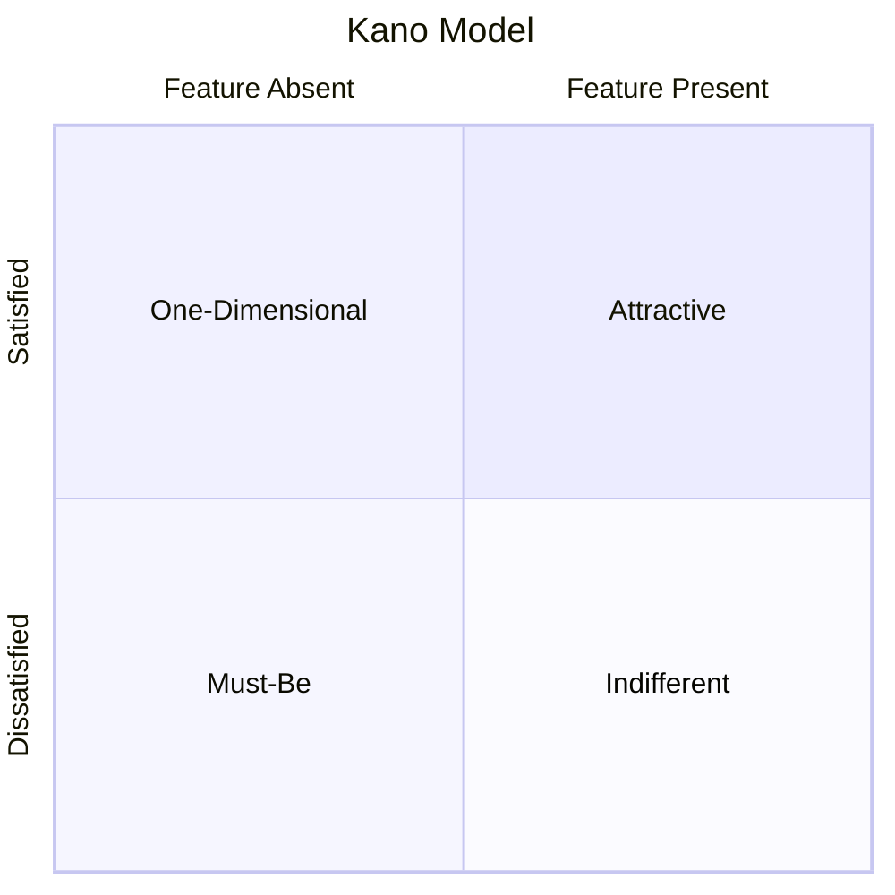

# Kano Model Analysis Skill

This skill applies the Kano Model to categorize features based on their relationship to customer satisfaction.

## Theoretical Foundation

### Origin
The Kano Model was developed by **Professor Noriaki Kano** (Tokyo University of Science) in 1984, providing a theory of customer satisfaction.

### Feature Categories

| Category | Description | Effect |
|----------|-------------|--------|
| **Must-Be** | Expected, basic needs | Absence = Dissatisfaction, Presence = Neutral |
| **One-Dimensional** | Performance features | More = More Satisfaction |
| **Attractive** | Delighters, unexpected | Presence = Satisfaction, Absence = Neutral |
| **Indifferent** | Doesn't affect satisfaction | No impact either way |
| **Reverse** | Creates dissatisfaction | Presence = Dissatisfaction |

### Strategic Implications
- **Must-Be**: Must deliver, but don't over-invest
- **One-Dimensional**: Compete here, proportional returns
- **Attractive**: Differentiate here, high ROI

### When to Use
- Feature prioritization
- Customer satisfaction strategy
- Product differentiation
- Competitive positioning
- Investment allocation

## Instructions

### Step 1: List Features to Evaluate
Gather features from:
- Backlog
- Competitor analysis
- Customer requests
- Team ideas

### Step 2: Kano Questionnaire
For each feature, ask two questions:

**Functional (presence):** "If the product HAD this feature, how would you feel?"
**Dysfunctional (absence):** "If the product DID NOT have this feature, how would you feel?"

**Response Options:**
1. I like it
2. I expect it
3. I'm neutral
4. I can tolerate it
5. I dislike it

### Step 3: Classify Using Evaluation Table
| Dysfunctional → | Like | Expect | Neutral | Tolerate | Dislike |
|-----------------|------|--------|---------|----------|---------|
| **Like** | Q | A | A | A | O |
| **Expect** | R | I | I | I | M |
| **Neutral** | R | I | I | I | M |
| **Tolerate** | R | I | I | I | M |
| **Dislike** | R | R | R | R | Q |

**Legend:** A=Attractive, O=One-Dimensional, M=Must-Be, I=Indifferent, R=Reverse, Q=Questionable

### Step 4: Prioritize Based on Classification
**Investment Strategy:**
- **Must-Be**: Ensure complete coverage (baseline)
- **One-Dimensional**: Invest for competitive parity
- **Attractive**: Invest for differentiation

### Step 5: Generate Report
**File path**: `02-reports/[YYYYMMDD]-kano-analysis-v0.md`

| Feature | Category | Priority | Rationale |
|---------|----------|----------|-----------|
| [Feature] | Must-Be/One-Dim/Attractive/Indiff | High/Med/Low | [Reason] |

## Output Specifications
- **File Naming**: `[YYYYMMDD]-kano-analysis-v0.md`
- **Location**: `02-reports/`
- **Template**: `references/kano-template.md`

## Related Skills
- `niopd-st-rice`: Quantitative prioritization
- `niopd-st-moscow`: Scope prioritization
- `niopd-ur-jtbd`: Underlying jobs
- `niopd-ur-satisfaction`: Satisfaction measurement
