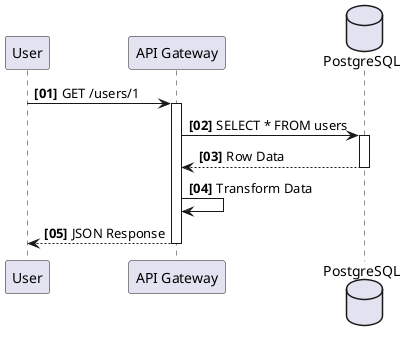
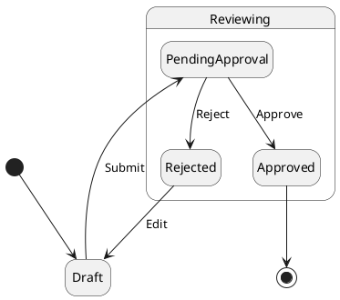
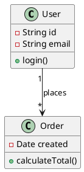

# PlantUML Syntax Reference & Ultra SOTA Rules

This document provides a comprehensive reference for PlantUML, with a specific focus on **C4 Architecture Models** and strict enterprise UML standards.

## 1. Global Configuration (Theming)

Use strictly defined `skinparam` or themes to avoid the "default yellow" look.

### NioPD Professional Theme
```plantuml
@startuml
!theme plain
skinparam backgroundColor white
skinparam handwritten false
skinparam shadowing false
skinparam RoundCorner 10
skinparam ArrowColor #64748b
skinparam ArrowThickness 2

' Text Defaults
skinparam DefaultFontName "Arial"
skinparam DefaultFontSize 14
skinparam DefaultFontColor #1e293b

' Nodes
skinparam componentStyle uml2
skinparam packageStyle rectangle
@enduml
```

## 2. C4 Model Architecture (Primary Use Case)

PlantUML is the industry standard for C4. Always explicitly include the C4 library.

### 2.1 C4 Library Imports
**Always** use the remote URL for stability, or local if configured.
```plantuml
!include https://raw.githubusercontent.com/plantuml-stdlib/C4-PlantUML/master/C4_Context.puml
!include https://raw.githubusercontent.com/plantuml-stdlib/C4-PlantUML/master/C4_Container.puml
!include https://raw.githubusercontent.com/plantuml-stdlib/C4-PlantUML/master/C4_Component.puml
```

### 2.2 C4 Layout Directions
- `LAYOUT_TOP_DOWN()` (Default)
- `LAYOUT_LEFT_RIGHT()` (For timelines or wide flows)
- `LAYOUT_WITH_LEGEND()` (Recommended for C4)

### 2.3 C4 System Context (Level 1)
```plantuml
@startuml
!include https://raw.githubusercontent.com/plantuml-stdlib/C4-PlantUML/master/C4_Context.puml

Person(customer, "Customer", "A user of the bank")
System(banking_system, "Internet Banking System", "Allows customers to check accounts")

System_Ext(mail_system, "E-mail System", "Sends internal SMTP")
System_Ext(mainframe, "Mainframe Banking", "Core banking API")

Rel(customer, banking_system, "Uses")
Rel(banking_system, mail_system, "Sends e-mails", "SMTP")
Rel(banking_system, mainframe, "Uses")
@enduml
```

### 2.4 C4 Container (Level 2)
```plantuml
@startuml
!include https://raw.githubusercontent.com/plantuml-stdlib/C4-PlantUML/master/C4_Container.puml

System_Boundary(c1, "Internet Banking") {
    Container(web_app, "Web Application", "Java, Spring MVC", "Delivers static content")
    Container(spa, "Single Page App", "JavaScript, Angular", "Provides functionality")
    ContainerDb(database, "Database", "Oracle 12c", "Stores user data")
}

Rel(web_app, spa, "Delivers")
Rel(spa, database, "Reads/Writes", "JDBC")
@enduml
```

## 3. Standard UML Diagrams

### 3.1 Sequence Diagram
Used for strict timeline analysis.


### 3.2 State Machine
Used for lifecycle management (e.g., Order Status).


### 3.3 Class Diagram
Used for data modeling.


## 4. Advanced Layout Hacks (Ultra SOTA)

PlantUML's layout engine (Graphviz) can be stubborn. Use these tricks to force specific layouts.

### 4.1 Hidden Links for Layout
Use `-[hidden]-` arrows to force nodes to be on the same rank or relative position without drawing a visible line.

```plantuml
A -[hidden]right- B  ' Forces B to be to the right of A
B -[hidden]down- C   ' Forces C to be below B
```

### 4.2 Grouping & Separation
- **Separation**: `skinparam nodesep 100` (Horizontal definition) or `ranksep 100` (Vertical definition).
- **Together**: Use `together { ... }` block to force nodes to stay close.

```plantuml
together {
  class A
  class B
}
```

## 5. Troubleshooting & Syntax Safety

### 5.1 Common Errors
- **Preprocessor Error**: `!include` fail.
  - *Fix*: Check internet connection or fallback to standard UML without C4 macros.
- **Syntax Error**: `syntax error near "..."`
  - *Fix*: Often caused by unquoted strings containing special chars. **ALWAYS quote labels**. `("My Label")` not `(My Label)`.

### 5.2 NioPD Safety Rules
1. **Always Quote Labels**: `System(id, "Label", "Desc")`. Never leave strings unquoted.
2. **Use Define for Long Urls**:
   ```plantuml
   !define C4 https://raw.githubusercontent.com/plantuml-stdlib/C4-PlantUML/master
   !include C4/C4_Context.puml
   ```
3. **Avoid Space in IDs**: Use `user_db` not `user db`.

## 6. Quick C4 Reference

| Macro | Arguments | Description |
|-------|-----------|-------------|
| `Person(alias, label, desc)` | `alias`, `label`, `optional desc` | A human user |
| `System(alias, label, desc)` | `alias`, `label`, `optional desc` | The software system |
| `Container(alias, label, tec, desc)` | `alias`, `...`, `technology`, `desc` | A deployable unit (API, DB) |
| `Relationship(from, to, label)` | `from`, `to`, `label` | A direction connection |
| `System_Boundary(alias, label) { ... }` | `alias`, `label`, `block` | Grouping containers |
